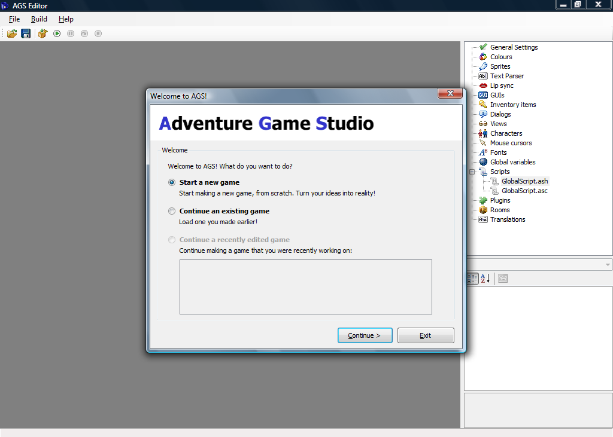
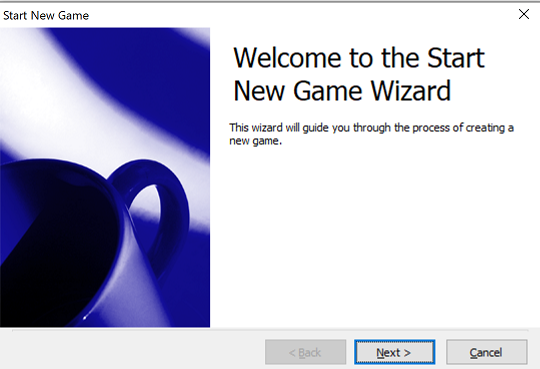
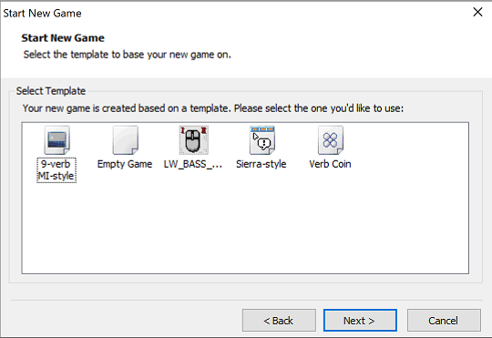
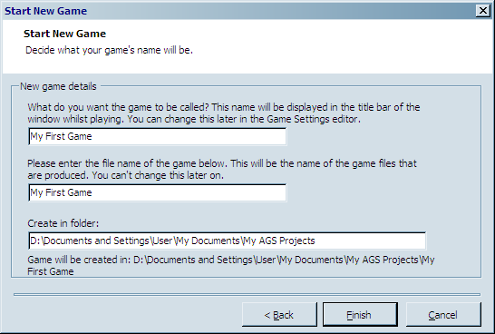

# Creating Your First Game

After successfully installing the AGS Editor, you should be able to easily find it in you Windows Start menu.  Running the editor will show an AGS splash screen and then the IDE appears as in [Figure 0.2](#figure02).

 **Figure 0.2: AGS IDE**

You should see three options in the wizard that pops up.  More than likely, you don't already have any games to open (otherwise you wouldn't need this book.) Choose the default option to start a new game and click the **Continue** button. The Start New Game wizard will now guide you ([Figure 0.3](#figure03)).  After clicking **Next**, you should see three templates to choose from ([Figure 0.4](#figure04)).

 **Figure 0.3: Start New Game Wizard**
   

 **Figure 0.4: Start New Game Wizard**

New games created with AGS are always based on templates.  Templates are basically skeletons for games.  You choose your skeleton and build around it.

* **Sierra Style** is the easiest one to get started with.  Choosing this template will create a game that provides you with some default graphics, such as an example character, as well as graphics for the default icons and buttons.  It will also include some actions like *Save*, *Restart*, and *Quit*.  This is the template we'll be using in this book.
* **Empty Game** will create a game that contains no graphics, GUIs, sounds, rooms, scripts, etc.  It basically gives you nothing, in case you just want to create a brand-new game entirely from scratch. Since we want the graphics and GUIs and extra goodies that are in the **Default Game** template, and since the process of creating graphics isn't the focus of this book anyway, we won't be using this template at all.
* **Verb Coin** allows you to create a game with a different interface than the one in the default template.  Verb coin can be interesting to work with, but we will not be talking about it in this book.

> **Side Note:** If you'd like to know more about verb coin you can create a game with the Verb Coin template and try it out.  The Verb Coin template attempts to emulate the interface style used by some of the LucasArts games, like *Full Throttle* and *The Curse of Monkey Island*, as opposed to the default icon-based interface that AGS uses, which is based on the Sierra On-Line adventures like *King's Quest IV*, *Police Quest 3*, and *Freddy Pharkas, Frontier Pharmacist*, to name a few.

> **Side Note:** It's important to note that AGS doesn't limit you to creating games that only use the default interface or the Verb Coin interface, despite the fact that these are the only templates you can choose from.  Part of what makes AGS so compelling is the fact that you can customize almost every aspect of the game, including the interface, graphics, and sound.  So, if you want a game that has a particular interface that's not in the templates, just go ahead and create your game using the Default template, and then you can tweak it and change it however you want.  Just about every type of adventure game interface has been done with AGS, from the LucasArts SCUMM interface used in *The Secret of Monkey Island* and *Maniac Mansion* to the text-based interface used in the early Sierra adventures; from the interface in *Myst* to the type of interface in games from the Adventure Company.  It can all be done with AGS, but you might have to customize things a little using the know-how you gain from this book.

Choose the **Sierra Style** template and click **Next**. Something like [Figure 0.5](#figure05) should appear. Here you should give your game a name.  You can change this later though if you don't like it.  You'll also need to give it a file name to use and a folder to put your game in.  Typically, your file name and the name of your game will be the same.  We're calling our game "My First Game" for now.

 **Figure 0.5: New Game Information**

And now for the final click.  Yes, click **Finish**. Congratulations, you've created your first AGS game.  It doesn't do much right now, but believe it or not, your first game is actually playable right now!
