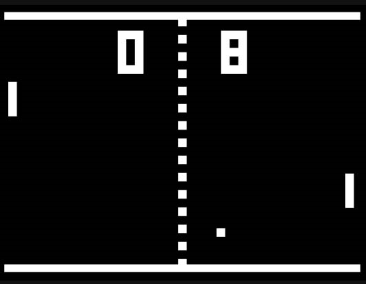
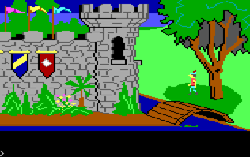

# History of the Adventure Game

## Video Games

Before there were adventure games, people entertained themselves by drawing on cave walls and playing drums by the campfire.  Shortly after this, someone invented a computer and decided that it might be fun to play games on it.

*Computer Space* was the first commercial video game, released in 1971, and boy was it a doozy.  It was a coin-operated machine that housed a 15-inch, black-and-white television and four input buttons.  You dropped in a quarter, and then you had 90 seconds of riveting gameplay where you controlled your spaceship around the screen and tried to shoot as many UFOs as you could, gaining a point for each UFO you hit.  After the 90 seconds was up, if you had a bigger score than the UFOs did, the game would give you an additional 90 seconds and then you would start again.  Fun!  Just make sure you didn't hit more than 9 UFOs, because if you did your score would reset back to 0 (counting to 10 was HARD).  Gameplay would continue like this forever, or until you got tired and had to go back to hunting and gathering.

Games got a bit more exciting in 1972 with the release of everyone's favorite computer tennis game, *Pong*. This game was based on the Magnavox Odyssey console, which, unlike *Computer Space* before it , was a console game that people could buy and play at home on their own TVs.  *Pong* connected to a television and had two paddles for input.  The graphics were made up of a line drawn vertically down the center of the screen, two smaller vertical lines on the left and right sides of the screen, and a dot which represented a ball (graphics artists had it easy back then).  There were two sets of numbers at the top of the screen for the players' scores.  The "ball" moved around and the players would bat it back and forth and hope the other player missed it, in which case a point would be awarded.  Simple?  Yes.  Popular?  Very!

This was basically the only choice of computer games at the time.  These games were considered "fun" at the time, although there wasn't much *interaction* to them. There were no characters to speak of, little or no story, and certainly no real challenge aside from being able to press some buttons.  But things were about to change.

## The First Adventure Game

Will Crowther, it could be argued, was the father of the Adventure Game.  In 1975, while working as a computer programmer for Bolt Beranek and Newman, he decided he would write a computer game for his two daughters.  Crowther called his game *Collosal Cave*, and it was based on his adventures exploring Mammoth Cave in Kentucky.  The game, by today's standards, was very primitive and simple, consisting only of a textual interface and input system, where the player would type commands into the computer and read the result on the screen.  Since he designed *Collosal Cave* for his young daughters, and also wanted it to appeal to the general population (not just computer geeks), he programmed it to understand the commands entered by the user in a "natural language" kind of way.  The player could instruct the game to do things by using 1- or 2-word commands.  For example, if a player wanted to go north to the next section of the cave, she could simply type "go north" and the program would understand and process the request (alternatively, she could type "walk north" or "go up".) A player who wanted to look at the wall could type "examine wall."

The game was passed from person to person throughout the fledgling Internet (which at that time consisted of only a handful of computers -- nothing like the gargantuan network we know and love today,) until it became fairly ubiquitous among computer geeks.  After all, people were hungry for a little computer entertainment, since programs then usually consisted of cryptic user interfaces that were difficult to understand (NLS, anyone?) and computer games were practically unheard of.

The next year, in 1976, a guy by the name of Don Woods found the game on one of the computers at Stanford Unversity and, after corresponding with Crowther, greatly expanded the game.  Later that same year, it was ported from FORTRAN to C and and distributed by DECUS (Digital Equipment Corporation User Group) as *Colossal Cave Adventure*, or simply, *Adventure*.

Voila!  The *Adventure* Game was born!

A couple of years after *Adventure*, four programmers at MIT took this idea of an "interactive fiction" adventure game and developed a game similar in design called *Dungeon*.  At least, that was what they had planned on calling it.  The game ended up being called *Zork*, a name which was used at the time to refer generically to an unfinished program.  The name kinda stuck, and in 1979 they founded a company called Infocom and published the game as *Zork I: The Great Underground Empire* in 1980. Infocom later went on to publish many more text adventure games throughout the 1980s, including no fewer than 10 additional games in the Zork series.

Text adventures were all well and good, but eventually computer processors got faster, and computer video got more advanced.  Text adventures advanced a bit in the early 80s to the point where the player was presented with a static "background" image. In 1980, the newly founded On-Line Systems (later to become Sierra On-Line) released just such a game called *Mystery House*, and later that same year they produced the first color adventure game, *Wizard and the Princess*.  These games were still basically text adventure games, however.  Even though there were graphics, the graphics didn't animate, and the player had no real interaction with the graphical environment.  It was more of a supplement to the text, not the other way around.

This changed in 1984 when Sierra On-Line released the very first truly *graphical* adventure game: *King's Quest: Quest for the Crown*.  For the first time, a player could control the character on the screen in a (pseudo) 3D environment (at least, it was marketed that way, as a "3D Animated Adventure".) In *King's Quest*, the player takes the role of Sir Graham, who is sent by the King of Daventry to recover the kingdom's three most precious magical items: the Magic Mirror that forsees the future, the Magic Shield of invincibility, and the Magic Chest that is always filled with gold.  Along the way, Graham meets with several characters from fairy tales (Rumplestiltskin, a dragon, and the witch from Hansel and Gretel, to name a few) and in the end, Sir Graham inherits the crown to become King Graham, and ends up being the protagonist in two of the seven subsequent *King's Quest* adventures. *King's Quest* was not an instant success; however, it did well enough that Sierra released a sequel just a year later and the graphical adventure game genre took off.  They subsequently created classics like *Police Quest*, *Space Quest*, *Quest for Glory*, and *Leisure Suit Larry*, among others.

These text-based adventure games soon evolved into mouse-controlled games, where, for example, the player didn't have to type commands like "open the door" but could instead use the mouse to click on the door to open it.  Sierra created games like this, as did Lucasfilm, George Lucas's movie production company.  Lucasfilm teamed up with Atari to produce games under the "Lucasfilm Games" label, which eventually became *LucasArts*.  They created very successful, well-known adventure games like *Maniac Mansion*, *The Secret of Monkey Island*, and *Indiana Jones and the Fate of Atlantis*, which all used this more updated mouse-based interface.
