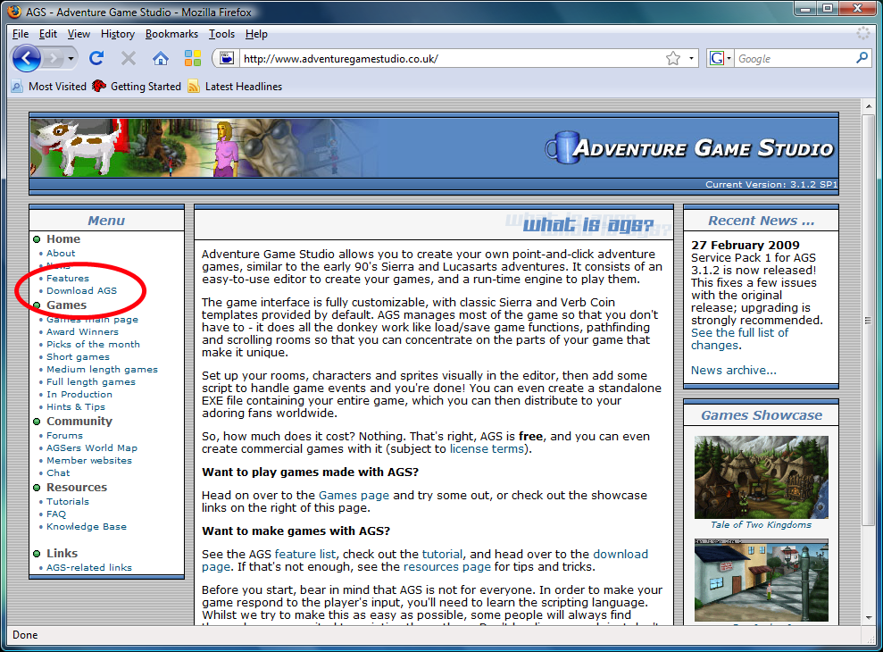

# Installing AGS

Installing the AGS Editor is a simple matter of downloading it from [http://www.adventuregamestudio.co.uk/](http://www.adventuregamestudio.co.uk/). Click on the download link (see [Figure 0.1](#figure01)) and get the latest installer.  Double-click the installer and follow the instructions.  If you have any problems, then you might be missing the .NET Framework. If you don't have the .NET Framework for some reason, then run a Windows Update on your computer. If you still don't see it there, then you probably have it or you're running Windows ME or something ridiculous.  (UPGRADE NOW!)  You can also check your Add/Remove Programs under Control Panel for .NET Framework.  If you're running Windows Vista or later, then you should already have the .NET Framework installed.

 **Figure 0.1: The AGS Website.  The download link is circled in red.**
