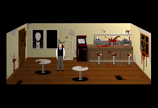
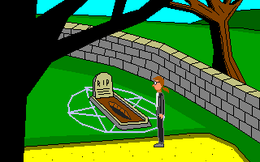
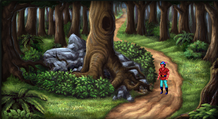

# Getting to Know (and love) AGS

# Introduction

AGS, or Adventure Game Studio, is a feature-rich application that allows you to create point-and-click adventure games.  If you remember games from the late 1980s and early 1990s like *King's Quest*, *Quest for Glory*, *Monkey Island*, and *Maniac Mansion* (just to name a few) then you know the types of games we're talking about.  AGS provides you with an simple, intuitive interface that you can use to create games just like those, and, with enough creativity, you can use AGS to make games that equal (if not surpass) those professional quality games!

AGS was created by Chris Jones in 1997 as "Adventure Creator."  Back then, Adventure Creator was an MS-DOS-based program, it didn't have mouse support and it only allowed very primitive graphics.  Step by step, little by little, Adventure Creator evolved from this initial, featureless program into Adventure Game Studio, which now supports high-res graphics, its games can run on multiple operating systems, it has fully integrated sound and video, and it can support thousands of sprites, hundreds of rooms, unlimited characters, and even customized mouse cursors, GUIs, and other interface elements.  Plus, AGS has an extremely active user community, so help, criticism, and play testers are never more than a forum post away.  And Chris Jones still supports AGS and provides updates and patches to it on a regular basis.

How much does AGS cost?  That's the best part.  It's FREE!  Isn't that the best kind of hobby to get into?  Even if you decide to write a commercial game for profit, AGS is still free*!

 &ast; AGS itself is 100% free, but some of the internal pieces of AGS (like the MP3 decoder, the graphics and sound subsystems, some of the fonts that AGS uses, etc.) weren't written by Chris Jones, and therefore have their own license agreements that you would need to consider if you released your game for profit.  For more information you can visit the AGS license page at <a href="https://www.adventuregamestudio.co.uk/site/ags/legal/" target="_blank">https://www.adventuregamestudio.co.uk/site/ags/legal/</a> 

Hundreds, if not thousands, of games have been created with AGS over the years, and they range from very amateur games on the low end, to professional quality commercial games on the high end.  Here are just a few examples of games that were made using AGS:

## Trilby's Notes

Trilby's Notes (<a href="http://www.fullyramblomatic.com/notes" target="_blank">http://www.fullyramblomatic.com/notes</a>) was created by Ben Croshaw, aka Yahtzee, and is part of a series of adventure games, collectively known as "Chzo Mythos." The series consists of four games, with Trilby's Notes being the third installment. Unlike most games written with AGS, Trilby's Notes is unique in that the player doesn't use a mouse to control the game.  Instead, the action is controlled much like the early Sierra games, where the player moves the character with the arrow keys and types commands he or she wishes the character to perform.

## Reality on the Norm series

Easily the largest series of games written with AGS, Reality on the Norm (RoN) (<a  href="http://www.realityonthenorm.info" target="_blank">http://www.realityonthenorm.info</a>) is a collaborative collection of games where anyone can create a game and add it to the series.  The series takes place in a fictional place called Reality on the Norm, and the series has several recurring characters and themes.  The first game was called "Lunchtime of the Damned" (created by none other than Ben Croshaw and it was about a young kid named Davy Jones and his zombie.  Since that first game, no less than 90 games have been created in the RoN universe, written and created by dozens of people, and characters ranging from Death to Bill Cosby to David Hasselhoff to Commander Keen have visited RoN.

## AGDI Games

As you can imagine, the quality of games written with AGS varies widely from game to game.  Few, however, have the same feel as a professionally written game (which is to be expected, since most AGS users don't have the same production budget as a professional game company!) Games from AGDI (Anonymous Game Developers Interactive) break that typical mold, however.  AGDI (<a href="http://www.agdinteractive.com" target="_blank">http://www.agdinteractive.com</a>) is a group of individuals who are "determined to revive the adventure game genre." They make beautifully crafted adventure games, containing stunning artwork, professional quality music, and talented voice acting.  AGDI has released three remakes of classic Sierra games: *King's Quest I*, *King's Quest II*, and *Quest for Glory II*. These games are truly works of art and are just as much fun to play as their original counterparts were.  Each game stays true to the original classic, but adds new plot elements, puzzles, and in some cases even new characters to meet.  AGDI even got Josh Mandel, the voice of King Graham in the original King's Quest games from Sierra, to reprise his role as King Graham in both of their remakes.  AGDI also has made an original game called *Al Emmo and the Lost Dutchman's Mine*. All these games were created using AGS.

