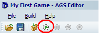
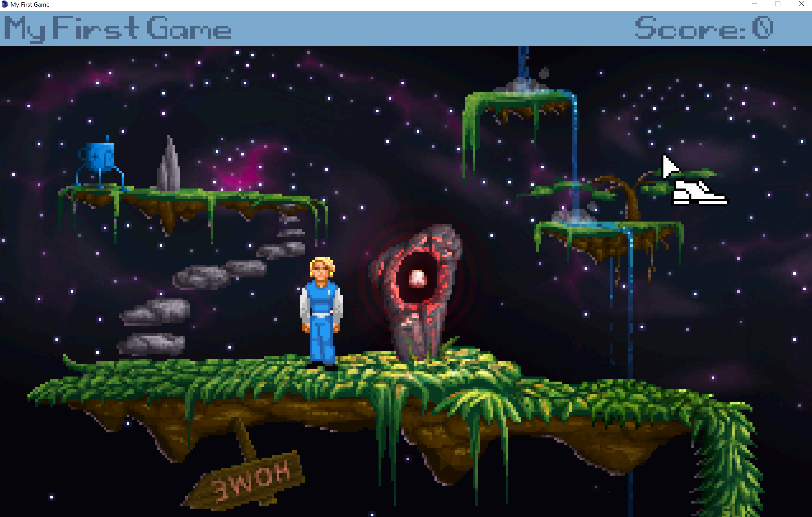
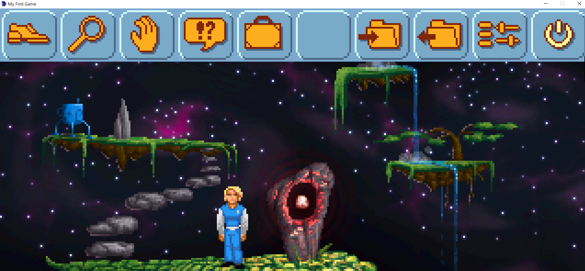
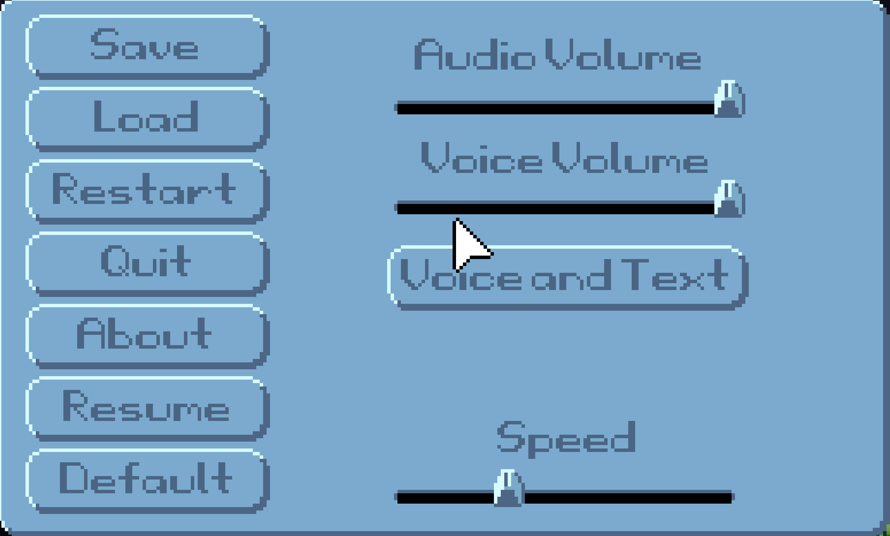

# Running Your Game

Let's see what this game can do.  You should see a window similar to the one in [Figure 0.6](#figure06). We'll discuss the editor interface in a moment, but for now let's run this game we just created.  Click on the circle with the green arrow in it. It looks like [Figure 0.7](#figure07).

 **Figure 0.6: The Editor**

 **Figure 0.7: The Run Button**

You'll see some dialog boxes pop up and then, Voila! You have your first Adventure Game running.  The game doesn't do much yet, but as you'll see, there is already a lot of functionality built in for you.  You will see the main character wearing a blue suit and the mouse cursor will look like a shoe ([Figure 0.8](#figure08)). This shoe cursor is used to make the main character walk around the screen.  Try clicking around the screen now and the character will walk to wherever you clicked.  Move your mouse cursor to the top of the screen and an in-game menu will pop up ([Figure 0.9](#figure09)).

> **Side Note:** You might be wondering why the game is running inside a window instead of full screen.  This is because we ran the game in *Debug Mode* (by clicking the green button in [Figure 0.7](#figure07)) which will always run in a window. *Debug Mode* is the mode you'll be running in while you are designing your game, and the thought is, while you're creating your game you don't need to see it in full screen all the time.  Your users, though, will be able to run the game in all its full screen glory when you distribute it.  There are times when you might want to run your game in full screen mode even while you're designing it, and you can do this at any time by clicking the **Build** menu, then clicking **Run without debugger** (or by pressing **Ctrl+F5**).

 **Figure 0.8: Your First Game**

 **Figure 0.9: In Game Menu**

The first four icons on the left are used to change what action is to be done on an object or character.  From left to right, the actions are **walk**, **look**, **touch/interact**, and **talk**. Clicking one of these icons will change the mouse cursor to match the action.  Try each one of these actions on the main character and you can see how they work.  Click the **magnifier** icon, for example, and your mouse cursor will change into a magnifier. Then if you click the **magnifier** on the main character you will see a message that says, "Damn, I'm looking good!" Each of the other two icons will display messages as well.  As an alternative to using this menu bar to switch between actions, you can also use the right mouse button while playing to cycle through all the mouse actions that are available.

Continuing from left to right, the next icon is a **suitcase**. Clicking this icon will bring up a screen that shows the player's inventory of items.  The default game comes with a Blue Cup and a Key.  If you opened the inventory, just click the **OK** button to close it. The next icon in the menu bar is an **empty box**. This is there to show the most recently selected inventory item.  If no item is selected, or you have nothing, then it will remain an empty box. The next two icons are the **save** and **restore** features of the game. These actually work and you can try saving and restoring the game if you like (you know, in case you made a lot of progress so far and want to save).  If you click **save**, you can enter a file name and save the game.  You can also delete previously saved games.  Clicking **restore** will show a menu of previous games that you can choose to load.  The next item in the menu bar brings up an in-game control panel.  As you can see in [Figure 0.10](#figure010), you can save and load games, restart, quit and change other options. The final icon is self explanatory: **Exit** (I wonder what that does).

 **Figure 0.10: In Game Control Panel**

Well ok then.  That's how you make a game and run it.  Thanks for buying our book.  Please be sure to check out our other wonderful products.  For the rest of the book, we will recite all the words to "3,890 Bottles of Beer on the Wall."
