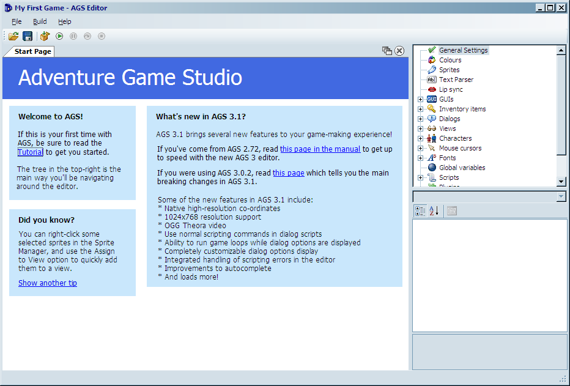
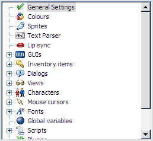
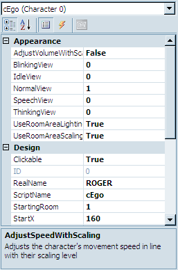
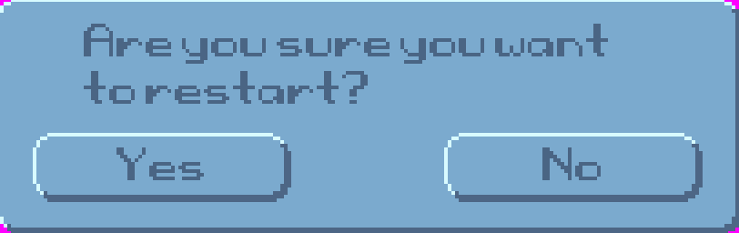
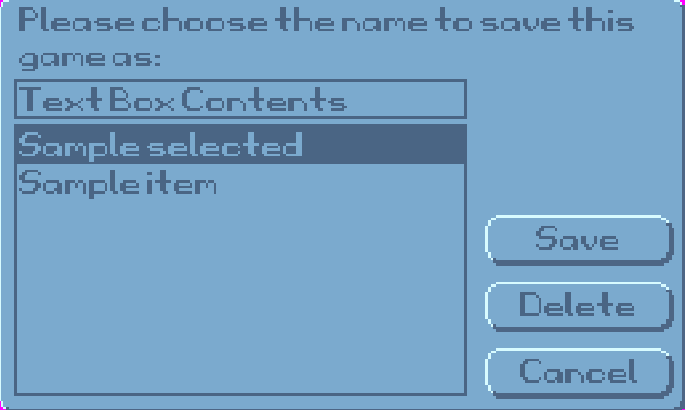
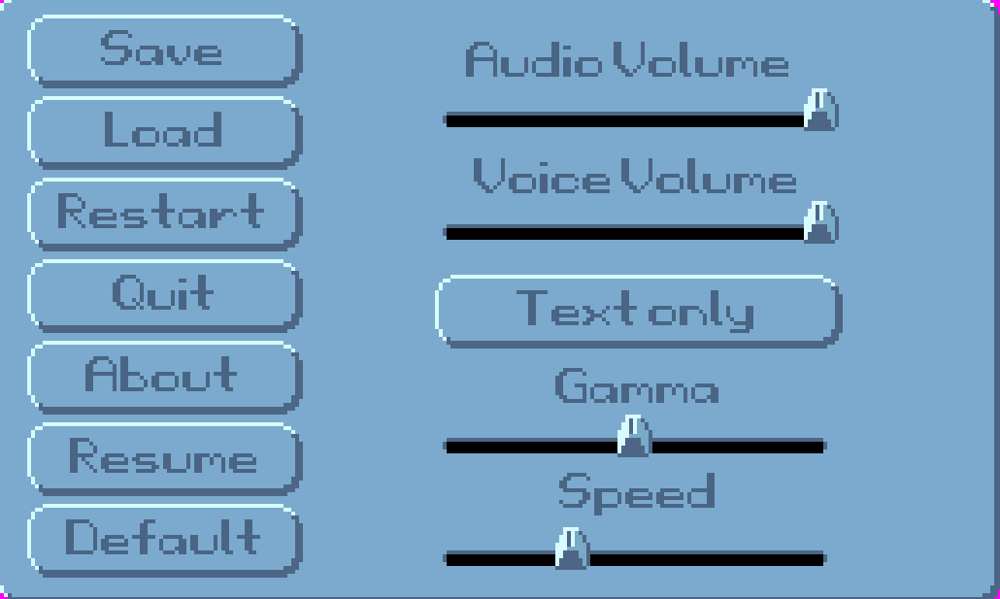

# The Editor

Just in case you missed the last screenshot of the editor, here it is again.  (I know I hate it when I have to flip back in a book!)

 **Figure 1.1: The Editor**

The editor consists of three main parts.  The big part in the middle, the Document Pane, is where you do all of your, um...editing. The section on the top-right shows a tree that looks much like [Figure 1.2](#figure12). This tree, called the Project Tree, allows you to open different editing panes.  Go ahead and get familiar with it by double-clicking the options.  You'll be using it a lot.

 **Figure 1.2: The Project Tree**

The bottom-right pane will show different things depending on what you're working on.  It is called the Properties Pane and allows you to change detailed attributes of whatever object you are currently editing.  Sounds like fun? Well it is! [Figure 1.3](#figure13) shows an example of what the Properties Pane looks like when editing a character.  If you'd like to see it for yourself, expand the **Characters** item in the Project Tree and double-click **cEgo**. In fact, double-click everything and look at the properties that come up.  More about this later.

 **Figure 1.3: The Properties Pane**

Let's talk a bit about the different types of editing panes that you can use within AGS.  We won't go into too much detail here, but just enough so you get familiar with what AGS can allow you to do within your game.

## General Settings

In the Project Tree, scroll all the way to the top and double-click on the item labeled **General Settings**. This opens the General Settings editor in the Document Pane, which allows you to specify some of the basic settings for your game like the resolution at which your game will run, the name of your game, the maximum score the player can achieve, as well as letting you put in information about who created the game.  There are lots of options here and we'll delve into most of the options in [Chapter 6](../chapter6/settings.html).

## Colors

The Colors editor lets you define colors within your game.  For the most part, you won't be using this editor too much if you selected a 16-bit or 32-bit color palette in the General Settings, but it can be useful for using colors within the AGS scripting engine. (If that last sentence didn't make any sense to you, don't worry about it for now; more will become clear later when we talk about colors in more detail in [Chapter 6](../chapter6/colors.html).)

## Sprites

Sprites are simply images within the game.  The character you saw in the default game, for example, is a sprite.  In fact, since the main character animates, it is actually composed of several sprites that play much like the frames of animation in a cartoon.  The Sprites editor is where you go to manage all of the sprites in your game.  Double-click on **Sprites** in the Project Tree, and you'll see several sprites appear in the Document Pane.  This isn't all of the sprites, however.  Notice that a new tree appears in the Document Pane, with the word *Main* at the top.  Expand this tree and click on the **Defaults** folder. This is where you'll see the sprites that make up the character, and in the subfolders, there are the sprites for all of the icons in the menu bar that we mentioned earlier.  The Sprites editor lets you import new sprites into your game and organize them into folders.  We'll be using sprites throughout the entire book, so you'll get very familiar with the Sprite editor.

## Text Parser

Do you remember the old games from Sierra like *Police Quest* and *King's Quest* where you had to type commands that you wanted the character to do and the computer would respond with ambiguous answers like, "You're not close enough"? Well, if you want to recreate games like those then the Text Parser is your friend.  Since the game we're creating in this book is not a text-style game, we will only briefly mention it in [Chapter 8](../../part2/chapter8/text_parser.html).).

## Lip Sync

AGS syncs with the lips and the lip syncing is the thing for AGS without lips.  If your adventure game shows a close-up portrait of the characters' faces when they are speaking, then you can use the Lip Sync editor to try to closely match the text that the characters are saying to their mouth movements.  Although this is a fairly rudimentary feature, it does the job quite nicely and it can really make a character look like he is speaking.

## GUIs

A GUI is a Graphical User Interface.  GUIs allow a user to interact with the game in some way.  It can allow you, as the game creator, to get information from the player of your game by asking questions ([Figure 1.4](#figure14)), getting input from the keyboard ([Figure 1.5](#figure15)), or allowing the player to change game settings ([Figure 1.6](#figure16)). AGS lets you make GUIs for all of these purposes and more.  You can even make GUIs to interact with characters.  You'll have to wait until you get to [Part 2](../../part2/part2.html) for more on this. (NOT KIDDING.  NO PEEKING AHEAD!)

 **Figure 1.4: Question GUI**
 
 

 **Figure 1.5: Input GUI**
 
 

 **Figure 1.6: Settings GUI**

## Inventory Items

Inventory items are used extensively in most adventure games.  Usually, the main character collects items during the game to use at specific points in the game.  This is the editor to use to create all these items.  Go ahead a look at the default items that are in there now.  You'll soon get very familiar with this editor.

## Dialogs

The Dialogs editor allows you to create interactive conversations that can take place between characters.  You can develop question and answer interactions between characters and have the game proceed differently depending on the answers the player chooses.  This is actually a lot of fun.  We'll see more of this in [Chapter 8](../../part2/chapter8/)

## Views

A view is simply a collection of animations.  Any animation that you use in your game will be represented by a view.  For example, the animation that you see when your main character is walking comes from a view, as does the animation that you see if a cup falls off of a table and smashes on the ground.  Go ahead and double-click on **VIEW1** and take a look at the editing pane.  This is the default view for the main character's walking animation.  Since animations are an integral part of an adventure game, making views is going to be one of the most important parts of creating your game.  We'll delve extensively into views in [Chapter 2](../../part1/chapter2/)

## Characters

The Characters editor is where you create the characters that are in the game.  Not only is the main character created here, but any character that the main character interacts with would be here as well.  The Character editor allows you to specify attributes of each character; including which room the character starts in, which views are used to represent the character, the speed at which the character walks around on the screen, and other such things.

## Mouse Cursors

AGS allows you to make many differently shaped mouse cursors to use throughout the game.  If you look at the first four cursors in the Project Tree, you will notice that they are the ones that appear in the sample game you created earlier.  The mouse cursors you create here can be a single image, or they can be associated with a view, which allows your mouse cursors to animate. You'll learn more about cursors in [Chapter 6](../../part1/chapter6/cursors.html) 

## Fonts

AGS lets you use different fonts to represent text in your game.  However, you cannot use a font without first importing it into the Fonts editor.  The Fonts editor supports true type fonts (TTF) as well as SCI (Sierra Creative Interpreter) fonts, which are fonts used in the old Sierra games like *King's Quest* and *Space Quest*. More about this when we talk about GUIs later.

## Global Variables

Global variables are associated with scripting (If you don't know what a script is, look at the next section really quick and come back here).  Variables are objects that you use in scripts that hold values.  Normal (non-global) variables can only be used within a specific script file or room.  A global variable, however, can be used in any script.  This editor is a place to define your global variables for use within your game.  If this is all foreign to you, don't worry about it now.  You'll pick all this up as we go along.

## Scripts

Scripts are, more or less, instructions that you give AGS to tell it to do specific tasks.  It's basically the nuts and bolts of your game.  There are certain things you will want to do within your game that you just can't do with any of the other editors in AGS, and scripting allows you to do those things.  You will quickly find out that scripting is a very important part of creating adventure games.  Go ahead and double-click a few scripts and get a feel for what they look like but know that we will be including scripting all throughout this book and you'll get familiar with it soon enough, so don't let it scare you right now.

## Plugins

Plugins are extensions to AGS that give it extra functionality.  They can be written by anyone and distributed to be used in making games.  Plugins are not necessary to create a game and are beyond the scope of this book.

## Rooms

Rooms are very, very important.  Think of it this way: There would be NO game if there was not at least one room and one character.  A room is where the action takes place in your game.  Don't let the word "room" confuse you - a room is anywhere action takes place in your game, regardless of whether it's a typical room with four walls, a floor, and a ceiling.  A forest, for example, can be a room, and a meadow could also be a room.  A room in AGS will contain the background graphic, any objects that are in the room, the room script, and other room goodies like regions, hotspots, walkable areas, edges, and walk-behinds.  There is one room already created in the default game.  Open the Rooms item in the Project Tree, then expand the item labeled **"1:."** This is the default room.  Double-click **Edit room** to see the graphics.  Double-click **Room script** to see the script file.  There's not much to see here now, but this will grow as we add things to our room later on.

## Translations

Je ne sais pas ce que c'est.  Was? Verstehest du nicht?  That's why you need translations.  If you're going to make your game to be playable by people who speak different languages, you'll want to use the Translations editor.  This allows the text in your game to be translated into different languages. We will tell you more about this later.
