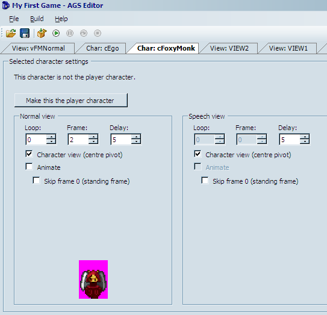

# Characters

Now that we have a view for Foxy Monk, we should be able to easily create a character of her.  Start by right-clicking on **Characters** in the Project Tree and selecting **New character**. This will create a new item in the tree called `1:cChar1`. Ick! What a horrible name.  Let's give our character a proper name.  Click on `cChar1` in the tree to select it.  Remember when we talked about the Properties Pane?  We'll get to use it now to set up our new character.  Look at the Properties Pane and find the section called `Design`. In this section you should find two important properties: `RealName` and `ScriptName`.  `RealName` is the actual name you want to give to your character.  As you can see, the real name of the character right now is "New character." Double-click on `RealName` and Type in Foxy Monk, and then hit Enter. Now isn't that better? Let's turn our attention to the `ScriptName` field now. The script name is the name that you will be using to refer to your character when writing scripts.  In other words, this is the name that AGS will use to refer to the character.  AGS assigned the name `cChar1` to it by default. The lowercase **c** in this case stands for "character" and is there to let you know that this is a script name for a character when you're scripting later.  (Remember we did something similar with a view in the previous section.)  Double-click on `ScriptName` and type in **cFoxyMonk** and then hit **Enter**. Please note that this name shouldn't have spaces.  And that's all there is to naming a character.

> **Side Note:** For you programmers, the script name is the variable name.

Now that your character has a name, we need to give it a face.  Well, a view actually.  Find the section in the Properties Pane named `Appearance`. Under this section you should find 5 types of views: `BlinkingView`, `IdleView`, `NormalView`, `SpeechView`, and `ThinkingView`. The names of these views should give you a hint as to what they're for.
* The blinking view is the animation that is displayed when the character blinks.
* The idle view is the animation for the character when it's just standing there doing nothing.  This view is activated automatically after a certain amount of time passes without doing anything (we'll talk about this later.)
* The normal view is, well, the normal view.  This is the view that the character will have when it's standing or walking and is the most used view.  We created this view earlier in this chapter.
* The speech view is the animation used when the character is talking.
* The thinking view can be used to make the character look like it's thinking about something.

AGS automatically uses the right view when the character is doing each of these actions, so you don't have to think about it.  For example, if you have a view assigned for the speech view, then AGS will automatically switch the character's view to the speech view when it's talking, and switches back to the normal view when it's done.

What is most important for us is the normal view.  We want Foxy Monk to look like the view we just created when she's standing and walking. AGS assigned View 1 to Foxy Monk by default but that's not the one we want.  Double-click `NormalView` in the Properties Pane and type in **3**, and then hit **Enter** (view 3 was the view we created in the last section, remember?) Now if you look at the Editing Pane you should see Foxy Monk appear as in [Figure 2.16](#figure).

 **Figure 2.16: Foxy Monk's Character**

Let's play around in the Editing Pane and watch Foxy Monk in action.  Start by clicking the **Animate** checkbox. You should see Foxy Monk start walking.  Neat huh?  Click the **up** or **down** arrow under Loop and you should see Foxy Monk change directions.  There should be 4 loops that you can cycle through.  Also, note that the Frame box continuously changes as Foxy Monk walks.  Let me know when you're done playing with that...

Ok, so we have a character, and she walks. I'd say it's about time to see this character in action.  Go ahead and run the game now.  Seriously! Don't read anymore until you run the game.

Oh no! Where's Foxy Monk?  Don't panic.  Now, I know we haven't talked about rooms yet, but in order to see Foxy appear in the game, we have to move her to the first room in the game; the room that the default blue-suite character is currently occupying.  By the way, his name is Roger, if you haven't already figured that out.  Go back to the Properties Pane and find the `Design` section.  There you will see a property called `StartingRoom`. Change this property to 1 and run the game again.  Voila! Foxy is here! And so is the default guy, errr, I mean Roger.  Now click somewhere to move her around.  Oh, wait wait wait.  She's not moving.  Roger is.  Back to the drawing board!  We want Foxy to be the main character, not Roger.  Did you notice that large button labeled "Make this the player character" back in the editing pane ([Figure 2.16](#figure216))? Click this button to make Foxy Monk the main character.  Now she will replace Roger as the character that you play.  While we're at it, let's go ahead and take Roger out of the game.  Double-click on **cEgo** (yes, that's his script name) under Characters in the Project Tree and change his starting room to `(None)`. While you're there, go ahead and look at the `StartX` and `StartY` parameters in the `Design` section. These are the X and Y coordinates for where in the room the character will initially be.  Copy those numbers (127, 142) over to Foxy Monk's properties.  If you don't do this, she'll start in that tree trunk looking thing and won't be able to move (We'll talk about Walkable areas of rooms later.) Now run the game again.  Foxy Monk should appear all by herself and you should be able to move her around.

Let's explore a few other character options.  I don't know about you, but to me, Foxy was moving a bit too slow around the screen.  Double-click on Foxy's character in the Project Tree and go back to the Properties Pane.  Find the `MovementSpeed` option under the `Movement` settings and increase it from 3 to 6.  Run the game now and see if you like her speed better.  Woohoo!

