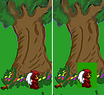

# Sprites

The first step in creating a character is to draw some sprites.  Our character is going to be a fox in a monk outfit with angel wings.  (hmm.  SOMEONE was drunk!)  Find the file named *foxy_monk.bmp* to follow along. [Figure 2.1](#figure21) shows a quick snapshot of the file.  I know you can't tell that it's a fox.  So what!?  If you want to create your own sprites, then go for it.  We'll wait...

 **Figure 2.1: Foxy Monk Sprites**

As you can see, there are 12 sprites in this file.  They each take up the same amount of space to make importing them easier, but that is not necessary.  Most of the time, an artist will put many individual sprites into one image file to reduce the number of files needed to create the game, making each sprite the same width and height.  That way, the sprites can be aligned in a tiled pattern, as in our example above.

Once you have your sprites saved in a file, the next step will be importing them into your game.  Open the Sprites editor by double-clicking **Sprites** in the Project Tree.  You will see two panes open up in the editing area ([Figure 2.2](#figure22)). On the left is a list of folders that contain sprites.  This is simply a way for you to organize the sprites within your editor.  For example, you might want to have all of the sprites associated with a character in a folder with the same name as that character.  Your final game could easily contain hundreds, if not thousands, of sprites, and getting into this habit of organizing your sprites will make it easier to find and manipulate sprites later.

 **Figure 2.2: Sprites Editor**

Let's create a folder to contain all of our sprites for Foxy Monk.  First, right-click on the **Main** folder on the left editing pane and click **Create sub-folder** and call this folder *FoxyMonk*. The right editing pane will now be empty since there are no sprites in this folder (duh!).  Let's fix that by adding a few sprites.

To start importing your sprites, **right-click** in the right editing pane and choose **Import new sprite from files**... This will bring up the good ol' Windows file open dialog.  Find your file and **double-click** it. You should then see the Import Sprite window open as in [Figure 2.3](#figure23).

 **Figure 2.3: Import Sprites Window**

As you can see, AGS loaded your file and is ready to import the sprites.  Let's tell it how we want the file divided up.  Use the zoom slider to make the picture bigger so you can see it easier. Hold the mouse at the top-left corner of the picture.  Click and hold the mouse button.  Drag the mouse down and to the right until the first image has a box around it as in [Figure 2.4](#figure24). Note that in this case, the mouse location needs to end up at position (24,32) because that's the size of each of our sprites (you can see your mouse location as you are highlighting the sprite).  Click the **Import** button now and your first sprite is imported!  Feels good on the inside, doesn't it? Well good.  Now all we have to do is repeat the above steps 11 more times to import the rest of the sprites for Foxy Monk.  (sigh)  If only there was a better way...

Well, there is!  But first let's delete the sprite you just imported (it will be easier this way, trust me.)  Click on the newly imported sprite and hit the **delete** key and click **Yes** when asked to confirm.

 **Figure 2.4: Highlighting a Sprite to Import**

Let's start the process again, and this time we'll use the fact that the sprites are tiled to our advantage.  **Right-click** the middle pane and choose **Import new sprite using previous files...** This option will open up the last file so you don't have to hunt for it again.  Zoom in if you like, but make sure that the entire image stays visible (this will be important in just a second).  Click the **Tiled sprite import** checkbox on the left. Tiled sprite import allows you to select all the sprites that you want to import at once, as long as they are all the same size.  Change the **Number of tiles** to 12. Move the mouse pointer to the top-left corner of the image and highlight the first sprite exactly as you did before.  Now when you let go of the mouse button, you'll notice all 12 sprites are outlined as in [Figure 2.5](#figure25). Click the **Import** button now and all your sprites should be imported! Yay!

 **Figure 2.5: Tiled Import**

One other thing to note.  Did you notice that our sprites have a green background?  This green area won't be drawn when the game is played, thanks to something called *transparency*. The Import Sprite dialog has an area on the left called *Transparent colour*. This allows you to tell AGS what the transparent color is in your sprite.  Any pixel that is the same color as the transparent color will be invisible when you play your game.  If this weren't set correctly in our sprite, Foxy Monk would always have a green rectangle behind her ([Figure 2.6](#figure26)).

 **Figure 2.6: On the left, the Foxy Monk sprite has proper transparency.  On the right, transparency is not correct and you can see a green box around the sprite.**

