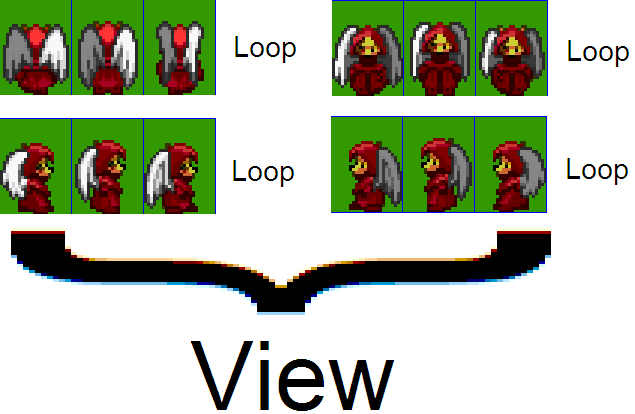
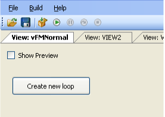
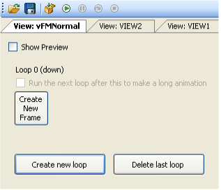
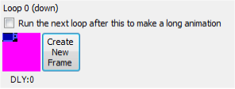
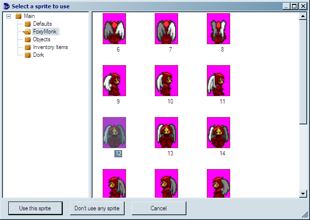
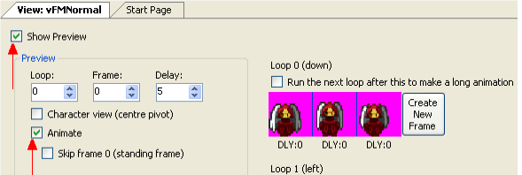
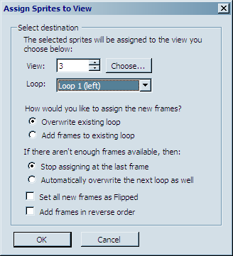
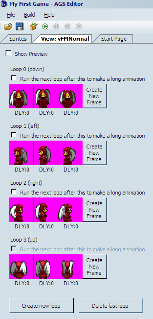

# Views

Now that we have the sprites imported for our character, we need to create a View for the character.  We told you earlier that a view is a collection of sprites that make up an animation.  We lied (sorry!).  A view is actually a collection of loops, and a loop is a collection of sprites.  Put another way, a loop is an animation, and a view is a collection of animations.  To understand this, let's use our Foxy Monk as an example.  In our image, we had 12 sprites.  The first 3 images show Foxy Monk walking away from us, the second 3 show her walking to the right, the next 3 show her walking towards us, and the last 3 show her walking to the left.  Each of these directions (up, down, left, and right) is a separate animation (loop), and they will all be contained in a single view that represents Foxy Monk walking ([Figure 2.7](#figure27)).

 **Figure 2.7: Foxy's View**

In AGS, the 4 loops that are associated with Foxy Monk walking will all reside in the same View.  So later, when we assign this view to Foxy Monk, AGS will automatically know to use loop 0 when she's walking down, loop 1 when she's walking to the left, loop 2 when she's walking to the right, and (you guessed it) loop 3 when she's walking up.  In case you're wondering how AGS knows that those loop numbers go with those directions, it's something that's built into AGS.  Loop 0 is *always* the loop for down, loop 1 is *always* the loop for left, etc.  The list of loops and the associated directions is listed in [Figure 2.8](#figure28). The first four loops (loops 0 - 3) are required; if your view does not contain at least four loops, AGS will create them for you automatically.  However, the rest of the loops are optional; that is, you don't have to create loop 4 if you don't want to have a separate animation for your character walking down and to the right.  In this case, AGS will make an educated guess as to which of the four "cardinal" directions to apply to your character when it is walking in a direction that is not explicitly up, down, left, or right.

<table width=100%>
<tr><td><b>Loop</b></td><td><b>Direction</b></td></tr>
<tr><td>0</td><td>Down</td></tr>
<tr><td>1</td><td>Left</td></tr>
<tr><td>2</td><td>Right</td></tr>
<tr><td>3</td><td>Up</td></tr>
<tr><td>4</td><td>Down-Right</td></tr>
<tr><td>5</td><td>Up-Right</td></tr>
<tr><td>6</td><td>Down-Left</td></tr>
<tr><td>7</td><td>Up-Left</td></tr>
</table>

**Figure 2.8: Loops and their directions**

Let's create the view shown in [Figure 2.7](#figure27). Expand **Views** under the Project Tree.  If you created the default game and have been following along, you will already have two views listed there (VIEW1 and VIEW2).  We could change one of those views to suit our needs, but for purposes of demonstration let's go ahead and make a new one. Right-click on **Views** in the Project Tree, select **New View** from the popup menu, and name the view `vFMNormal`. Whoa! That's a weird name.  What the heck does `vFMNormal` mean, anyway? Well, as a general rule, you can name things in AGS whatever you want, but if you follow some simple nomenclature it will make your life much easier when your game gets larger.  In this case, our view name begins with a lowercase "**v**." This stands for "view" and it's there just so that we immediately know just from looking at the name that `vFMNormal` is a view. The "**FM**" part of the name stands for Foxy Monk, and "**Normal**" means that this is Foxy Monk's normal view.  (We'll talk about what a normal view is in the next section.)

> **Side Note:** You might be wondering why we're making such a big deal about how things are named within AGS.  After all, why name a view starting with a lowercase "v" when it's obvious that the view is a view, since it's in the Views section of the Project Tree?  This is a good question, and if we always dealt with our views and other things solely from the Project Tree then we might not need to be picky about the names.  But, as you'll find out later, we will be using many of the names we create when we talk about scripting, and we won't want to have to refer back to the Project Tree to remember what we named our stuff.  If we're always consistent with the way we name things, then a name like vFMNormal will actually be much easier to remember than if we'd named the view Banana or something arbitrary!

Ok, we've created a view, now what?  If you've been paying attention you should be able to answer this question yourself.  We need to create our four loops!  Open `vFMNormal` view if it isn't already and notice that there are no loops created yet ([Figure 2.9](#figure29)).

 **Figure 2.9: Our new view with no loops or sprites**

 **Figure 2.10: Our new view with one loop.  It doesn't have any sprites assigned to it yet.**

Let's fix that now.  Click the **Create new loop** button and Loop 0 will be created as in [Figure 2.10](#figure210).  There are three buttons here: **Create New Frame**, **Create new loop**, and **Delete last loop**. These should be self-explanatory, but just in case, we'll discuss each of them.  Click the **Create new loop** button. A second loop will appear called (Loop 1).  Now click **Delete last loop** to delete it. This is how you would create and delete loops from within the view editor.  Go ahead and click **Create new loop** three times to get our four main loops.  Now we'll assign sprites to Loop 0.  Click the **Create New Frame** button under Loop 0, and you'll see a blue cup sprite appear ([Figure 2.11](#figure211)). The blue cup is the default sprite that AGS uses when it knows a sprite should be there but you haven't told it which sprite to use yet. Double-click the blue cup and AGS will bring up a dialog box to let you choose a sprite to use.  Click the *FoxyMonk* folder on the left, and choose the first of the three sprites that shows Foxy Monk walking down.  Click **Use this sprite** ([Figure 2.12](#figure212)). The blue cup has been replaced by Foxy Monk.  Rock on!  Since we have three sprites for Foxy Monk walking down, this loop will need to have three frames.  **Click Create New Frame** and watch closely at what happens.  Now, instead of a blue cup appearing, AGS is smart and it automatically selected the *next sprite* in the animation.  Click **Create New Frame** again and it will get the third frame.  How does AGS know which sprite to use when you create a new frame?  Well, it doesn't really.  AGS just selected the next sprite in our list of sprites.  Since we imported all the Foxy Monk sprites at the same time, the next sprite in our list was the next sprite in the animation.  This is common enough that AGS automatically selects the next sprite for you.  This is also why it's always a good idea for your sprite file to have the images in the right order and not strewn about every which way.

 **Figure 2.11: The default Blue Cup appears when AGS doesn't know which sprite to use**

 **Figure 2.12: Choose the first down facing sprite**

Now that we have three frames of animation for loop 0, it would be nice to see what the animation looks like.  The view editor provides a nice way for you to preview the animation without having to run the game.  To see the loop animated, click the **Show Preview** checkbox above Loop 0 ([Figure 2.13](#figure213)), and then click **Animate** from amongst the new checkboxes that appeared.  Aww, look.  Foxy Monk is walking, ain't she just precious?  Wittle Foxy-woxy Monky-wunky is just da cutest wittle thing!  Errr.. ahem...

 **Figure 2.13: The Show Preview and Animate checkboxes**

What we just walked through was one way to create a loop and assign it to a view.  Let's look at another (easier) way to do the other three.  This time choose **Sprites** from the Project Tree to bring up the Sprite editor.  Click the *FoxyMonk* folder so we can see Foxy Monk's sprites.  Let's select all the sprites that will make up Loop 1 (left).  Find the three frames that show Foxy Monk walking to the left.  Click the first of those three sprites, hold down the shift key, and click the last one.  This will highlight all three sprites of her walking to the left.  Now **right-click** on any of those three sprites and click **Assign to View**. You will see the Assign Sprites to View window, as shown in [Figure 2.14](#figure214). Under View, choose the view to which you want to assign this animation (view number 3 in our case).  (Alternatively, you can click the Choose button and select the view that way, but if you know the view number you can just type it in.)  For Loop, choose Loop 1 (left).  The next question it asks is, "How would you like to assign the new frames?" Select Overwrite existing loop, since our loop is empty anyway.  Leave the default options for everything else and click **OK**. A dialog box will appear that says, "The selected sprites were assigned successfully." Click **OK**. Now, go back to your view, and you'll see Loop 1 populated with Foxy Monk walking left!

Repeat the above steps to create Loops 2 and 3 for Foxy Monk walking right and up, respectively.  Your view should end up looking like [Figure 2.15](#figure215) when you finish. 

 **Figure 2.14: Assign to View dialog**

 **Figure 2.15: Foxy Monk's Normal View**

