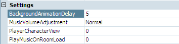

# Animating Backgrounds

Let's do one more cool thing with backgrounds before we move on.  As you might have guessed from this section's title, we're going to add animation in the background.  And what better to animate than the pond.  Normally, when one is taking a long stroll by a water pond, with a windowless shed and a tree in the park, one would notice that the water ripples ever so slightly as the wind whispers around it.

To make an animating background, you need to simply copy your background image for each frame of animation you want and change the parts of each image that should be animated (in our case, the pond).  AGS allows you to have up to 5 frames of animation that make up your animating background.  We've already created 5 background images for you that show the animating water (aren't we nice?) In each image, the water in the pond is slightly different so, when they are animated it will look like the water is rippling or waving.

Ok then! Let's ripple us some water.

Quit the game if it's running and go back to the room editor and edit room 1 by double-clicking it. Click the **Change...** button to change the background and choose the file named *RipplePond1.bmp*. You should see some white areas show up in the pond.  This will be the first image that we're going to add to the background to create the ripple effect.  To add the other 4 images, open the drop-down box next to **Background:** (this will say "Main background") and choose **Import new background**. Say **Yes** to the popup and choose the file *RipplePond2.bmp*. Do the same thing 3 more times choosing the next *RipplePond* files in the series.  Ta da! You have an animating background.

Run the game now.  When Foxy shows up to the tree-pond-windowless-shed park now, she'll be able to enjoy a nice ripply pond to stroll next to.  But hang on a minute.  We think the water is moving just a bit too fast.  With that speed, we'd have to make the tree sway back and forth too.  We're too lazy for that, so let's just slow the water down.  Look at the properties pane for the room and find the `Settings` section. You'll see a setting called `BackgroundAnimationDelay` ([Figure 3.12](#figure312)). Change this setting from 5 to 15. (We played with it and thought 15 looked best.  You can do whatever delay you like.) And that's it!  Now to take care of that whole walk-on-the-tree-trunk business...

 **Figure 3.12: Background Animation Delay**

