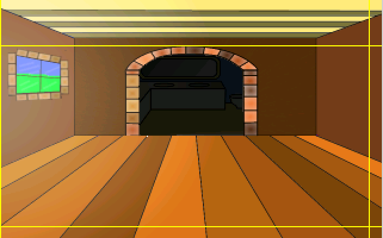
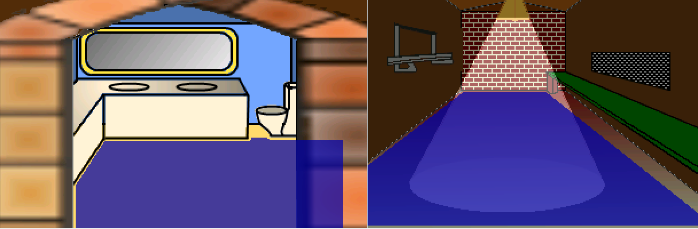
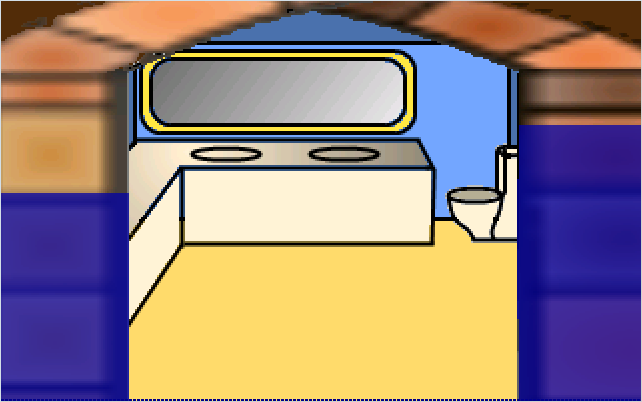
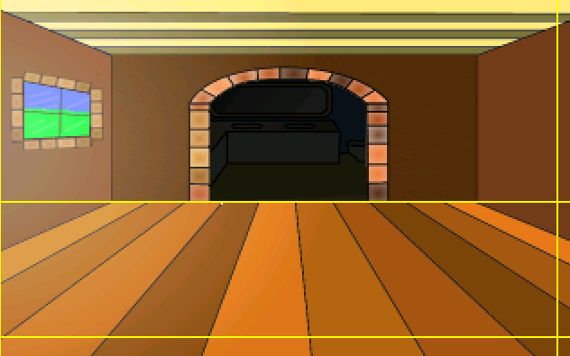

# Room Edges

Regions are one way to change rooms, but it's not always the best way.  Most of the time room changes will occur as the character walks off one of the room's edges.  Unless you want to do some teleporting, of course.

The first thing we should do is allow Foxy to leave the shack and get back out that door.  We could create a region at the bottom of the shack floor and put some code in place for that region to move Foxy out to the pond area, or we could use the room's bottom edge for that.  Since changing rooms happens at the edges most of the time, room edges cut down on some of the work of having to draw the regions.

tart by choosing **Edges** from the ellipsis at the top of the room editor. (We're assuming you know where this is by now.)  You should see 4 yellow lines -- one for each edge ([Figure 3.22](#figure322))

<a name="figure322"></a>
<span><br>**Figure 3.22: Room Edges**</span>

Be aware that one or more of the edges might be, literally, right up along the edge, so look hard to find them (The left edge in [Figure 3.22](#figure322) is flush against the left side.) Just like you can create a function that runs when a character enters a region, you can also set up a function that runs when a character crosses one of these edges.  To leave the shack, we want to fire up a function when Foxy crosses the bottom edge (where she came in).   We need the bottom edge to be moved up a little so that Foxy can actually cross it.  Click and drag the bottom edge so that the y coordinate (the second number in the Mouse Position) is set at about 188.

Now let's write the function. Make sure that the Properties Pane is set for the room itself by choosing `Main Hall` from the drop-down then click the lightning bolt between the Project Tree and the Properties Pane (see [Figure 3.18](regions.html#figure318) if you don't remember where the lightning bolt is.) You should see some events pop up.  One of these events should be `Walks off bottom edge`. Click on that event and then click on the ellipses button on the far right that will pop up.  This is going to create the function, link to the event, and place you in the function (script) editor.  The code for this function is going to be very similar to the code for the region we created earlier and looks like [Listing 3.2](#listing32).

> **Side Note:** From now on, when we refer to the edges of a room, we will be talking about the edges that we can drag and NOT the physical edge of the picture.

<a name="listing32"></a>
```agsscript
function room_LeaveBottom()
{
  cFoxyMonk.ChangeRoom(1, 634, 108);
}
```
**Listing 3.2**

As you can see, the differences between this function and the last one we wrote are the name of the function, the room number to change to, and the x,y coordinates.  We chose those coordinates by looking at room 1 (the Pond) and placing the mouse where we want Foxy to be when she comes out.  Oh, and make sure not choose chose any x,y coordinates that are right in the region we created in room 1. Otherwise, Foxy will never be able to leave the shack because as soon as she does, she'll step on the region and come right back in.

And that's all there is to edges.  While we're here, let's go ahead and create the two remaining rooms in the shack and create edges to get into and out of them.  Find two files named *ShackRoom2.png* and *ShackRoom3.png*. Create two new rooms with those files as backgrounds.  Make *ShackRoom2.png* room 3 and *ShackRoom3.png* room 4. Well ok, so the numbering can get confusing.  Live with it.  Name room 3 "Bathroom" and room 4 "Longroom." Hopefully, you remember how to do all that.  Now create walkable areas in both rooms that look something like [Figure 3.23](#figure323). 

<a name="figure323"></a>
<span><br>**Figure 3.23: The Other 2 Rooms in the Shack**</span>

And yes, we know that the walkable area in the bathroom goes behind the wall, so guess what you have to do with that.  Yep, create a walk-behind for it so it looks like [Figure 3.24](#figure324) (we created two.) And remember to set the baseline for your walk-behind all the way at the bottom so that Foxy will always be behind that wall when she walks there. (You can see ours as a dotted blue line all the way at the bottom.)

<a name="figure324"></a>
<span><br>**Figure 3.24: Walk-behinds in the Bathroom**</span>

Great! Now we're ready to add some functions for two more edges in our first shack room.  Let's start with the bathroom.  Go back to editing room 2's edges and drag the top edge so that it's just at the junction where the floor meets the walls ([Figure 3.25](#figure325)). Once the edge is in the correct spot, create a new function for the `Walks off top edge` event (hint: click the ellipses button next to the event) and make it so it looks like [Listing 3.3](#listing33). 

<a name="figure325"></a>
<span><br>**Figure 3.25: Set the Top Edge at the Bottom of the Wall**</span>

<a name="listing33"></a>
```agsscript
function room_LeaveTop()
{
  cFoxyMonk.ChangeRoom(3, 160, 189);
}
```
**Listing 3.3**

Before running the game, go ahead and add the right edge function to move Foxy to room 4.  I'll let you do that on your own.  Run the game and walk around.  Then, once you realize that your stuck either in the bathroom or the longroom, go ahead and write the functions to exit out of those rooms using the bottom edge of the bathroom and the left edge of the longroom.  Our code for that is in [Listing 3.4](#listing34). The first function is in room 3's file and the second function in room 4's. 

<a name="listing34"></a>
```agsscript
function room_LeaveBottom()
{
  cFoxyMonk.ChangeRoom(2, 159, 118);
}

function room_LeaveLeft()
{
  cFoxyMonk.ChangeRoom(2, 310, 168);
}
```
**Listing 3.4**
