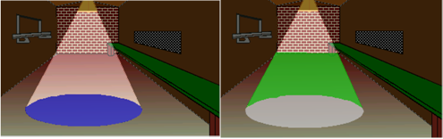

# Lighting

Some of you may have noticed that there's a light in the Long Room.  I'd say as   long as there's that light there, let's use it to our advantage and create a lighting effect for Foxy.  Edit room 4 and create two regions right under the light (blue region) and in the cone of the light (green region) as in [Figure 3.26](#figure326)

 **Figure 3.26: The Two Lighting Regions**

Now here's how easy it is to set the lighting.  Choose **Region ID 1** (left image) from the dropdown between the Project Tree and the Properties Pane. Change the `lightLevel` property from 100 to 150.  Choose **Region ID 2** (right image) and change that light level from 100 to 120.  Run the game and go into that room.  Walk around in and out of the regions and watch how the lighting on Foxy changes.

All regions start out with a default lighting level of 100%, but AGS allows you to change that level from 0% (pitch black) all the way up to 200% (very bright). Easy peasy.

