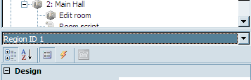
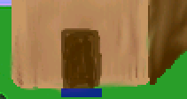
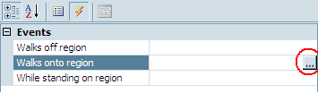
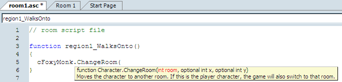
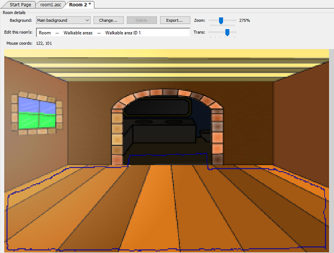
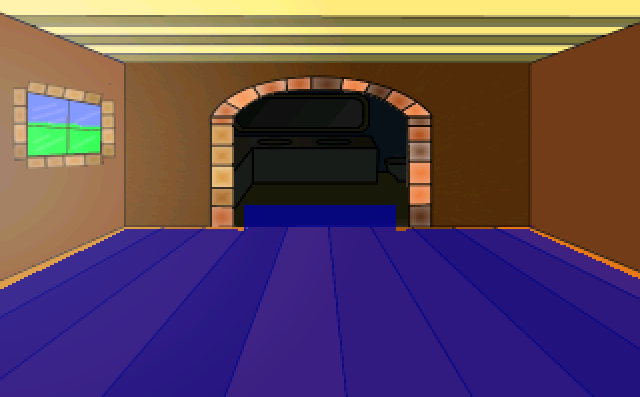

# Regions

A Region is basically a place that the character walks onto and something happens.  That makes no sense; let me try again.  A region can be a spot that triggers an event and/or changes the environment.  For example, you could change the light level or color tint in that region.  You can also trigger events when a player walks INTO the region, OUT OF the region, or is just STANDING in the region.  I believe this could best be explained with an example.  So, guess what?

Nope, you guessed wrong! We're going to add another room!!!  And what better place to add a new room than inside our shack?  You can draw your own room of course, but we did the hard work, and you should be able to find a file called *ShackRoom1.png*, which will become the inside of our shack.

To start, right-click on **Rooms** in the Project Tree and choose **New Room**. Keep the default options and click **OK**. Double-click on **Edit room** under **2:**. in the Project Tree and go ahead and give this room a good name by typing in a name in the `Description` field of the Properties Pane. We're calling ours `Main Hall`.

Now think way back to when you first added a background to a room.  Do you remember how you did it?  Good! Add a background to this room using the file *ShackRoom1.png* (or one that you made).

Great! Now we need a way for Foxy Monk to be able to walk from outside the shack to inside.  That's what we'll use a region for.  We're going to put a region right in front of the door on the outside of the shack.  Basically, when Foxy Monk steps onto the region it would be as if she walked through the door.  Go back to the Project Tree and double-click **Edit room** under **1: Pond** to edit room 1. (Notice that AGS will only allow you to edit one room at a time.  Whenever you start editing a room, it will close the previously opened room.)  Scroll and zoom the background of the Pond room so you can see the shack's door on the right.  Now, select **Regions** from the ellipsis next to **Edit this room's**. Look at the space between the Project Tree and the Properties Pane.  You should see a drop-down box.  This is where you select which region you want to work with.  AGS allows you to have up to 15 regions.  Region 0 is an eraser region and can't be used for what we want (you use it to get rid of other regions.) Choose **Region ID 1** from the drop-down box so we can draw our first region. ([Figure 3.16](#figure316)). 

<a name="figure316"></a>
<span><br>**Figure 3.16: Choosing Region 1**</span>

Drawing a region is very much like drawing a walkable area.  Enclose the area for the region with a drawing tool and fill it in.  To make our door-to-the-shack region, we chose the Rectangle tool (The blue box in [Figure 3.5](walkable_areas.html#figure35)) and made a small rectangle right in front of the door as in [Figure 3.17](#figure317). Don't make this rectangle too big, otherwise Foxy Monk will go inside the shack when she's far away from the door and that would be just crazy.

<a name="figure317"></a>
<span><br>**Figure 3.17: Region in Front of the Door**</span>

That's all there is to making a region; Except for that whole scripting thing.  But before we start scripting, we need to add an event to that region. You see that thunderbolt symbol in [Figure 3.16](#figure316)? Good.  Go ahead and click that.  Once you click it, the Properties Pane will change to show 3 different events:

* Walks off region
* Walks onto region
* While standing on region

This tells us that we can do something when the character walks off of the region, do something else when the character walks onto it, or do something repeatedly as long as the character is standing on the region.  For our purposes, we want to use the `Walks onto region` event to make Foxy Monk change rooms when she walks up to the door.  To create the script, click on `Walks onto region` and then click the **ellipses** that will show up to the right of the input area next to the `Walks onto region` option (Red circle in [Figure 3.18](#figure318)). Doing this will open the script editor for room 1.  (The script editor can also be opened by double-clicking **Room script** in the Project Tree, but that will not add events; it will just open the script editor.)

<a name="figure318"></a>
<span><br>**Figure 3.18: Click the Ellipses to Add a Script**</span>

Now for the fun stuff.  Oh boy, we're going to get into a bit of scripting now.  Don't worry; it's really not as hard as it sounds.  AND it doesn't sound hard.<br>
Huh?<br>
You should see a new function called `region1_WalksOnto()`. A function is a set of instructions that are grouped together to perform a certain task.  Nifty huh?  Make the function look like [Listing 3.1](#listing31).

<a name="listing31"></a>
```agsscript
function region1_WalksOnto()
{
  cFoxyMonk.ChangeRoom(2, 155, 184);
}
```
**Listing 3.1**

Let's dissect this line-by-line:
```agsscript
function region1_WalksOnto()
```
This line declares the function `region1_WalksOnto` that AGS created for us. Notice that the word `function` is <font color="blue">blue</font> -- this tells you that it's a word that has special meaning in AGS's scripting language.  In this case, the word `function` means that we are beginning to define a function, and the name that follows, `region1_WalksOnto`, is the name of the function we're defining.

Following the name of the function we would define any parameters that need to be passed to the function to help it work.  For example, there's a function called `Say` that is used to cause a character to say something.  Well, if we were using that function, we would need to tell it what the character should say.  This text would be passed to the function as a parameter. Function parameters are included in parentheses after the function name.  (The `region1_WalksOnto` function doesn't require any parameters, so there's nothing within the parentheses.)
```agsscript
{
  cFoxyMonk.ChangeRoom(2, 155, 184);
}
```
These next lines are the body of the function.  Everything within the curly braces is considered part of the function.  In our case, there's only one instruction in our function.

Remember when we were creating Foxy Monk, there was an attribute in her character properties called `ScriptName` and we set it to `cFoxyMonk`? Any time we want to refer to Foxy in the script, we have to call her by her Script Name (appropriate, eh?).  So, you can see above that we say `cFoxyMonk.ChangeRoom`. This causes Foxy Monk to eat a jelly donut.  No wait!  I mean it causes her to change rooms.  This time we're *calling* a function instead of *defining* one. But what are all those numbers for in the parentheses?  Those are the parameters that the `ChangeRoom` function needs. If you were observant (and assuming you didn't just copy and paste the code above but actually typed it) you would have noticed that when you typed that open parenthesis after the `ChangeRoom` function, there was a tool tip that popped up ([Figure 3.19](#figure319)). If you did happen to copy and paste the code, or if you just didn't see this tool tip pop up before, you might want to try to re-type this line into AGS by hand so that you can see it.  This tool tip is there to help you remember what parameters are required for the function that you are using.  The first parameter for `ChangeRoom` is called `room`, and it's an integer number (we know that because it has an "int" in front of it, which stands for integer.) This is the room that we want Foxy to change to.  In our case, we want her to change to room #2 (the Main Hall) so we type 2 for the room parameter. The second and third parameters are both optional (hence the "optional" keyword in front of each parameter) so we don't have to supply these at all, but we will anyway.  These two parameters are the x and y coordinates of where Foxy should be located in the new room when she shows up there.  We chose coordinates 155 for x and 184 for y.

<a name="figure319"></a>
<span><br>**Figure 3.19: Tooltip Pop-up**</span>

> **Side Notes:** 
>
> You MUST use AGS to create the function as we did here.  You CAN'T just open the script editor and type a whole function in because AGS won't know to connect the function to its event.  See the Scripting appendix for more.
>
> If you're controlling the main character, you can use the keyword `player` instead of `cFoxyMonk`. It will always stand for the player character.
>
> How do you know what x and y coordinates to use?  Well, open your room in the room editor (double-click **Edit room**) and move your mouse around on your room.  Do you see at the top, where it says Mouse coords?  This tells you the x and y position of your mouse cursor.  So, just put your mouse at the spot in your room where you want Foxy's feet to be, and then look at the value of Mouse coords.  Plug those numbers into the script and that's all you need to do!
>
> What happens if you don't supply those optional parameters?  Many functions in AGS have optional parameters and each function behaves differently if you don't supply them.  In the case of `ChangeRoom`, for example, if you didn't supply the x and y coordinates then Foxy's position wouldn't change in the new room.  In other words, her x and y coordinates would remain the same from one room to the other. So, if she were standing at x, y coordinate (10, 137) and you called `ChangeRoom` but didn't specify a new x, y location, then she would be at location (10, 137) in the new room as well.  Other functions that have optional parameters have fixed default values that they will take if you don't supply them.  When in doubt, just hit **F1** and refer to the manual. It will tell you what the default values are for each optional parameter in AGS.

That's all there is to the function.  Let's review real quick:
* We created a region in front of the house that will be used to cause Foxy to enter the shack.
* We created an Event that was associated to that region so that whenever Foxy walks onto the region it calls our function `region1_WalksOnto`.
* Inside this function is the scripting command that actually causes Foxy to change rooms.

Cool huh?

Now run your game and have Foxy walk just in front of the door to the shack.  If everything worked correctly, Foxy will now be inside the shack!  Yippee! Oh, hang on a second...She can't move around in this new room at all (are her feet stuck in cement?) and she can't get back to the pond yet.

First things first: Foxy can't walk around in the new room because we haven't created a walkable area for her yet.  Remember that a walkable area defines the area on the screen where characters can walk, and since we haven't created one yet in our new room, Foxy can't walk around at all!  That's easily fixed.  Go back to the room editor by double-clicking on **Edit room** under the Main Hall room in the Project Tree. Select **Walkable areas** and ... you should be quite familiar with this now.  Trace around the floor area using the Line tool ([Figure 3.20](#figure320)) and then fill that with the Fill area tool ([Figure 3.21](#figure321)). Make sure to add a little extra walkable area that goes up into the top room (You'll see why later.)

<a name="figure320"></a>
<span><br>**Figure 3.20: Trace the Walkable Area in the Main Hall**</span>

<a name="figure321"></a>
<span><br>**Figure 3.21: Complete Walkable Area in the Main Hall**</span>

Now if you run the game you should find that Foxy can walk around in the shack, but there's still one problem: once she enters the shack, there's no way for her to leave!  Don't worry Foxy, we'll fix that in the next section.

