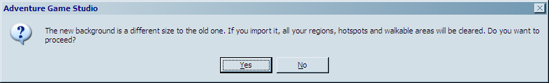
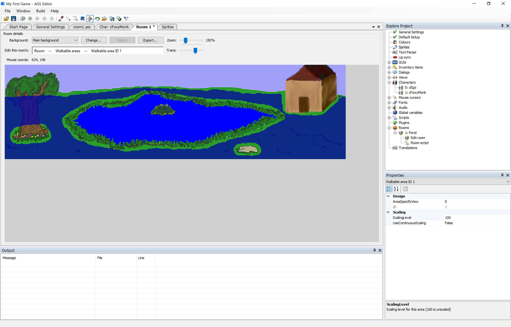

# Scrolling Backgrounds

Before we fix the problem of Foxy walking everywhere that she's not supposed to, let's do a couple more things first.  As we said earlier, we imported a background that was exactly the same size as the game's resolution (320x200 in this case).  This is fine and dandy, and it means that the player will be able to see the entire background all the time.  What would happen, you might wonder, if we used an image for the background that was bigger than the game's resolution?  That is, instead of a background of 320x200, what if we used one that was 721x200 for example?  We're glad you asked!  We just happen to have a file of that size.  Let's load it up and test it out!

Quit out of the game if it's still running and go back to the room editor.  We're going to change the background that we just imported to a bigger one so we can see what happens.  Click on the **Change** button again, and this time when the file dialog opens, choose the file *scrolling_bg.bmp*. After you click **Open**, you'll get a warning message like the one in [Figure 3.10](#figure310), letting you know that this new background image is a different size than the one you're currently using.  If we had done a lot of work with our room, like adding lots of regions or hotspots or something, then changing a background like this would clear all of those areas, which is basically what this message box is telling you.  This new background does cause us to have to redo the walkable area in this room, which we'll do in just a minute.  Click **Yes** on the dialog box.

 **Figure 3.10: Warning Message**

Our new room's background looks very similar to the one we just loaded, but with one important difference: it's longer! Now let's fix that walkable area issue.

 **Figure 3.11: Scrolling Tree-Pond-Grass background with walkable area**

Use what you already learned and create a new walkable area by tracing right at the horizon, around the shack, around the pond, and around the base of the tree and the flowers like in [Figure 3.11](#figure311). Oh, and don't forget that rock.

Ok, now that we've fixed the walkable area, run the game again.  Now click close to the right side of the screen to have Foxy walk there.  When she gets about halfway across the screen, the background will start to scroll!

