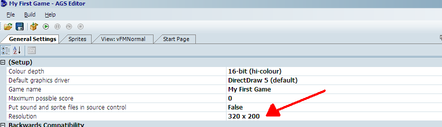
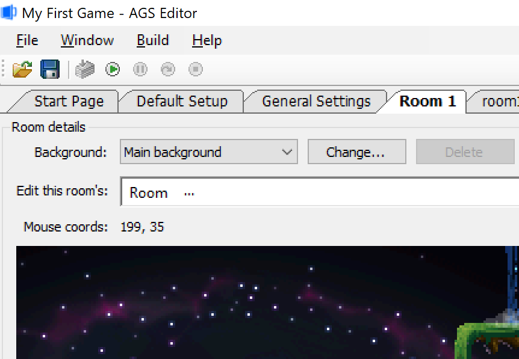
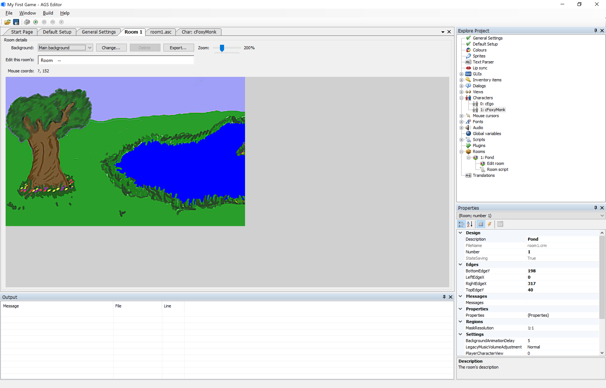

# Simple Backgrounds

The default background for room 1 was good enough to get our character walking around.  But let's change the room and give Foxy Monk a place where she can frolic in some grass.  If you want to make your own background, then go ahead.  Otherwise find the file called *simple_bg.bmp*. This file will contain a nice little tree and a small pond.  The file is 320 pixels wide and 200 pixels high. "Hmmm...Where did they get those numbers from?" you might be asking yourself.  Well, let's take a little detour and explain that.  Do you remember the General Settings option in the Project Tree?  It's all the way at the top.  If you double-click that, the General Settings editor should open up and you should see that the default game's `Resolution` option is set to 320x200. So, we made our background image that size in order to fit perfectly in the room.  Now that you understand that let's go ahead and put that image into the game as room 1's background.

 **Figure 3.1: General Settings and Game Resolution**

Open the room editor and edit room 1 by expanding the Rooms node in the Project Tree and double-clicking on **Edit Room** under the **1:** node.  Room 1's editor should be in the Editing Pane now and you should be looking at our famous default background.  Changing the background is so easy that you're going to laugh at me when I tell you.  Click the **Change...** button at the top of the edit screen.  ([Figure 3.2](#figure32)).

> **Side Note:** This would be a good time to learn how to name your rooms.  Click on **1:** under Rooms in the Project Tree.  Now look at the Properties Pane and change the `Description` option to something descriptive.  We're going to name room 1 **Pond**.

 **Figure 3.2: The Change... Button for Room 1**

A File Chooser window should pop up.  Navigate to the file *simple_bg.bmp* and choose it, then click **Open**. You should see the background turn into your new Tree-Pond-Grass background.  And yes, that's what I want to call it.  Press **F5** now to run the game and have Foxy run amok around our beautiful scenery.  Click on different parts of the screen to have Foxy walk around.  Ok, ok, so you may have noticed that Foxy is walking on everything!  I mean, not only is she walking on the grass where she's supposed to walk, but she can walk on the water and on the tree!  As an exercise, why don't you change Foxy's starting position so she's on the grass somewhere (on some other grass than where she is now).  As a hint, go to the room editor and move your mouse around the background.  You should notice that the Mouse Position coordinates, which are right above the background image, are changing.  Choose a nice place to start Foxy (we're choosing 110,167) and set her starting coordinates.  If you don't remember how to do it, look at the previous chapter.  Now run the game and walk around...are you stuck? Are you? Are you?

 **Figure 3.3: Tree-Pond-Grass background**

