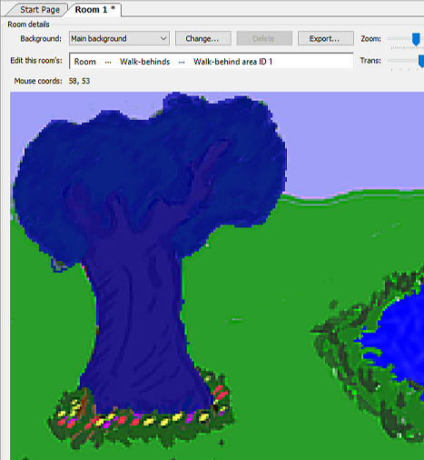
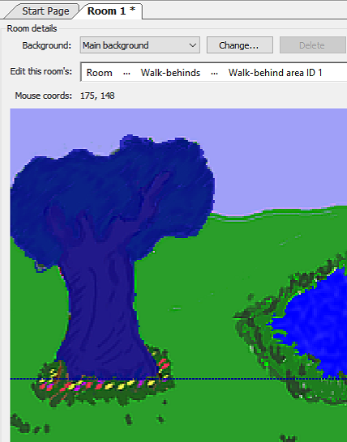
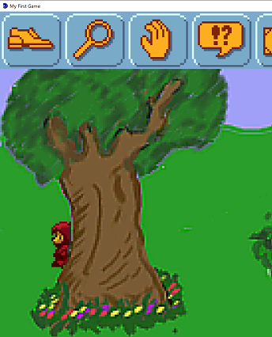

# Walk-Behinds

Foxy shouldn't be able to walk *on* the tree, but she should be able to walk *behind* it. That's where walk-behind areas come in.  Walk-behind areas in AGS give your game an illusion of depth by allowing characters and objects to appear to walk behind sections of your background.  Since we want Foxy to be able to walk behind the tree, we have to allow her to walk across that area (which is why we kept the walkable area on top of the tree in the last section), but we need to create a walk-behind area so that Foxy will disappear when she walks behind the tree.  Let's do that now.

First, select **Walk-behinds** from the ellipsis next to **Edit this room's**, then select "Walk-behind area ID 1" to create the first area. Now, trace the tree just like you traced the walkable area in the last section.  You'll need to be a little more precise here so zoom in as far as you can to make the outline of the tree follow as closely as possible to the picture.

> **Side Note:** If you want more control over drawing the walkable areas or walk-behind areas of your room than AGS editor allows, you can always use a paint program of your choice to create an image mask and use it instead.  More information on this can be found in [Chapter 10](../../part2/chapter10/masks.html).

Once you have the tree outlined, your room's walk-behind should look something like [Figure 3.13](#figure313). Notice the very top of the picture, just above the sky.  Do you see a blue dashed line going across the picture?  This line is the **baseline** of the walk-behind area.  The baseline is important, so pay attention here. 

 **Figure 3.13: Walk-behind on the Tree**

Every walk-behind has a baseline, which is an imaginary line that gives AGS information on when the character should be drawn behind the walk-behind area. You can click and drag this baseline up and down to wherever you want it to be.  Whenever a character's baseline\* is above the walk-behind's baseline, the character will be drawn behind the walk-behind area.  Conversely, whenever a character's baseline is below the walk-behind's baseline, the character will be drawn in front of the walk-behind area.  Occasionally, the placement of the walk-behind's baseline takes a little thought, but most of the time the baseline should be placed snug against the bottom of the walk-behind area.  [Figure 3.14](#figure314) shows where we put the baseline of the tree walk-behind area. With the baseline in that position, Foxy will disappear behind the tree when she's above the line.

> **Side Note:** By default, the character's baseline is set to the very bottom of the sprite that is used to display the character.  If that sounds confusing, just think about the character's baseline as being the same thing as the character's feet.  Unless your character is an inverted Squirkle with 7 feet from the planet Vexus, this analogy should work pretty well for you.

 **Figure 3.14: Baseline for the Walk-behind**

Now that we've defined the walk-behind area, Foxy should be able to walk behind the tree.  Run the game and see if it works.  When Foxy goes behind the tree, she should really go *behind* the tree ([Figure 3.15](#figure315))! If Foxy doesn't walk behind the tree for you, go back and make sure your baseline is set correctly.

> **Side Note:** By the way, remember how we outlined the flowerbed at the base of the tree when we were creating our walkable area in the last section?  The reason we excluded the base of the tree from the walkable area was that it adds to the illusion of depth by making it appear that Foxy walks around the tree.  If she could walk directly up to the tree, it would make the tree seem paper thin, which is obviously not what we want.  If you want to see what we mean, go back to your walkable area, and fill in the flower bed so that Foxy can walk there, then run the game and have Foxy walk around the tree.  The tree seems kinda flat, huh?

 **Figure 3.15: Foxy Hiding**

