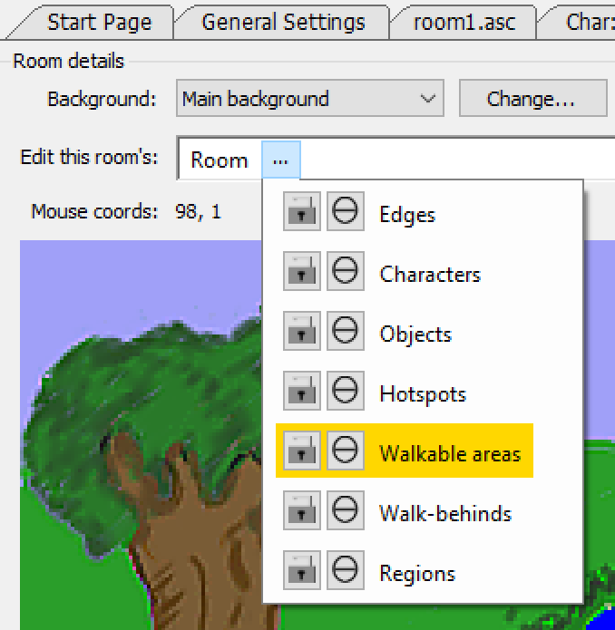
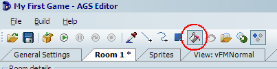
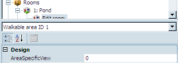
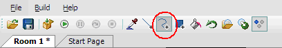
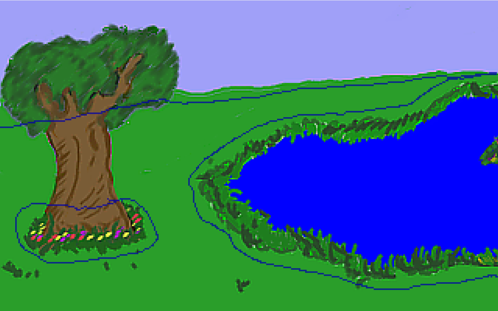
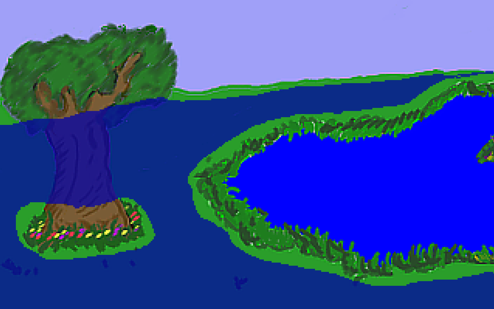

# Walkable Areas

That's right ladies and gentlemen; it's time to make sure Foxy Monk doesn't walk on things that she shouldn't walk on. Walkable areas in AGS are special areas that are drawn onto the background where characters are allowed to walk.  AGS allows you to have up to 15 different walkable areas that you can turn on and off at will.  As you should already know, there is one walkable area that was automatically created for you when the game was created.  Now we're going to fine tune this walkable area so Foxy only walks where she's supposed to.

Now let's see; people don't normally walk on the sides of houses and on the sky, right?  We'll go with that for now. Look at the room editor, just above the background image, where it says **Edit this room's**. Click the ellipses next to **Room** and select Walkable areas ([Figure 3.4](#figure34)). Notice that a gray looking area is now highlighted starting at the tree and going into the water; this is the walkable area.  Now, click on the Fill tool at the top of the screen (circled in red in [Figure 3.5](#figure35)) and then **RIGHT-CLICK** anywhere on that gray walkable area, and poof, it's deleted. So, you should **right-click** to get rid of a walkable area and **left-click** to create one. Now we need to recreate the area right.  Click the ellipses next to **Walkable areas** and choose **Walkable area ID 1**. If you look between the Properties Pane and the Project Tree ([Figure 3.6](#figure36)), you will notice a drop-down box that says "Walkable area ID 1." This tells us that we're currently editing the first walkable area, which happens to be the default one.

 **Figure 3.4: Choose Walkable areas from the Drop-down box**

 **Figure 3.5: The Fill Tool**

 **Figure 3.6: Walkable area ID location**

Now comes the fun part.  We have to create a new walkable area that makes more sense.  Choose the **Freehand** tool from the toolbar (Highlighted in [Figure 3.7](#figure37)). Now we're going to see how good you are at free-hand tracing around the picture. Start anywhere you like and trace right at the horizon, and around the base of the tree so that Foxy doesn't trample the flowers, and around the pond because Foxy is a fox and not a duck.

 **Figure 3.7: Freehand Tool**

When you're done, it should look something like [Figure 3.8](#figure38).

 **Figure 3.8: Freehand Tracing (blue line)**

Choose the **Fill** tool from the toolbar and click anywhere Foxy is ALLOWED to walk.  You should have something that looks like [Figure 3.9](#figure39). The blue (not including the water) is Walkable Area 1 and will be the only place that Foxy can walk.  If your blue covers more area, then undo and check your edges.  You might not have closed your line somewhere.  Notice that we left a bit of an edge around everything so that Foxy doesn't go right up to something and smack right into it.  Also notice that we didn't trace around the tree itself.  This does mean that Foxy will still be able to walk right onto it, but that's ok for now (we have plans for that tree).  Ok now for the fun part:

 **Figure 3.9: Completed Walkable Area**

Run the game and walk around.  You'll find that you will not be able to walk anywhere that is not blue (of course, you can't see the blue areas in the actual game!) In fact, click on one side of the pond and wait for Foxy to get there.  Then click on the opposite side of the pond.  You'll see that Foxy is now smart enough to go around the pond to her new destination.
