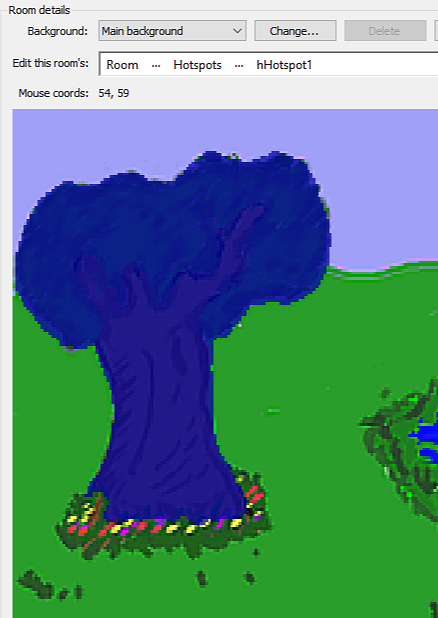
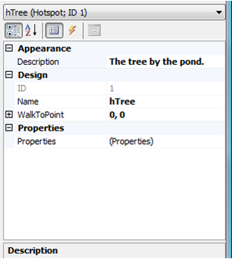
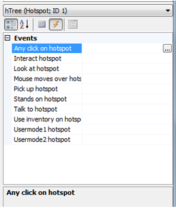

# Hotspots

Let's just say that we want Foxy to be able to look at the big tree next to the pond.  
What we'd really like is for the game to say something witty and clever when the player clicks the magnifying glass cursor on the tree, like, "That's a big tree next to the pond." ([Figure 4.2](#figure42))

<a name="figure42"></a>
<span><br>**Figure 4.2: Foxy Looks at the Tree**</span>

We'll do that using a hotspot.  To get started, edit the Pond room, and select **Hotspots** from the **Edit this room's** area. Since we don't have any hotspots yet, all you see is the pond, but let's draw a hotspot on the tree.  Select **hHotspot1** from the dropdown list of Hotspots by clicking the ellipses. Using the drawing tools at the top of the window, outline the tree, and then flood fill the area inside your outline.  This should color the tree blue, as in [Figure 4.3](#figure43).

<a name="figure43"></a>
<span><br>**Figure 4.3: A Hostspot on the Tree**</span>

Before we start to use the hotspot, let's rename it to something that makes a little more sense than "hHotspot1." Make sure that **hHotspot1** is still selected and look in the Properties Pane for an attribute called `Name`. Change the value of that attribute from `hHotspot1` to `hTree` (the "h" stands for "hotspot.") While we're at it, let's go ahead and change the description of the tree to something descriptive like, "The tree by the pond." When you're done, the Properties Pane should look like [Figure 4.4](#figure44). 

<a name="figure44"></a>
<span><br>**Figure 4.4: The Properties Window for Our First Hotspot**</span>

Now we need to tell AGS to display our message whenever the player clicks the magnifying glass mouse cursor on the tree.  Bring up the Events for the hotspot by clicking the lightning bolt icon in the Properties Pane ([Figure 4.5](#figure45)). 

<a name="figure45"></a>
<span><br>**Figure 4.5: Events for the Tree Hotspot**</span>

Here we have all the events that can occur with a hotspot.  There's one for each mouse mode (Interact [Hand], Look at [Magnifying Glass], Stands on [Walk], and Talk to [Speech Bubble]), as well as some other events that can occur, like when the mouse moves over the hotspot, when the player uses an inventory item on the hotspot, and also a couple of "Usermode" events which can be used if you want to create your own custom mouse modes (we'll go over each of these later).

At the moment we're interested in the magnifying glass cursor, so click on the event **Look at hotspot**, and then click the ellipses button next to the event to create the function in the room script.  The function that AGS creates for you is called `hTree_Look`. All that's left to do now is to add one simple line to that function:

```agsscript
Display("That's a big tree next to the pond.");
```
That line causes AGS to display a message on the screen with the text "That's a big tree next to the pond."

Run the game and right-click to change to the magnifying glass cursor, then left-click on the tree. If you did everything right, the message will appear just like in [Figure 4.2](#figure42) above.  Cool!

