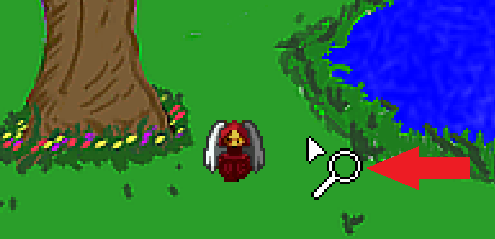

# Interaction

So far, we've had Foxy walk around each room by clicking the little mouse icon (which looks like a shoe) on different parts of the screen.  But have you tried right-clicking?  We briefly mentioned this before, but let's try it again.  Load up the game and try it now.  You'll notice that your mouse cursor changes from a shoe to a magnifying glass ([Figure 4.1](#figure41)). If you right-click again, it will change to a hand, and if you right-click yet again it will change to a speech bubble with exclamation point and question mark.  If you continue to right-click, it will simply cycle back through these four mouse cursors.  (We know, this is all basic stuff but not everyone read the first chapter.)  Each of these mouse cursors represents a different action that the player can take.  The shoe, as we've seen, is used for walking; the maginifying glass is used for looking around; the hand is for interacting with things; and the speech bubble is used to talk to someone or something. When you left-click you are performing that action on whatever you left-clicked on.  Rocket science, right?

 **Figure 4.1: The Magnifying Glass Cursor**

Notice, though, that none of the mouse modes does anything except the walk mode.  That's because we haven't told AGS to do anything with those modes yet!  That's all about to change.
