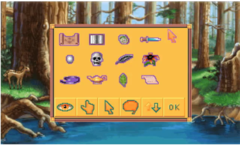
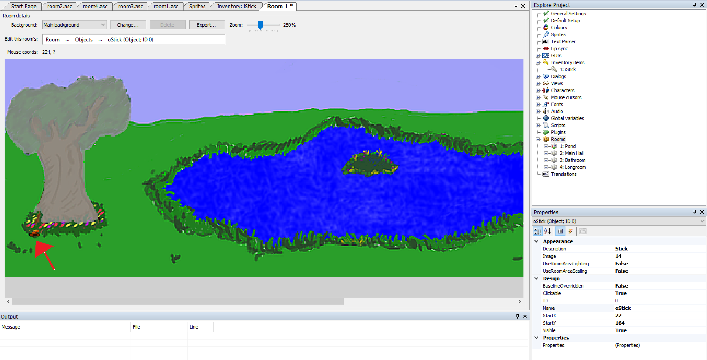
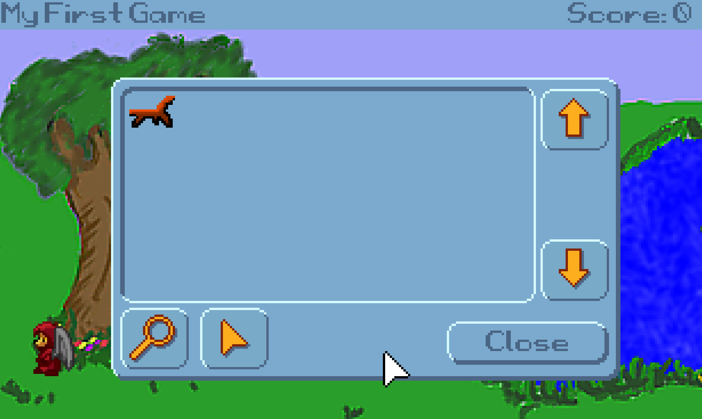

# Inventory Items

Now we're really getting some interaction going.  We can look at things, and we can manipulate objects within the game.  But, of course, an adventure game just isn't an adventure game unless the player can pick things up and carry them around, and that's where the inventory system comes in.  Every adventure game from *King's Quest* to *Monkey Island* uses an inventory system; after all, without an inventory, how can you do really obscure things like in *Monkey Island* where Guybrush used a wad of spit from Largo to make a voodoo doll?  Adventure Games Need Inventory Items.

By default, AGS uses a Sierra-style inventory system, where the player's inventory is managed through a separate "inventory screen" which displays all the items the player is currently carrying.  [Figure 4.15](#figure415) shows an example of an inventory screen from *King's Quest VI*.  (*King's Quest VI* wasn't written using AGS, of course, but it shows the type of Inventory Screen you get by default with AGS.) Just like about everything else in AGS, the inventory system you use is entirely configurable and you can use any other style of inventory system you wish.  For now, though, we'll use this Sierra-style one.

<a name="figure415"></a>
<span><br>**Figure 4.15: Sample Inventory Screen**</span>

In the Inventory Screen, the player is presented with the inventory items that he or she has collected throughout the game.  Notice that each inventory item is represented by its own sprite image.  This sprite image is usually different than the sprite that was actually used when the character picked up the item.  For example, in the image above, the sprite for the black feather would be much too large if it were actually placed in a room in the game (compare it to the size of the fawn in the background to see what we mean.) So, each inventory item that is in your game will most likely need two sprites to represent it; one for the object when it's in the game, and one for the inventory item that appears on the inventory screen once the player picks it up.

Enough talk about that.  Let's create an inventory item!

We're going to put a stick on the ground in front of the big tree and allow Foxy to pick up the stick to use later in the game.  First thing we need is a sprite of the stick so that we can import it into AGS.  Once again, we've done the hard work for you and provided you with a stick sprite you can use.

Double-click on **Sprites** in the Project Tree.  Let's create a new folder again just like we did for the Door sprite in the last section, but this time let's call it *Inventory Items*.  Find the file *LittleStick.bmp* and import it. 

Great!  Now we have our sprite imported that will represent the stick.  This is the stick that will be placed near the tree.  Now let's import the sprite for that same stick that will be used in the inventory screen, so find the file *InventoryStick.bmp* and import that one.

That's our sprites taken care of.  The next step is to create the inventory item.  In the Project Tree, expand **Inventory Items**, where you'll see two items listed: `iBlueCup` and `iKey`. These are just examples that are built into the default game, so you can delete them if you want by right-clicking them and selecting **Delete this item** (just say Yes to the confirmation dialog that pops up; deleting these items won't be a problem for us.) Create a new inventory item by right-clicking **Inventory Items** and selecting **New Inventory Item**. This will create a new inventory item called `iInvItem1`. That's a really useless name, so let's rename it to something more descriptive like `iStick`. Double-click the inventory item and change its `Name` attribute to `iStick`. While you're changing attributes, we need to set the image of the stick to the sprite we just imported.  Click on the *Image* property, then click the ellipses button next to it.  This will bring up the Sprites browser, where you can browse to the image of the inventory stick, select it, and click **Use this sprite**. (Make sure you choose the big stick and not the small one, since we're creating the inventory item and not the object.) Each inventory item has an associated Mouse Cursor Image, which is the image used for the mouse cursor when the player selects the inventory item.  We need to set the sprite of the mouse cursor image, so just change this property (called `CursorImage`) to the same number as the `Image` property.

Now comes the part where we will add the stick in our game under the tree.  This is just like when you added the door to the Main Hall earlier. Edit the Pond room and select **Objects** from the **Edit this room's** area. Right-click in the room somewhere near the base of the tree, and select **Place New Object Here**. Change the `Image` attribute of the new object to the sprite for the little stick, change the Name to `oStick`, and change the Description to "Stick". Once you've done that, your room should look something like [Figure 4.16](#figure416).

<a name="figure416"></a>
<span><br>**Figure 4.16: Our Stick Under the Tree (squint your eyes!)**</span>

Since we want the player to be able to pick up the stick, we need to create an event for the stick object.  With the stick selected, click the lightning bolt icon to bring up the events and, just like with the door, select the **Interact object** and click the ellipses icon next to it.

> **Side Note:** So why didn't we use the *Pick up object* event for the stick, since we're wanting to pick it up?  Well, the Pick up event is used when the player uses the Pick Up mode of the mouse on the object.  By default, there is no Pick Up mouse mode enabled, so this event really doesn't do anything.  Some adventure games use different mouse modes for the different actions like Pick Up, Open, Move, Operate, etc., and you can do this too if you want, but in our game all of those actions are represented with the Interact mouse mode. 

This brings up the room script and creates a function for us called `oStick_Interact`. Put the following code in the function:

```agsscript
cFoxyMonk.Walk(oStick.X, oStick.Y, eBlock, eWalkableAreas);
oStick.Visible = false;
cFoxyMonk.AddInventory(iStick);
Display("You stick the stick in your pocket and hope it's not a sticky stick that will stick you.");
```

Let's talk about what each line does:

```agsscript
cFoxyMonk.Walk(oStick.X, oStick.Y, eBlock, eWalkableAreas);
```
The first statement should be all-too-familiar by now.  It causes Foxy to walk over to where the stick is.
```agsscript
oStick.Visible = false;
```
This line sets the `Visible` property of the `oStick` object to `false`, which (surprise!) makes the stick invisible.  Once an object is invisible, the player can no longer interact with it at all, so this effectively turns the object off.
```agsscript
cFoxyMonk.AddInventory(iStick);
```
This is where the item is added to the player's inventory.  Notice that we used `iStick` here, and not `oStick`.  The `iStick` is the inventory item, whereas the `oStick` is the object in the room.  (See?  We told you the letters at the beginning of those names would be helpful later on!)

And finally, we display a message to the user to tell them they picked up the stick:
```agsscript
Display("You stick the stick in your pocket and hope it's not a sticky stick that will stick you.");
```

That's it.  Run the game now and click the hand icon on the stick.  You should see Foxy walk over, the stick will disappear, and our message will be displayed on the screen.  Click to dismiss the message and then look at your inventory.  You can do this either by pressing the **Tab** key, or by moving your mouse to the top of the screen and clicking the **suitcase** icon.  You should see the stick in your inventory now!  Yay!  Mission accomplished!

<a name="figure417"></a>
<span><br>**Figure 4.17: Our First Inventory Item**</span>

