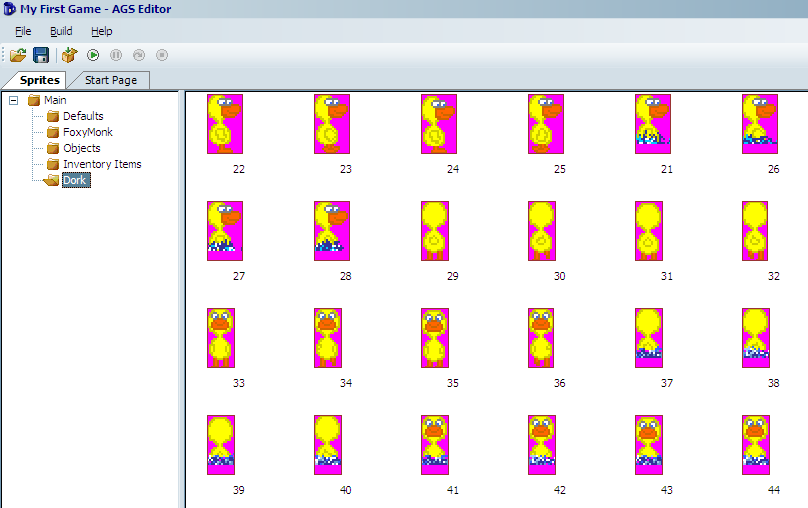
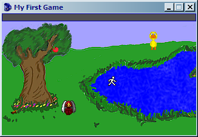
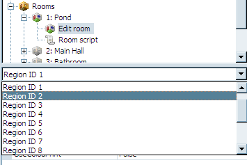
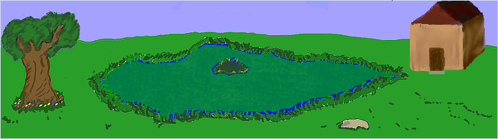

# Non-Player Characters (NPC)

Even though there are games out there that only have one character, I don't think our game would be complete without at least one more character.  We figure that since we have a pond, then we should have a duck.  Therefore, we created a duck name Dork.  Dork the Duck is a happy sort of duck that likes to play around the pond, splashing in the water, and happily waddling his way around the tree. 

The first part of introducing a new character is of course drawing the character's sprites. We've already done that and put the sprites in a file called *Dork.bmp*. If you look at those sprites, you'll notice that Dork has a swimming view.  Also, notice that he has walk and swim right views, but no walk or swim left views.

Even though you're now an expert at importing sprites and creating views, let's import Dork and create his views together.  Start by opening the Sprites editor and creating a new folder for Dork.  Choose to import new sprites from a file and import the sprites any way you wish.  When you've finished, you should have 24 sprites in all.  They should be walk right, swim right, walk up, walk down, swim up, and swim down.

<a name="figure419"></a>
<span><br>**Figure 4.19: The Many Sprites of Dork**</span>

We need to create two views for Dork: one of him walking and one of him swimming.  Let's start with the walking view.  Create a new view and call it `vDNormal`. Select the 4 "walk right" sprites for Dork, right-click, and choose to assign them to a view. Put in your new view number (probably 4), choose Loop 2 (right), and click **OK**. Remember how we don't have a walk left view?  Here's how to make it.  Select the **SAME 4** walk right sprites, right-click, and choose to assign them to a view. Put in view 4 again, choose Loop 1 (left), and check the box at the bottom that says: **Set all new frames as Flipped**. Click **OK** and check your view.  Neat huh?  This way our walk right and walk left will look the same.  Now go ahead and create the walk up and walk down loops on your own.

For the swimming view, create a new view called `vDSwim`.  Add the loops just as above but choosing the swimming sprites.  Be sure to flip the walk left loop.

Now that we have the views for Dork, we need to actually create the character.  Right-click the **Characters** node in the Project Tree and choose **New Character**. Make sure the character is selected and change the `ScriptName` property to `cDork` and the `RealName` property to `Dork`. Set the `StartingRoom` property to 1 to make him show up at the pond. Set the `NormalView` property to 4 (or whatever your normal Dork view was) and set the `StartX` and `StartY` to 250 and 60 to put him near the pond when the game starts but not in the pond.  Set the `MovementSpeed` property to 6 to match that of Foxy's. Run the game and check him out.  He won't do anything, but it'll be fun to see him standing there.

<a name="figure420"></a>
<span><br>**Figure 4.20: Hey Look! Dork is Standing There!**</span>

When you're done staring in awe at your new character, close the game and go on with this lesson.  We know exactly what you want to do now: you want to see that duck swim!  But why would he swim?  Let's take this one step at a time.  First, let's make Dork walk over to the middle of the pond when Foxy interacts with him.  Double-click Dork's view to edit him and click on the lightning bolt to bring up his events.  Notice that characters have the same kinds of events as objects and hotspots do. Create a new event for `Interact character`, which will create a function named `cDork_Interact` in the script. In this function tell Dork to walk to position (334, 95), which is the middle of the island.  Remember to tell him to walk anywhere because there is no walkable area over the pond. You'll need to make Foxy walk over in that direction too, otherwise Dork will walk off the screen and you won't see him, so we'll make Foxy walk up to him and then he'll run away from her when she gets close, and we only want that to happen if Dork is not already on the island.  The function should have the following:

```agsscript
if(cDork.x != 334)
{
    cFoxyMonk.Walk(230, 60, eBlock, eWalkableAreas);
    cDork.Walk(334, 95, eNoBlock, eAnywhere);
}
```

First, we check Dork's x coordinate and if it's not on the island, we tell Foxy to walk over to Dork.  We also tell her to make sure to only walk on walkable areas.  The second line of the `if` block tells Dork to run away from Foxy and to ignore walkable areas while NOT blocking.  The reason we don't want him to block will become apparent in a few minutes.  Run the game, use the hand icon on Dork, and watch the fun.

> **Side Note:** the function is created in the global script and not the room script.  This is because character interactions can happen in any room.

## Animations

Let's make him swim now.  This is what we've all been waiting for.  In order to make Dork swim, we have to change his view to the swim view when he's on water, and the best way to do that is to create a region.

Open the editor for room 1 and view the room's regions.  You'll notice we already created a region in front of the shack's door, so we'll need to change the region ID to 2.  Find that in the dropdown box between the Project Tree and Properties Pane ([Figure 4.21](#figure421)). Once you choose Region ID 2, use the pen to trace all around the pond enclosing all the water.  Be sure to leave out the island though.  Then, use the flood tool to fill in the water.  When finished, it should look like [Figure 4.22](#figure422).

<a name="figure421"></a>
<span><br>**Figure 4.21: Choosing Region 2**</span>

<a name="figure422"></a>
<span><br>**Figure 4.22: Region 2 is the Pond**</span>

## Repeatedly Execute

If Dork were the main character then at this point, we would add two event handlers for the water region, one for walking onto the region and one for walking off of it.  We would change the view to the swimming view when he walks onto the region and back to normal when he walks off of it.  But, since these events are only called when the main character walks onto and off of a region, and since Dork is not the main character, we have to do something special. There is an event in every room called `Repeatedly Execute`. This event fires every *game cycle*, which equates to 40 times per second, or once every 25 milliseconds.  So, anything that we put in this event will happen 40 times every second that the room is on the screen (See side note).  We need to add some code to this function that constantly checks where Dork is and changes his view accordingly.

> **Side Note:** Remember the eBlock parameter we've been using for various function calls?  Anytime a function runs with eBlock, it's called a *blocking function*. Script instructions, including those in the Repeatedly Execute event, will not fire while a blocking function is running.  There is a special Repeatedly Execute event that does get called even through blocking routines, called `repeatedly_execute_always`. If you put a function with this name in your room script (or in the global script), it will get called even when a blocking function is running.

Choose the room from the dropdown between the Project Tree and Properties Pane and then click the lightning bolt to bring up the room's events.  You've done this before when you added the after fade in and leave right/leave left events in other rooms.  You should see an event called `Repeatedly execute`. Add a handler to this event by clicking the ellipses.  This will create a function called `room_RepExec`. Edit the function to make it looks as follows:

```agsscript
function room_RepExec()
{
  if(Region.GetAtRoomXY(cDork.x, cDork.y) == region[2])
  {
    if(cDork.View != VDSWIM)
      cDork.ChangeView(VDSWIM);
  }
  else if(cDork.View != VDNORMAL)
  {
      cDork.ChangeView(4);
  }
}
```

This function consists of two `if` blocks. The first block checks Dork's position in the room to see if he's in the pond region. The function `Region.GetAtRoomXY` takes an x and a y and gives you the region number that the (x,y) coordinates is in.  If the coordinates are not in any region, then you'll get a zero back. So, we compare the return from that function to see if it equals region 2, which is our pond region.  If so, we check to see if Dork's view is already the swim view and, if not, change it to the swim view. So now Dork will have the swim view activated whenever he's in the pond.  Notice that we used `VDSWIM` instead of the actual number of the view.  We could have used the number 5, which is our swim view, but this is more readable. 

> **Side Note:** AGS will always create an all-caps version of the view names that you create to make it easier to refer to them in scripts.

The second `if` block in the function is actually an `else/if` block. This will only happen if the first block is `false` and Dork's view is not the normal view (i.e., it's the swimming view). In that case, we change the view back to normal.  Notice this time we used the number so you can see that they really are interchangeable.  One thing to note:  We could not have written the function like this:

```agsscript
function room_RepExec()
{
  if(Region.GetAtRoomXY(cDork.x, cDork.y) == region[2])
  {
      cDork.ChangeView(VDSWIM);
  }
  else
  {
      cDork.ChangeView(VDNORMAL);
  }
}
```

This way, the view is always changed.  We don't want to do this because of a couple of reasons: first, it's not very efficient to change Dork's view 40 times per second when it doesn't need to be changed; and second, every time Dork's view is changed, his position changes as well, which actually has a peculiar side effect of making him walk really fast (try it out for yourself.)  Oh, and now for the reason we didn't let Dork block while moving:  Since the Repeatedly Execute event doesn't fire when a blocking function is running, this would mean that the view would not change.  Try that out too and see for yourself.

## More Animation

Now let's do a bit of animating with Foxy.  Earlier in the chapter, we gave you a homework assignment to show the stick fly out of Foxy's hands and hit the apple.    We're going to do that here and add a little bit more pizzazz to it.  Foxy is going to first walk to a good position to better see the apple and turn to face the apple.  Then you'll see her hand go up and throw the stick at the apple.

To start this, we'll need to create a whole new view of Foxy throwing the stick.  There's a sprites file called *FoxyThrowingAnimation.bmp* that contains the proper sprites.  Import those sprites into the *FoxyMonk* folder of the Sprites editor (or create a new folder if you wish).  You should now have 6 new sprites of Foxy (We actually don't need all 6 here, so just use the first 4.  The other two are there for you to play with if you want to extend the animation.) Create a new view for Foxy called `vFMThrow` using the new sprites.  We'll just need one loop here so it will be loop zero by default.  That's it for the easy part.  The rest is the code in the function.  Find the `oApple_UseInv` function in the Pond room's script and change it to the following: (The comments in the code should explain what's going on.)

```agsscript
function oApple_UseInv()
{
  if (cFoxyMonk.ActiveInventory == iStick) 
  {
    if (Game.DoOnceOnly("StickIsInTree") == true) 
    {
      // Have Foxy walk to a prime throwing position
      cFoxyMonk.Walk(116, 164, eBlock, eWalkableAreas);
      
      // Turn Foxy to face the apple
      cFoxyMonk.FaceObject(oApple);
      
      // Since she's going to throw the stick, it needs to disappear from her inventory.
      cFoxyMonk.LoseInventory(iStick);
      
      // Change her view to the new throwing view and lock it
      cFoxyMonk.LockView(VFMTHROW);
      // Animate the new view
      cFoxyMonk.Animate(0, 5, eOnce, eBlock, eForwards);
      // Unlock the view
      cFoxyMonk.UnlockView();
      // Lock frame 2 of the view so her arm stays up in throwing position
      cFoxyMonk.LockViewFrame(VFMTHROW, 0, 2);
      
      // Set the x and y location of the stick object to be wherever Foxy is, and then make it visible.
      oStick.X = cFoxyMonk.x;
      oStick.Y = cFoxyMonk.y - 10;
      oStick.Visible = true;

      // Override the baseline of the stick so it doesn't appear behind the tree.
      oStick.Baseline = 200;
      
      // Move the stick to where the apple is.
      oStick.Move(oApple.X, oApple.Y, 6, eBlock, eAnywhere);
      
      // Now move the stick down to the ground with the apple.  Notice the use of eNoBlock here, since we want the apple to fall at the same time.
      oStick.Move(oApple.X, 160, 5, eNoBlock, eAnywhere);
      oApple.Move(oApple.X, 170, 4, eBlock, eAnywhere);

      // Reset the baselines for both the apple and the stick back to the default.
      oApple.Baseline = 0;
      oStick.Baseline = 0;
      
      // Unlock the view
      cFoxyMonk.UnlockView();
      
      Display("Good shot! The apple falls out of the tree and lands on the ground with a thud.");
    }
  }
}
```

The things to note here are the view locking and unlocking functions.  Locking a view will keep it from changing until you call the unlock function.  This way, if you change a view and then ask a character to walk, the walking view will not come back automatically unless you unlock the view first.  Always remember that for every lock view call you need an unlock view call: **NO EXCEPTIONS**.

```agsscript
cFoxyMonk.LockView(VFMTHROW);
cFoxyMonk.Animate(0, 5, eOnce, eBlock, eForwards);
cFoxyMonk.UnlockView();
cFoxyMonk.LockViewFrame(VFMTHROW, 0, 2);
```

The code snippet above demonstrates this.  Here we lock Foxy's view to the throwing view and animate.  The `Animate` function says to animate using loop 0 with a delay of 5 (game cycles).  The `eOnce` parameter says to do the animation only one time.  We want to block while animating and we want to animate forward.  After that we unlock the view then we lock the view again using only one frame with the `LockViewFrame` function. This will hold the view at frame 2, which is the frame of Foxy's arm being in the up, or extended, position.  We keep the lock while the stick flies and the apple falls, then we unlock her view with the `UnlockView` function so that she can go back to her normal view.
