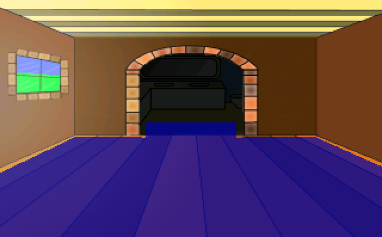

# Objects

Objects are exactly what their name implies they are.  They're objects; things in the game that can move.  They can disappear and come back.  They can move up and down the screen.  Or even side to side if that's your fancy.  A good example of an object is a door, or a tree branch.  Or maybe even a light switch.

Let's add a door to the bathroom.  Most people enjoy the ability to do their business in private.  In addition, most people like having huge garage-door-like doors in their house that lead to the bathroom.  Let's do that now.  Use your favorite painting program to draw a door that fits into the opening to the bathroom. Or...you can use the one we provided in our sprites section called *BathroomDoor.bmp*. Let's begin by creating a new folder under Sprites.  Double-click on **Sprites** in the Project Tree to open the sprites editor.  Right-click on the **Main** folder on the left and choose to **Create sub-folder** and name it *Objects*. Of course, you don't have to do this, but it will keep all your sprites organized.  Now open that folder and import the door sprite from the file.  You should know how to do this by now.  The final result is in [Figure 4.6](#figure46).

<a name="figure46"></a>
<span><br>**Figure 4.6: Importing the Bathroom Door**</span>

Great! Now let's add that door as an object to our Main Hall.  Edit the Main Hall room and choose Objects from the **Edit this room's** area. Now right-click on the background somewhere and choose **Place New Object Here**. As you can see, that created a new object in the room and made it look like a little blue cup ([Figure 4.7](#figure47)).

<a name="figure47"></a>
<span><br>**Figure 4.7: Our Little Blue Cup Object (up on the ceiling)**</span>

The blue cup is the default look of all objects.  Now let's make that cup transform into a door.  Go back to the sprite editor and get the sprite number of the door.  You should find it right under the sprite as in [Figure 4.6](#figure46). 

For our game here, the number is 18 (in your game the number might be different so be sure to check.) Now back in the room editor click on the blue cup to make sure it's selected and change the `Image` property to the sprite's number as in [Figure 4.8](#figure48). Oh, go ahead give the object a name.  We call it `oDoor` (the little o means object.)

> **Side Note:** If you don't give it a name you won't be able to associate any events to it.  But AGS will tell you that if you forget.

<a name="figure48"></a>
<span><br>**Figure 4.8: Changing the Object's Image**</span>

You should see the blue cup change into the door.  Use the mouse to drag the door to its proper position.  Ta da!  We now have privacy.  But how do we open this door?

<a name="figure49"></a>
<span><br>**Figure 4.9: Our Bathroom Door**</span>

To open the door, we need to create an event for when Foxy interacts with the door.  This is going to be much like the event created for the hotspot on the tree.  Click the lightning bolt to open the door events in the Properties Pane and add a function to the **Interact object** event. Now we want to tell the door to slide up when Foxy interacts with it (Yes, we're making a sliding door). For this function we need to move the object up when it's clicked on, and down when it's clicked on again.  Look at the Properties Pane for the door and find the `StartY` value.

<a name="figure410"></a>
<span><br>**Figure 4.10: See the StartY Value?**</span>

This is, by default, the bottom left pixel of an object.  We want to move this pixel up and down as necessary.  As you can see from [Figure 4.10](#figure410), the `StartY` value for our door is 114.  Moving it up to about 55 should accomplish what we want, but feel free to play with the value once you get the thing moving.  So, to move this object up, use the `Move` function as follows:

```agsscript
oDoor.Move(oDoor.X, 55, 3, eBlock, eAnywhere);
```

This function will keep the door's x coordinate in the same spot and move the y coordinate up to 55.  To move the door back down we just reverse this as follows:

```agsscript
oDoor.Move(oDoor.X, 114, 3, eBlock, eAnywhere);
```

The `eBlock` and `eAnywhere` is nothing new, but what does that 3 do? Well, that's the speed of movement.  Again, feel free to play with that as needed.  So, our finished function should look like this:

```agsscript
function oDoor_Interact()
{
  if (oDoor.Y == 114)
  {
    oDoor.Move(oDoor.X, 55, 3, eBlock, eAnywhere);
  }
  else 
  {
    oDoor.Move(oDoor.X, 114, 3, eBlock, eAnywhere);
  }
}
```

First, we check to see where the door is.  If it's resting in the down position, we move it to the up position.  If it's in the up position, we move it to the down position.  Go ahead and run the game now and click on the door using the hand mouse icon.  You should see it move up and down with every click.

I'm sure you've noticed something about the door.  It just looks very weird moving up and down the way it does.  It doesn't make sense for it to just hover up and down like that.  Maybe, just maybe, if we make it go behind the wall, then it would look a lot more natural.  Let's do just that.  For this exercise, we're going to use our good friend the walk-behind.  Create a walk behind that looks like [Figure 4.11](#figure411). 

<a name="figure411"></a>
<span><br>**Figure 4.11: Walk-behind for the Bathroom Door**</span>

Set the baseline at the bottom of it.  Run the game now and see how the door looks.  Neat huh?  We still have one little problem that you may or may not have noticed.  Run the game and tell Foxy to walk into the bathroom with the door closed.  Freaky!!!!  Either she's a ghost or we've got more work to do.  Let's prevent Foxy from going into the bathroom without opening the door first.

Open the script editor for the Main Hall and find the function that gets called when Foxy moves beyond the top edge (probably called `room_LeaveTop`). Change that function to look like this:

```agsscript
function room_LeaveTop()
{
  if (oDoor.Y == 114)
  {
    cFoxyMonk.y = cFoxyMonk.y + 1;
  }
  else
  {
    cFoxyMonk.ChangeRoom(3, cFoxyMonk.x, 220);
  }
}
```

As you can see, we added a check to see if the door is down, and if it is, move Foxy back down one pixel and don't change her room.  Moving back one pixel puts her back under the top edge of the room so that she can attempt to move past it again.  Now the door has to be opened before Foxy can go into the bathroom.

Ok, we know we said we only had one little problem left, but there are actually two more.  One problem is that Foxy can open the door from anywhere in the room.  Clicking the hand icon on it will open it even if Foxy is all the way on the other side of the room.  That just won't do at all because unlike the rest of our game, it's just not realistic!  This is easy to fix.  Change the function for interacting with the door (`oDoor_Interact`) to first move Foxy to it before opening or closing it.   All we have to do is add one line to it.  Add the following line as the first line in the function:

```agsscript
cFoxyMonk.Walk(oDoor.X + 20, Room.TopEdge, eBlock, eAnywhere);
```

Before the door is moved, Foxy will walk to the door's x position plus 20 pixels.  That will put her somewhere in the vicinity of the middle of the door.  And, she'll walk to the top edge of the room.  Remember that this is the edge at which she will actually walk into the next room.  So now when Foxy interacts with the door, she will walk up to it, open it, and proceed into the bathroom.  If you don't want her going into the bathroom after opening the door, then just add 1 to Room.TopEdge and she won't pass the edge and will just open the door and stand there.  But why open the door if you're not going through.

And now for the final little problem: When Foxy tries to walk into the bathroom with the door closed, she'll stop but will appear to flicker there for a bit.  This is actually because she's passing through into the other room and then getting thrown back out.  Let's fix this by splitting our walkable area into two walkable areas.  We'll put one in the bathroom and one outside it and only activate the one inside the bathroom when the door is opened.

Go back to editing the room and view its walkable areas.  It should look something like [Figure 4.12](#figure412). You might have to hide the door object to see it.

<a name="figure412"></a>
<span><br>**Figure 4.12: The Main Hall Walkable Area**</span>

Remember how we added that extra lip that goes into the bathroom so that Foxy will pass the room's edge? Well, that lip should be made into its own walkable area.  To do this, use the eraser to get rid of the lip. You'll find the eraser by choosing **Walkable area ID 0** from the dropdown box between the Project Tree and Properties Pane ([Figure 4.13](#figure413)). Use the eraser on the walkable area to remove it, then recreate it without that lip.  Now choose **Walkable area ID 2** from the dropdown to draw a second walkable area and redraw the lip.  It should end up looking like [Figure 4.14](#figure414).

<a name="figure413"></a>
<span><br>**Figure 4.13: Choosing the Eraser**</span>

<a name="figure414"></a>
<span><br>**Figure 4.14: Adding the Second Walkable Area**</span>

The only thing we have to do now is turn our new area off when the door is closed and on when it's opened.  We should do this in two places: whenever Foxy first enters the room and whenever she interacts with the door.  Put the following block of code in the `room_AfterFadeIn` function:

```agsscript
if (oDoor.Y == 114)
{
  RemoveWalkableArea(2);
}
else
{
  RestoreWalkableArea(2);
}
```
What this says is, if the door is down, remove the walkable area we just created.  Now Foxy can't go up there at all.  If the door is up, then we restore the area so Foxy can move into the bathroom. The reason we do this in the after fade-in function is because it's possible that Foxy enters the Main Hall, opens the door, then leaves the Main Hall. When she comes back to the Main Hall, the door is still open, so we make sure the walkable area is active in that case.

The `RemoveWalkableArea` and `RestoreWalkableArea` functions should also be placed in the `oDoor_Interact` function. Make that function look like the following:

```agsscript
function oDoor_Interact()
{
  cFoxyMonk.Walk(oDoor.X + 20, Room.TopEdge, eBlock, eAnywhere);
  if (oDoor.Y == 114)
  {
    oDoor.Move(oDoor.X, 55, 3, eBlock, eAnywhere);
    RestoreWalkableArea(2);
  }
  else 
  {
    oDoor.Move(oDoor.X, 114, 3, eBlock, eAnywhere);
    RemoveWalkableArea(2);
    cFoxyMonk.PlaceOnWalkableArea();
  }
}
```

Notice we also added the function `cFoxyMonk.PlaceOnWalkableArea`. This makes sure that Foxy is placed on walkable area 1 since we're turning off walkable area 2 by moving her to the closest position on walkable area 1.  Otherwise, Foxy might get stuck in a non-walkable area and not be able to move.
