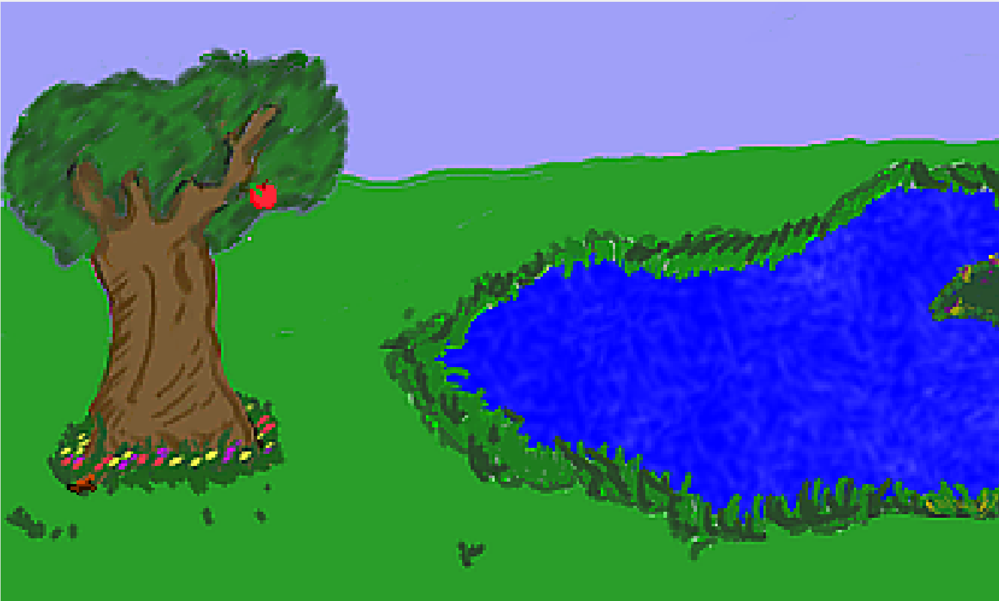

# Using Inventory Items

That was so awesome.  Let's add another inventory item now, but this time we'll make Foxy work a little harder to get it.  If there was an apple way up high in the tree, maybe Foxy could use her newly acquired stick to throw at the apple and knock it down.  (Yeah, we know, Foxy has wings and could just fly up there to get an apple, but let's forget about that and just play along.)

This would accomplish a couple of things.  First, it would let us get more practice adding inventory items.  But more importantly, requiring that Foxy use the stick on the apple in the tree lets us see how to use inventory items on other objects in the game.  We'll have to figure out a way to make something happen when the stick is used on the apple... hmm...

Before we get too far ahead of ourselves, we need to first put the apple in the tree and create an inventory item for it.  Go to your game's **Sprites** and import two new sprites: *LittleApple.bmp* and *InventoryAppleWithWorm.bmp*. Just like with the stick before, these sprites will be used to represent the apple in the game and in the inventory, respectively.  Ewww, the apple looks like it has a worm!  That's ok, we'll let Foxy get the worm out as another exercise later.

Putting the apple in the tree is very similar to when we put the stick on the ground, except for one very important difference.  Open the Pond room and select **Objects** from the **Edit this room's** area. Right-click somewhere in the tree and select **Place New Object Here** from the context menu.  Find the `Image` attribute in the new object's Properties Pane and change this to the sprite of the Little Apple you just imported (you can click the ellipses button to browse for the right sprite, just make sure to select the little apple and not the big one.) Now, change the `Description` to "Apple," and the `Name` to `oApple`. When you're done, your Pond should look something like [Figure 4.18](#figure418).

<a name="figure418"></a>
<span><br>**Figure 4.18: The Apple of My Tree**</span>

Here's the part that's different from when we added the stick.  If you run your game, you'll see a problem.  Actually, you *won't* see a problem because you won't see the apple at all!  What happened?  Where'd the apple go?  The apple really is there, but it's hidden by the walk-behind area on the tree we created back in [Chapter 3](../chapter3/walk_behinds.html). Let's think about what's happening here.  There's a walk-behind area on our tree, which we put there so that Foxy could walk behind the tree.  The problem is, objects obey walk-behind areas as well, and so the apple we put in the tree is being drawn behind the tree, since it is above the baseline of the tree's walk-behind area.  Well great, how do we fix that?  We need the apple to ignore the tree's walk-behind area so that it's always drawn in front of the tree. It just so happens that AGS allows you to do that relatively easily.  You might think there's an attribute on the apple object called `IgnoreWalkBehinds` or something like that, but there's not.  There is, however, something that will work just as well.

Find the attribute `BaselineOverridden` in the apple's Properties Pane.  This value is set to `False` by default, and that means that the object's Baseline is set to the very bottom of the object.  This is similar to how the character's baseline is at the very bottom of the character, like we mentioned when we created the walk-behind way back in [Chapter 3](../chapter3/walk_behinds.html). Change the `BaselineOverridden` value to `True`. You should see a new attribute appear, called `Baseline`. This lets us set a new y location for the object's baseline.  If we set the baseline to 200, which is the very bottom of the screen, this will effectively create a situation such that the apple's baseline is always *below* the walk-behind's baseline, causing the apple to be drawn in front of the tree.  After you've changed the apple's Baseline attribute, run the game again and you'll be able to see the apple up in the tree.

Eventually, Foxy will be able to pick up the apple, so we'll need an inventory item for it also.  Right-click on **Inventory Items** and select **New Inventory Item**. Under the Properties, change the `Description` to "Apple" and change the `Name` to `iApple` (please don't sue us, Tim Apple!) Browse for the `Image` and this time, select the big apple with the worm in it.  That's all there is to that, so let's go back to the Pond room and put all this together!

When Foxy uses the stick on the apple in the tree we want the apple to fall out of the tree onto the ground.  When the apple is on the ground, Foxy should be able to interact with the apple to pick it up.  We have to be sure that we don't let Foxy pick up the apple while it's still in the tree.

Click on the apple in the tree and create a new Event for **Use Inventory on object**. This should create a function for you in the room script called `oApple_UseInv`. Edit this function so it looks like the function below, then we'll discuss it.

```agsscript
function oApple_UseInv()
{
  if (cFoxyMonk.ActiveInventory == iStick) 
  {
    if (Game.DoOnceOnly("StickIsInTree") == true) 
    {
      oApple.Move(oApple.X, 170, 4, eBlock, eAnywhere);
      oApple.Baseline = 0;
      Display("Good shot! The apple falls out of the tree and lands on the ground with a thud.");
    }
  }
}
```

The `oApple_UseInv` function will be called by AGS any time the player uses an inventory item on the apple object.  Since the player might have several inventory items throughout the game, we have to make sure that it was the stick that was used and not some other item the player might have.  We use the `ActiveInventory` property of the character to do this:

```agsscript
if (cFoxyMonk.ActiveInventory == iStick)
```

Here, we're checking that the active inventory item (`cFoxyMonk.ActiveInventory`) is the stick (`iStick`). If it is, the code inside the if block's curly braces will run.

The first instruction in that `if` block is another `if` statement:

```agsscript
if (Game.DoOnceOnly("StickIsInTree") == true)
```

The function `Game.DoOnceOnly` does just what it sounds like it might do: it ensures that something happens only one time.  The function will return a `true` value the first time AGS encounters this statement and a `false` value every time after that.  The string that we passed as a parameter to the function, `StickIsInTree`, can be anything you want, and this is how AGS knows if this particular `DoOnceOnly` statement has been done before.  For example, suppose you have two events in your game, and you want each event to happen only once.  You can use `DoOnceOnly` for each event, but each one needs to have a different string passed to it.

The next statement causes the apple to fall down to the ground.

```agsscript
oApple.Move(oApple.X, 170, 4, eBlock, eAnywhere);
```

We're using the `Move` function here just like we did with the bathroom door.  
We changed the apple's `Baseline` property earlier so that the apple would always appear in front of the tree's walk-behind area.  Well, now that the apple is on the ground, that Baseline property will also make it always appear on top of Foxy whenever she walks over to it.  That's not what we want!  So, just after we make the apple fall on the ground, let's set the `Baseline` property of the apple back to 0, which effectively turns the Baseline back to its default behavior.

```agsscript
oApple.Baseline = 0;
```

Finally, we display a message to the player to let them know what just happened.

```agsscript
Display("Good shot! The apple falls out of the tree and lands on the ground with a thud.");
```

To try this out, run the game and pick up the stick by interacting with it.  Then, open the inventory by rolling the mouse all the way up the screen and clicking on the suitcase icon.  You should see the stick there.  Click on the stick and your mouse cursor will change into it.  Then click **Close**. Now click the stick on the apple to use it.  The apple should fall from the tree.

That was the hard part and now's the easy part.  If the player interacts with the apple while it's on the ground, we want Foxy to walk over to it and pick it up.  Create a new Event for the apple object for **Interact object**. AGS will create a function for you called `oApple_Interact`. Edit it so it looks like this:

```agsscript
function oApple_Interact()
{
  if (oApple.Y == 170) 
  {
    cFoxyMonk.Walk(oApple.X, oApple.Y, eBlock, eWalkableAreas);
    oApple.Visible = false;
    cFoxyMonk.AddInventory(iApple);
    Display("Foxy puts the apple away. Maybe she can eat it as a snack later.");
  }
  else 
  {
    Display("The apple is too high for Foxy to reach it!");
  }
}
```

This looks very similar to when we picked up the stick earlier.  The difference here is, we added that initial `if` statement to make sure that the apple is on the ground first before Foxy walks over to it (if the apple's Y location is 170, we know it's on the ground because that's what we set the Y location to in the `oApple_UseInv` function.) If it isn't on the ground, then we display the message telling the player that the apple is too high for Foxy to reach.

## HOMEWORK

Add code to this function so that you see the stick fly from Foxy's position to hit the apple before it falls.  Don't forget to make Foxy lose the stick from the inventory when she throws it. (Hint: use `cFoxyMonk.LoseInventory(iStick)`.) Also, have Foxy turn to face the apple before she throws the stick at it. (Hint: use `cFoxyMonk.FaceObject(oApple)`.)

## Using Inventory Items on Each Other

 get Foxy to take the worm out of the apple now.  I don't think Foxy wants to actually touch the worm with her hand, so let's have her dig the worm out with the stick. (Note that if you did the homework from the previous section, then Foxy no longer has the stick here, so go ahead and take that part out so that Foxy will keep the stick after throwing it.) This will be a good exercise on how to use one inventory item on another.  We'll need a few more sprites for this.  We're going to need a sprite of the apple without a worm in it, and a sprite of a stick with a worm on it.  That way the worm can crawl out of the apple and onto the stick.  Import the files *InventoryApple.bmp* and *InventoryStickWithWorm.bmp* and create two new inventory items using those sprites called `iAppleNoWorm` and `iStickWithWorm`. Now it's just a matter of adding some events.  Select `iApple` from the Inventory Items section of the Project Tree and click the Events lightning bolt.  You should see an event named **Use inventory item on this item**. Create an function for that event (it will be called `iApple_UseInv`) and make it look like this:

```agsscript
function iApple_UseInv()
{
  if(cFoxyMonk.ActiveInventory == iStick)
  {
    cFoxyMonk.LoseInventory(iStick);
    cFoxyMonk.LoseInventory(iApple);
    cFoxyMonk.AddInventory(iStickWithWorm);
    cFoxyMonk.AddInventory(iAppleNoWorm);
    Display("Oh goody! You got the worm out of the apple and onto the stick.");
  }
}
```

Basically, what we did is make Foxy lose the stick and the apple with the worm in it, then we gave her the stick with the worm and the apple without the worm.  Then we displayed a message to the user to say what just happened.  The inventory window should now show the new items.

> **Side Note:** the function is created in the global script and not the room script.  This is because inventory interactions can happen in any room.
