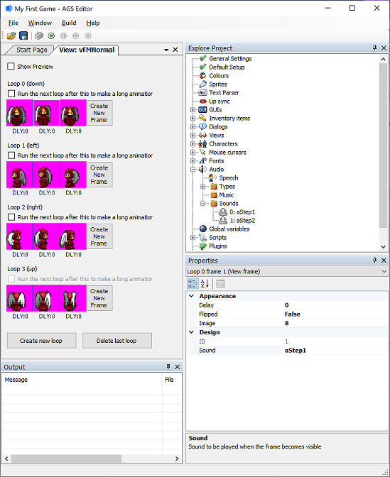

# Sound Effects

Creating sound effects is one of those things that's a lot of fun to do, but you'll quickly realize that you can easily get carried away with making a sound effect for every action in your game.  That's definitely not a bad thing necessarily, but having too many sound effects - or, I should say, having too many *obnoxious* sound effects - can drive your player bonkers, so be careful with them.  We're only going to put in a couple of sound effects into our game, just to show you an example of the different types of sound effects that can be used.

AGS supports several file formats when it comes to audio files.  All the major sound formats are supported: OGG, MP3, WAV, and VOC.  To use sounds in your game, you have to import it just like you've imported sprites and backgrounds.  Look in the **Project Tree** and you'll see **Audio**. Under **Audio** there's a folder for Music and one for Sounds.  This is where the importing magic will happen.

> **Side Note:** Windows hides file extensions by default.  You may need to set your properties to show file extensions.  Look online if you don't know how because we don't want to waste all this space teaching you something that you can just as easily find online by using Google.  I mean, after all, what's the point of explaining something here in the book that's documented online in about a gazillion places?  That would not only waste your time to have to read it, but it would also waste our time by having to type it out.  Especially when this book is about AGS and not about Windows.  Do you see our point here?  Should we also go into how to disable the display of file extensions in Linux and Mac?  Well, come to think of it, AGS doesn't even run on these platforms so that would be an even BIGGER waste of time and space.  So, you can see why we didn't want to waste the time and space to explain a simple concept like showing or hiding file extensions.

## Footsteps -- no more sneaking up on people

We've got an idea.  It would be nice if the player could hear Foxy's footsteps when she walks around.  AGS makes this really easy to do, because it lets you assign a sound effect to any frame of a view.  In Foxy's case, we want to assign two footstep sounds to two different frames of her walking view.  Here's how to do that.

Once again, we've done the hard work for you and created the files you'll need.  Look for the files called *Step1.wav* and *Step2.wav* in the *Sound* folder. Next, open the Audio properties in the Project Tree and right-click on **Sounds** to add those two files.  Notice that in the Properties Pane they have the name *aStep1* and *aStep2*. Next, open Foxy's normal view by expanding **Views** in the Project Tree and double-clicking on `vFMNormal`. Each loop of this view contains three frames.  What we're going to do is assign a sound to two of the three frames in each loop, and AGS will play that sound when it displays that frame of animation in the game.  Click on the second frame of loop 0.  If you look at the Properties Pane, you'll see a property called `Sound` ([Figure 5.1](#figure51)). Change this to `aStep1`, which is the sound that represents the first footstep (*Step1.wav*). Now click on the third frame of loop 0 and change its Sound property to `aStep2` to play *Step2.wav*. Repeat this for the second and third frames of each of the other three loops in this view.

Now run the game!  As Foxy walks around you should hear her footsteps.  (If you don't hear anything, you might need to turn your volume up; the footstep sounds we created are fairly quiet - remember, we don't want to totally annoy our player!) Why did we use the second and third frames? Well, because AGS treats the first frame as the character's standing around and twiddling thumbs view, and we don't want any footstep sounds while we're just standing there, now do we?

<a name="figure51"></a>
<span><br>**Figure 5.1: Properties for the Second Frame of Loop 0**</span>

## HOMEWORK

Create splish splash sounds for Dork and add them to his swimming view.

> **Side Note:** AGS will create a new folder in your game called *AudioCache* and it will copy your sound and music files into that folder. That way, your files can be anywhere on your computer and AGS will just take care of adding them to your game's files.  Generally, you won't need to worry about this folder.

## Ambient Sounds

Most of the time you won't need ambient sounds, but AGS provides the possibility just in case you want to use it. Ambient sounds are simply sounds that can be heard in the background, like crickets chirping, water running, etc.

To play ambient sounds, you have to create the sound object and use the script functions `Play` and `SetRoomLocation`. The Play function is used on a sound object and takes 2 optional parameters: `AudioPriority` and `RepeatStyle`. To make the sounds actually ambient though, the options will be required since the default for sound (not music) is to only play a sound once. (Those function are for audio in general and not just for ambient sounds.)  The priority can just be set to normal, but the `RepeatStyle` must be set to `eRepeat` in order for the sound to keep playing.

When the `Play` function is called, it will return an instance of an `AudioChannel`. This is the sound channel to play the ambient sound through. AGS supports 8 sound channels, which are numbered from 0 to 7.  Basically, you can think of a sound channel as a tunnel which carries one sound at a time.  So, if you have 2 sounds that you want to play at the same time, you have to play them through 2 different sound channels.  So, with 8 channels, AGS allows you to play up to 8 sounds at the same time. Once you have the channel, call the `SetRoomLocation` function to set the X and Y location of the sound. These are the coordinates of the source of the sound.  These parameters let you use ambient sounds that appear to be emanating from a certain spot in your game.  If a sound is coming from a waterfall on the right side of your screen, for example, you can specify the x and y coordinates of the sound to match the location of the waterfall and the sound will get louder as the player approaches the waterfall and quieter as the player walks away from it.  This gives the illusion of a location to the sound.  If you don't want this effect, you can simply use 0 for both x and y and the sound will be played at the same volume throughout the room.  By the way, the volume can also be set on the audio channel with the `Volume` property.

Example to play a sound called `aSound1` at low volume from location (10,10):

```agsscript
AudioChannel *myChannel = aSound1.Play(eAudioPriorityNormal, eRepeat);
myChannel.Volume = 20;
myChannel.SetRoomLocation(10, 10);
```


