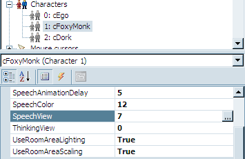

# Speech

Unless you're creating a game like *Myst*, you'll probably want your characters to be able to say stuff throughout your game.  There are two paradigms when it comes to speech in AGS: there's basic, scripted talking, either in response to events that happen in the game (like when Foxy looks at things or when she breaks the fourth wall by talking to the player) or a linear sequence of conversation between characters ("Hi, Fred!", "Howdy Billy, how's the weather?"); and then there's the interactive dialog that can occur between characters, where the player is given a choice of conversation topics and can choose which one(s) to talk about and in which order.  We'll be talking about the first kind of speech here; the second kind is called simply "Dialogs" in AGS parlance, and we'll cover that later in [Part 2](../../part2/chapter8/).

## Speech Views

The first thing we need to do to make Foxy and Dork talk is to create a Speech View for them.  The Speech View is the animation that is displayed for the character when that character is speaking.  AGS automatically uses the character's Speech View anytime the character is saying something, so we don't have to think about it.

We'll do Foxy's view first, so create a new view for her by right-clicking **Views** in the Project Tree and click **New View**. Name this view `vFMSpeech`. Go to the Sprites section of the Project Tree and import a new set of sprites by opening the Foxy sprites folder, right clicking in the sprite list, and selecting **Import new sprite from files...**. Find the file called *foxy_monk_speech.bmp* and import the twelve sprites in that file (if you need a refresher, refer back to [Chapter 2 ](../chapter2/sprites.html) where we imported our sprites earlier.) Once those sprites have been imported, assign them in groups of three to each of the four loops in the new view you just created.  (Again, if you need help remembering how to do this, refer back to [Chapter 2 ](../chapter2/sprites.html).) Finally, open the `cFoxyMonk` character from the Characters list in the Project Tree, and assign this new view for the Speech View in the Properties as in [Figure 5.2](#figure52). Now, do the same thing for Dork the Duck, using the sprite sheet file *DorkSpeech.bmp*.

<a name="figure52"></a>
<span><br>**Figure 5.2: Setting the SpeechView**</span>

## The Say Function

So, let's make Foxy and Dork say something already!  We're going to have a short, scripted conversation between Foxy and Dork.  When the player clicks the "Talk to" mouse cursor on Dork, Foxy will walk over to him, and the following conversation will take place:

**Foxy**: Hi!  My name is Foxy.<br>
**Dork**: Quack, quack, quack.<br>
**Foxy**: Oh, I thought you could talk.<br>
**Dork**: Quaaaaaack!<br>
**Foxy**: I feel silly talking to a duck.<br>
**Dork**: Thanks a lot!

Yeah, it's not great, but it will do for our purposes.

Create a "Talk to" event for Dork (double-click `cDork` in the Project Tree, click the **Events** thunderbolt icon, click the "Talk to character" event, and click the ellipses button.) This creates a new function called `cDork_Talk` in the global script file. The function we'll be using to actually have the characters say stuff is the `Say` function.  You'll use it like this:

```agsscript
function cDork_Talk()
{
  cFoxyMonk.Walk(cDork.x - 20, cDork.y, eBlock, eWalkableAreas);
  cFoxyMonk.FaceCharacter(cDork);
  cFoxyMonk.Say("Hi!  My name is Foxy.");
  cDork.Say("Quack, quack, quack.");
  cFoxyMonk.Say("Oh, I thought you could talk.");
  cDork.Say("Quaaaaaack!");
  cFoxyMonk.Say("I feel silly talking to a duck.");
  cDork.Say("Thanks a lot!");
  cDork.Say("&1 Quack-quack-quack-quack quack-quack-quack-quack!");
}
```
You've seen the first two lines before -- they cause Foxy to walk over to where Dork is and then turn to face him.

The next 7 lines use the `Say` function, and we put the text we want the character to say in double quotation marks.  AGS will animate the character with the Speech View while the text is on the screen and stop animating the character when the text goes away.  By default, the text goes away either with a mouse click or after a certain time has passed proportional to the amount of text that is being displayed.  This behavior can be changed, however, in the General Settings, by changing the value of the `Allow speech to be skipped by which events property`.

One thing to note is the last line.  Notice that there is a `&1` and a space right before "Quack-quack-quack-quack quack-quack-quack-quack!" This tells AGS to play the file called *Dork1.wav* in the *Speech* folder of your game's folder (see side note.) Unlike importing sounds into the Audio section of the project, you place sound files into that *Speech* folder. Sound files have a certain naming scheme and must be named after the character that speaks them along with a number.  Note though that you only use the first FOUR letters of the character name.  So, for Dork's sound 1, the file name would be *Dork1.wav*. This way, you can have actual speech in your game and tell AGS which recording to play just by using the ampersand and a number.  If you had a character named Micheal, his first speech file would be named *Mich1.wav*.  How simple is that?

Now to try it out! Find that file and move it into the *Speech* folder. Run the game and click the Speech mouse cursor on Dork.  You should see the conversation take place, and you should see both characters animate while they are speaking. Furthermore, you should hear Dork quack his last line so turn up the sound.

> **Side Note:** All speech files should be placed in a folder called *Speech* that sits alongside other AGS folders like *Sprites*, and *Music*. These are folders that are all inside your game's AGS folder.  It's likely that the *Speech* folder does not exist so you may need to create it.  Note that you DO NOT add speech sound files through the Project Tree like all the other types of sound files.
