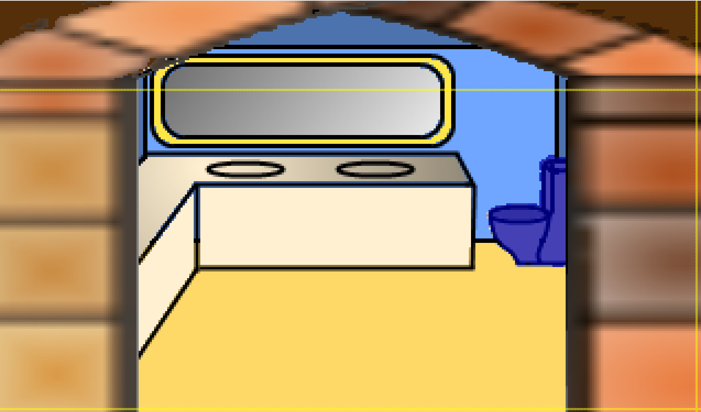
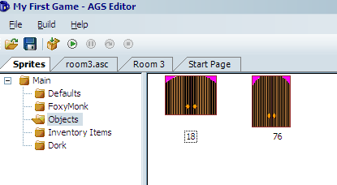
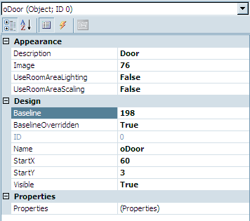
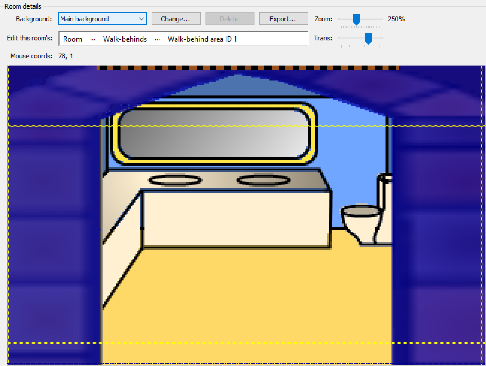
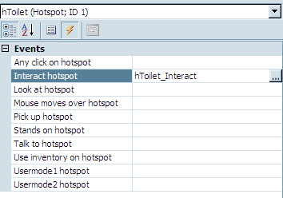

# Timers

Can you think of a good place in the game so far to create a timer? We can! In the bathroom, of course!  Confused?  Let's say Foxy wanted to use the bathroom.  As it stands, Foxy can open the door to the bathroom and step in.  When she's done looking around, she exits the bathroom and can close the door behind her.  But what if she wanted to close the door while she's in the bathroom; you know, for whatever she may want to do in there.  And, while she's doing her, ahem, business, we can't be telling her to do anything else, and, most importantly, we can't watch!

The first thing we need to do is to create a way for Foxy to close the door while she's in the bathroom.  Since, most likely, the reason to close the door would be to use the toilet, we should have Foxy close the door when she interacts with the toilet.  Start by creating a hotspot on the toilet to interact with it.

Edit the bathroom by double-clicking **Edit room** under Rooms and Bathroom in the Project Tree.  Choose to view **Hotsposts** and `hHotspot1` and use the line tool to outline and fill in the toilet as in [Figure 7.1](#figure71). This will create `Hotspot 1` in the room. Change the hotspot's description to `Toilet` and name it `hToilet`.

<a name="figure71"></a>
<span><br>**Figure 7.1: Toilet Hotspot**</span>

There's one more thing we have to add to this room before we go on.  You guessed it, a door.  Remember that the bathroom door is actually part of the Main Hall room and not the bathroom so, in order to be able to close the door while in the bathroom, we have to add a door to this room.  The door picture we used for the Main Hall is too small for this room, but we did create a new image that would fit in our bathroom.

Double-click on **Sprites** in the Project Tree and click on the **Objects** folder. You should see our bathroom door in there.  Add a new object by right-clicking and choosing to import a new sprite from a file. Choose the file named *BathroomDoor2.bmp* and click the **Import** button to import the whole image. You should see a new door object show up as in [Figure 7.2](#figure72). Our new object is ready to be created.  Go back to editing the bathroom and choose to view **Objects**. Right-click in the room and choose **Place New Object Here**. You should see the familiar blue cup show up.  Click on the cup and modify its properties as in [Figure 7.3](#figure73). Notice that our `StartX` is 60 and `StartY` is 3. When Foxy walks into the room the door is open.  Having the `StartY` set at 3 places the door at the top of the room.  Notice also that the baseline of the door is overridden and set at 198.  In order for the door to appear in front of Foxy the baseline must be higher than Foxy's.  But, in order for the door to appear behind the walk-behind the baseline must be lower than the walk-behind's. The walk-behind's baseline is set at 199, so we made the door's 198, which should always be higher than Foxy's because if she ever walked beyond that she'd leave the room.

<a name="figure72"></a>
<span><br>**Figure 7.2: Added another door object**</span>

<a name="figure73"></a>
<span><br>**Figure 7.3: Door Properties**</span>

One other thing we have to do with the door is make sure it's hidden behind the wall.  We need to extend our walk-behinds for this.  Choose to view **Walk-behinds** and select the first walk-behind, then use the line and fill tools to extend the current walk-behind area to look like [Figure 7.4](#figure74).

<a name="figure74"></a>
<span><br>**Figure 7.4: Expanding our walk-behind area to cover the entire wall.**</span>

Now let's add a function for Foxy interacting with the hotspot.  Select the hotspot and then click the lightning bolt (events) button in the properties box on the right and add a function to the `Interact hotspot` event by clicking on the ellipses on the right ([Figure 7.5](#figure75)). This will create a function called `hToilet_Interact()` and take you to the script editor.

<a name="figure75"></a>
<span><br>**Figure 7.5: Create a funtion for interacting with the toilet**</span>

Edit the script as follows:

```agsscript
function hToilet_Interact()
{
  oDoor.Move(oDoor.X, 250, 3, eBlock, eAnywhere);
  Wait(5*40);
  oDoor.Move(oDoor.X, 3, 3, eBlock, eAnywhere);
}
```

The Move function should already be familiar to you.  The first thing we do is move the door down to close it.  The last thing we do is move the door back up.  The middle is the interesting part. We call the `Wait()` function. That function does exactly what it says, it waits.  How long it waits depends on the number we pass in, which should be in game loops.  Since there are 40 game loops a second, we tell it to wait 200 game loops, or 5 seconds. Easy as pi.  Well actually pi is 3.1415 so that would screw everything up.  Don't use pi.

## HOMEWORK

Add a toilet flushing sound before the door opens. We made a sound for you to use.
