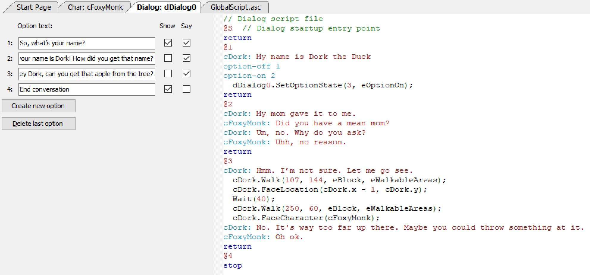

# AGS Scripts inside Dialog Scripts

Are you confused?  Do you find yourself asking the question: How can diolog scripts have AGS scripts inside them?  Well stop being confused my friend because wewill now explain:  Dialog Scripts can have AGS Scripts inside them. It's a simple concept if you think about it.  Sometimes you want a character to actually perform an action during a conversation.  To demonstrate this, let's have Foxy ask Dork if he could get the apple from the tree for her.

tart by adding a new option to our dialog by replacing Option 3 with the text "`Hey Dork, can you get that apple from the tree?`" and uncheck the **Show** checkbox but check the **Say** checkbox. In the right pane, add the following under the `@3` symbol.

```
    cDork: Hmm. I'm not sure. Let me go see.
	    cDork.Walk(107, 144, eBlock, eWalkableAreas);
	    cDork.FaceLocation(cDork.x - 1, cDork.y);
	    Wait(40);
	    cDork.Walk(250, 60, eBlock, eWalkableAreas);
	    cDork.FaceCharacter(cFoxyMonk);
    cDork: No. It's way too far up there. Maybe you could throw something at it.
    cFoxyMonk: Oh ok.
```

Now, notice there's indentation in the AGS Script. There has to be a Tab there to let AGS know that what you just typed in should be interpreted as AGS Script and not Dialog Script. Change the `stop` for Option 3 to `return` and add a 4<sup>th</sup> option with the text "`End conversation`" and uncheck the **Say** checkbox and check the **Show** checkbox. Change the 4<sup>th</sup> option's `return` keyword to `stop`.

This new option should be turned on with Option 2 after Foxy gets Dork's name.  Add the following in Dork's response to Option 1 right under `option-on 2`.
```
	dDialog0.SetOptionState(3, eOptionOn);
```
Make sure there's a **tab** in front of that because that's AGS script and not Dialog script.  It should end up looking like [Figure 8.5](#figure85).

<a name="figure85"></a>
<span><br>**Figure 8.5: 3 AGS Script Inside Dialog Script**</span>

So now, Foxy will be able to ask Dork to get the apple for her after she gets his name.  Notice that we used AGS Script to turn Option 3 on instead of Dialog Script using the `SetOptionState()` function. We only did this to show you that you can do that. But what if Foxy already has the apple...

