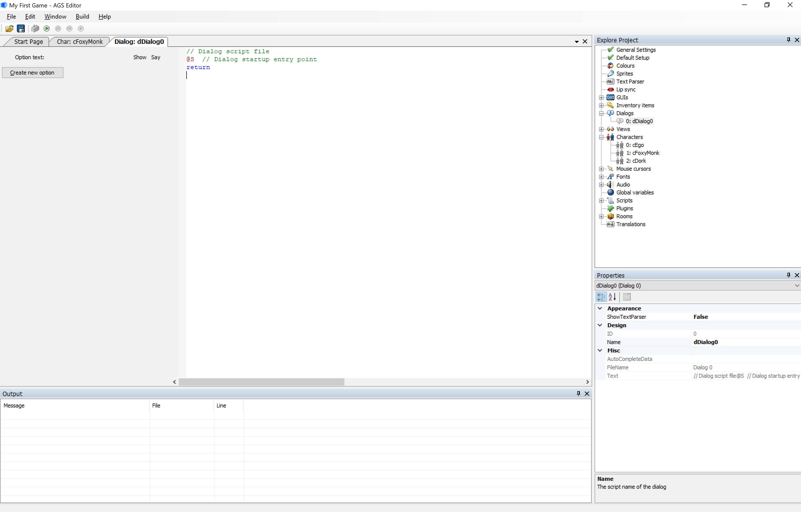
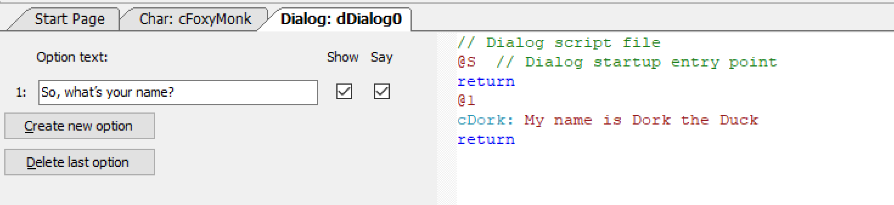
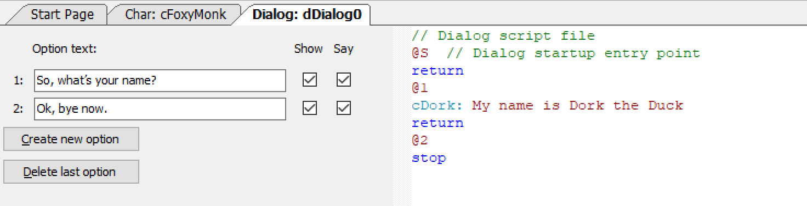
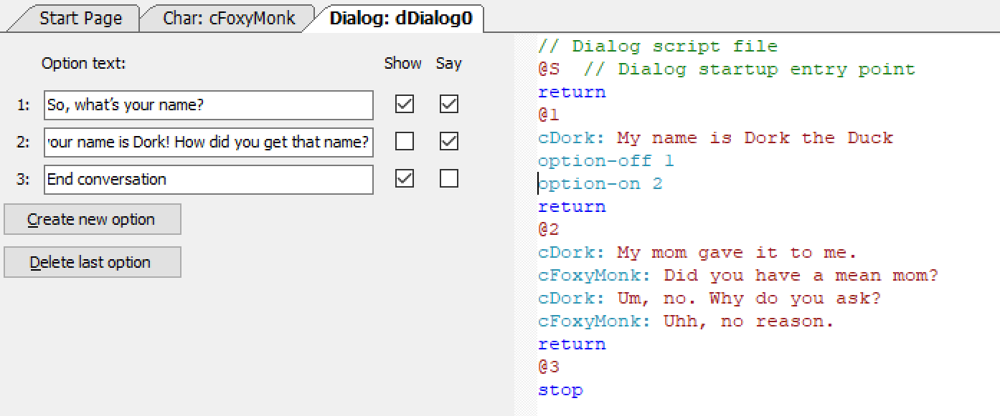

# Creating a Dialog

Wouldn't you know it! AGS provides a nice and easy way for us to create dialogs.  Look in the Project Tree and you should see an option for Dialogs.  Open that option and you'll see that there's one dialog already there called `dDialog0` that has the ID 0. We can use that as our first dialog, so double-click to edit it and the dialog editor will appear as in [Figure 8.1](#figure81).

<a name="figure81"></a>
<span><br>**Figure 8.1: The Dialog Editor**</span>

There are two panes in the dialog editor.  The left pane will show all the different dialog options that you will create, and the right pane will show the actuall dialog that will happen when a dialog option is chosen, which will be in the form of a script file. The best way to understand how this editor works is to use it though, so let's start by creating our first dialog option.

Click the **Create new option** button in the left pane and you will see a text box appear and a new button called **Delete last option** appear.  In the text box type in "`So, what's your name?`" In the right pane type in "`cDork: My name is Dork the Duck`" right under the `@1` and right above the `return` keyword so it looks like [Figure 8.2](#figure82).

<a name="figure82"></a>
<span><br>**Figure 8.2: Adding the First Dialog Option**</span>

> **Side Note:** The dialog scripting language is NOT the same language that is used in room scripts.

Let's dissect [Figure 8.2](#figure82) now. In the left pane we have an option that Foxy will be able to choose when this dialog starts.  Next to that option there are two checkboxes that will be checked by default.  The **Show** checkbox means that this option will be visible for the player to choose.  If you hide this option, you can show it later in the script.  One reason to hide options is if they are not relevant yet.  We'll get to that shortly.  The **Say** checkbox means that Foxy should say the words in the "Option text". So, when a player chooses that option Foxy will say "So, what's your name?" You might want to not say an option if it's something like "End conversation". We'll explain that shortly as well.

The right pane shows the actual dialog that will happen for each option.  `@S` is always there and marks the beginning (start) of the dialog script.  Don't put anything before this.  There will be a **@** for each option you create and everything between the **@** and the `return` will be the dialog that happens when that option is chosen. To have a character say something just put the character's scriptname followed by colon and whatever you want the character to say.  Please remember that the scripts you write in the dialog editor are NOT the same as the scripts you write in the room editor or in the global script.  I know there's a Side Note up there that says this, but it's important that you realize this.  In fact, FROM NOW ON WE WILL REFER TO ROOM AND GLOBAL SCRIPTS AS **AGS SCRIPTS** AND SCRIPTS IN THE DIALOG EDITOR AS **DIALOG SCRIPTS**.

Let's add another option to the dialog.  Click **Create new option** and enter the text "Ok, bye now."  In the right pane change the `return` keyword for that option to `stop` so it looks like [Figure 8.3](#figure83). 

<a name="figure83"></a>
<span><br>**Figure 8.3: Adding a Second Dialog Option**</span>

Now we have two dialog options.  Foxy will be able to choose to ask Dork for his name or say bye and end the conversation. Notice that Option 2 ends with a `stop` instead of a `return`. In the dialog script, a `return` means 'go back to the conversation' and a `stop` means 'stop the conversation.' So, in order to end the conversation, the player has to choose the 2<sup>nd</sup> option.

> **Side Note:** If you don't use the `stop` keyword you will never be able to get out of the dialog.

Let's add some more options.  Since the 2<sup>nd</sup> option ends the conversation, it would make the most sense to have that last, so replace Option 2 with the text "`So, your name is Dork! How did you get that name?`" and uncheck the **Show** checkbox. In the right pane, add the following conversation under the `@2` symbol.

```
	cDork: My mom gave it to me.
	cFoxyMonk: Did you have a mean mom?
	cDork: Um, no. Why do you ask?
	cFoxyMonk: Uhh, no reason.
```
Change the `stop` for Option 2 back to a `return` because we don't want to end the conversation after this option is run.  Add a 3<sup>rd</sup> option with the text "`End conversation`" and uncheck the **Say** checkbox and check the **Show** checkbox. Change the 3<sup>rd</sup> option's `return` keyword to a `stop`. Now let's do a bit of magic.  Go back to the right pane and add the following 2 lines right under Dork's response to Option 1:

```
	option-off 1
	option-on 2
```
It should end up looking like [Figure 8.4](#figure84).

<a name="figure84"></a>
<span><br>**Figure 8.4: 3 Dialog Options with Option Control**</span>

When this conversation starts, Foxy will have two options to choose from: Option 1 and Option 3 (Option 2 is hidden because **Show** is not checked.) If she chooses Option 3, the conversation will end; however, if she chooses Option 1, she will ask Dork for his name.  He will answer with the response uner the `@1` and then the script will turn off Option 1 using the `option-off 1` statement and turn on Option 2 using the `option-on 2` statement. So, when the conversation resumes, Foxy will still have two options to choose from, except this time they will be Option 2 and Option 3.  Furthermore, since the **Say** checkbox for Option 3 is not checked, Foxy will not say the words 'End conversation' when that option is chosen. Instead, the conversation will simply end.

Let's go ahead and add this dialog into our game.  Open the global script by finding it in the File menu or by pressing **Ctrl+Shift+G**.  Scroll all the way to the bottom and you should see the `cDork_Talk()` function we previously added.  Go to the bottom of the function and add the line `dDialog0.Start();` as the last line of the `else` block. `dDialog0` is the name of this dialog and the `Start()` function starts it. This will cause the dialog to start right after Dork mutters a random statement.  One thing about this function that you should know though: The dialog will only start AFTER the function finishes running.  Run the game and go through the conversations with Dork.

> **Side Note:** You can play sounds in dialogs the same way you do with speech.  Just add the & sign sign and a number to play the sound you want.  For example, if you record a sound of Dork saying, 'My name is Dork the Duck' and save that as *Dork2.wav* in the *Speech* folder of your file system, then you can put &2 right before 'My name is Dork the Duck' to have AGS play that speech file.  The dialog line will change from:<br>
> &nbsp;&nbsp;&nbsp;&nbsp;`cDork: My name is Dork the Duck.`<br>
> To:<br>
> &nbsp;&nbsp;&nbsp;&nbsp;`cDork: &2 My name is Dork the Duck.`

