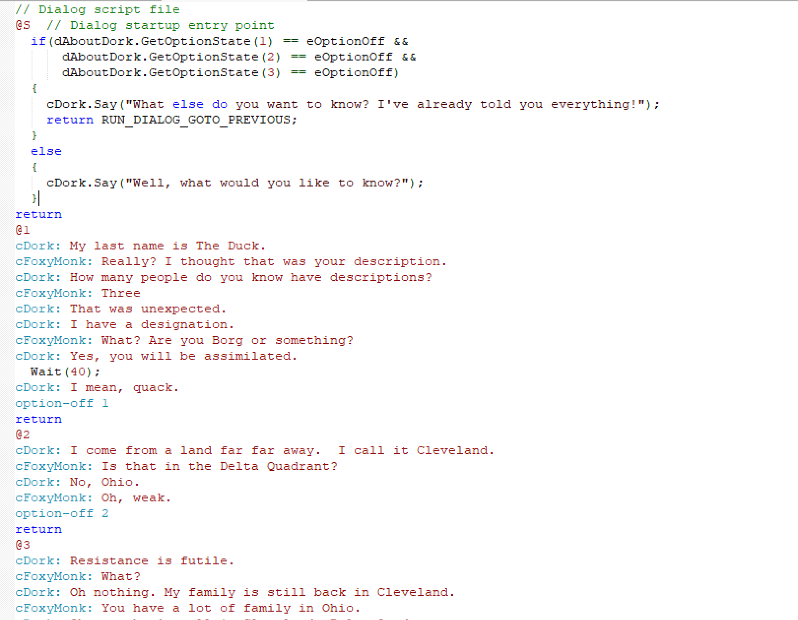

# Jumping Between Dialogs

Depending on your game, you may have just one conversation, like our game does now, or you may have many different conversations.  AGS provides a good way to switch between conversations using the `goto-dialog` and `goto-previous` script commands.

Let's add another conversation to our game and see how these commands work.
We'll have Dork tell us more about himself.  Start by adding a new option to our dialog by replacing Option 4 with the text "`So, tell me more about yourself.`" and uncheck the **Show** checkbox but check the **Say** checkbox. Change the `stop` for Option 4 to `return` and add a 5<sup>th</sup> option with the text "`End conversation`" and uncheck the **Say** checkbox and check the **Show** checkbox. Change the 5<sup>th</sup> option's `return` keyword to `stop`. Add `option-on 4` in the `@1` section to turn this new option on after getting Dork's name.  In the right pane, replace the `return` keyword under the `@4` symbol with the following line.
```
goto-dialog dAboutDork
```
Now, let's create the `dAboutDork` dialog. Right click on Dialogs in the Project Tree and choose **New Dialog**. This will create a new dialog called `dDialog1`. Go ahead and look at the Properties Pane and rename that dialog to `dAboutDork`. The dialog editor should now be open for our new dialog.   Add the following between the `@S` symbol and the `return` keyword. 
```
cDork: Well, what would you like to know?
```
Anything under the `@S` symbol will run as soon as the dialog launches.
Create options for the following question:

1. What's your last name?
1. Where are you from?
1. Tell me about your family.
1. Ok thanks

Make sure that the **Say** and **Show** checkboxes are checked for all of them.  In the right pane, add the following for each question respectively:

1. 
```
cDork: My last name is The Duck.
cFoxyMonk: Really? I thought that was your description.
cDork: How many people do you know have descriptions?
cFoxyMonk: Three
cDork: That was unexpected.
cDork: I have a designation.
cFoxyMonk: What? Are you Borg or something?
cDork: Yes, you will be assimilated.
  Wait(40);
cDork: I mean, quack.
option-off 1
return
```
2.
```
cDork: I come from a land far far away.  I call it Cleveland.
cFoxyMonk: Is that in the Delta Quadrant?
cDork: No, Ohio.
cFoxyMonk: Oh, weak.
option-off 2
return
```
3.
```
cDork: Resistance is futile.
cFoxyMonk: What?
cDork: Oh nothing. My family is still back in Cleveland.
cFoxyMonk: You have a lot of family in Ohio.
cDork: Oh no, they're all in Cleveland, Delta Quadrant.
cFoxyMonk: Um, ok then.
option-off 3
return
```
4.
```
goto-previous
```

Be sure to indent the `Wait()` function in the first response because it's AGS Script and not Dialog Script.  As you can see, each time one of the options is chosen it's turned off.  There's no reason to ask the same question over and over again. The last option simply returns to the previous dialog by using the goto-previous Dialog Script command.

## Jumping Between Dialogs with AGS Script

Analogous to the `goto-dialog` and `goto-previous` script commands for switching between dialogs, there are some predefined constant return values that can be used in AGS Scripts that are embedded in Dialog Scripts. The three values available are `RUN_DIALOG_GOTO_PREVIOUS`, `RUN_DIALOG_RETURN` and `RUN_DIALOG_STOP_DIALOG`.  `RUN_DIALOG_GOTO_PREVIOUS` goes back to the previous dialog just like `goto-previous` does in Dialog Scripts; `RUN_DIALOG_RETURN` goes back to the current conversation just like the `return` keyword does in Dialog Scripts; and `RUN_DIALOG_STOP_DIALOG` stops the dialog just like the `stop` keyword would.  These will be easier to understand with an example.

Let's modify Dork's dialog to use one of these return values.  Go to the dialog editor and delete the line "`cDork: Well, what would you like to know?`" between the `@S` symbol and the `return` keyword, and replace it with the following code:

```agsscript
if(dAboutDork.GetOptionState(1) == eOptionOff &&
      dAboutDork.GetOptionState(2) == eOptionOff &&
      dAboutDork.GetOptionState(3) == eOptionOff)
{
    cDork.Say("What else do you want to know? I've already told you everything!");
    return RUN_DIALOG_GOTO_PREVIOUS;
}
  else
{
    cDork.Say("Well, what would you like to know?");
}
```
Be **absolutely** sure that the whole block is indented as in [Figure 8.6](#figure86).

<a name="figure86"></a>
<span><br>**Figure 8.6: Indenting AGS Script in Dialog Script**</span>

So, what have we done here?  The `if` statement will check each of our first 3 options to see if it is on or off.  If all of the first 3 options are turned off, it means that Foxy already asked Dork everything, so Dork tells her he has nothing more to say and we return `RUN_DIALOG_GOTO_PREVIOUS` to return us to the previous conversation.  If any of the first 3 options is still there, then Dork will say what he said before we made these changes and Foxy will see the available options to ask him.

