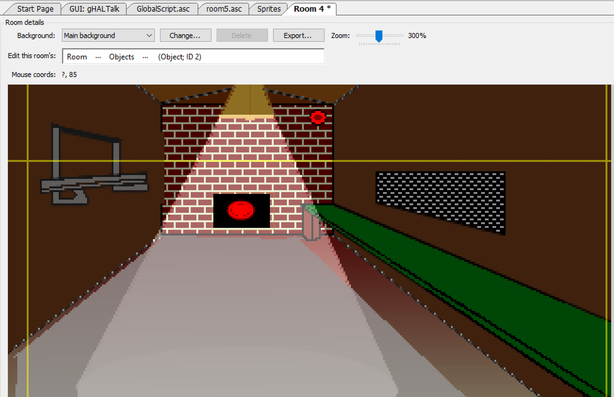

# Text Parser

A text parser can be used to obtain text input from a player and perform different actions depending on what the player types in.  AGS has a very nice text parser built in that is simple to use and efficient.

> **Side Note:** Text parsers can also be used to create a completely text-based games similar to some old games from Sierra like *Police Quest*.

To be able to parse text input, AGS will need a list of words that the player can type in.  This task can be daunting, so we're only going to make a simple text parser for our game.  Let's begin by examinig the text parser interface.


uble click on **Text Parser** in the Project Tree and you will be greeted with the text parser editor. Notice that it's already populated with a few words.  There are 4 types of words that we will come across: `Ignore`, `Normal`, `MatchAnyWord`, `MatchRestOfInput`.

* `Ignore` words are words you want the parser to just throw away.  If you look at the list already in the parser, you should notice that almost all of them are ignore words like 'a', 'an', 'the', and the like.
* `Normal` words are the words you want your game to act upon if a player types them in and in the correct order.  These will be the most important words for the parser.
* `MatchAnyWord` words are words that can match to just about anything the player types in.  There's usually only one of these in the text parser and, by default, it's the word 'anyword'.
* `MatchRestOfInput` words are words that will match everything beginning at that word to the end of the line.  Again, there's usually only one of these in the parser and, by default, it's the word 'rol', which stands for 'rest of line'.

Right-clicking in the words area will bring up a menu of things you can do here, which includes editing a word, adding a synonym for a word, deleting a word, adding a new word, and searching for a word.  Synonyms of words can be added to any of the four types above and deserve a little explanation: let's say there's a duck in your game and the player wants to look at the duck.  The player can type in "`look at duck`" to get a description.  However, the player could also mistake the duck for a goose (I don't know how that could possibly ever happen though with the awesome sprites we drew of Dork.) So, the player could type in "`look at goose.`" In this case, we can include "goose" as a synomym for "duck." We'll include synonyms in our game for practice later.

The first part, and the hardest part, of customizing the text parser is to sit down and come up with every possible word or phrase that you will need in your game.  Then you have to come up with synonyms of the words or phrases.  Well, you guessed it! We've done this job for you.

Let's add a little bit of a fun conversation to our game.  And what better way to do this than to add a new room.  This isn't going to be a room that you can walk around in though.  It's going to be a special type of room.  The main character will not be visible in this room.  It won't have walls or doors or anything room-like.  Let's just do this and then you'll understand.

## Creating a room that is not a room

Start by adding a new room to your project by right-clicking on **Rooms** in the Project Tree and choosing **New room** then click **OK** when the dialog box comes up. This should create room 5 for us.  Now, edit room 5 and name it `HAL` (you'll see why). Change the background by choosing the file named *HALRoom.png*. As you can see, this room only contains a giant red eye.  If you don't know where a giant red eye comes from, then go watch *2001: A Space Odyssey*. Now, this part is important: find the property named `ShowPlayerCharacter` in the Properties Pindow and change its value to `False`. When Foxy goes into this room, she will not be visible, but she will be able to chat with the giant red eye.

In order for Foxy to chat with the giant red eye, we'll have to give the player a place to type in some text, so we will need to create our first GUI. This will be a quick and dirty GUI to get us going.  We will talk more about making GUIs in a [later chapter](../chapter10/guis.html), so don't worry about it if you don't get it completely.

## Creating our first GUI

Start by right-click on **GUIs** in the Project Tree and click on **New GUI**. Name the new GUI `gHALTalk`. All we need is a place for the player to type in some text and an OK button, so shrink its `Height` property to `30` and the Width to `300`. We also don't want this GUI to show up all the time, so change its `Visible` property to `False`. Now if you look at the toolbar, you'll see some buttons that add components to the GUI. Use these buttons to add a text box and a button to the GUI to take up most of the space on it and change the text on the button to  '`Talk`'. Name the text box `txtHAL` and the button `btnHAL`. [Figure 8.7](#figure87) shows the toolbar buttons (red arrow) and the final result after adding the button and text box.

<a name="figure87"></a>
<span><br>**Figure 8.7: Our Simple Text Box GUI**</span>

Since this GUI is going to be used in our new room so Foxy can talk to the giant red eye, we need to make sure it's positioned correctly in that room, and that it actually shows up when Foxy enters the room.  We also want it to disappear when Foxy leaves.  Go back to editing the new room, and add a function for the `Enters room after fade-in` event and add the following code:

```agsscript
function room_AfterFadeIn()
{
  gHALTalk.SetPosition(10, 160);
  gHALTalk.Visible = true;
}
```

We set the x positon to 10 to center the box and set the y postion to 160 to place it under the giant red eye, then we make the box visible.  Add a function for the `Leaves room` event and add the following code:

```agsscript
function room_Leave()
{
  gHALTalk.Visible = false;
}
```
And there you have it.  When Foxy enters the room, the box shows up and when she leaves, the box disappears.  Only two things left to do: Make a way for Foxy to be able to enter this room and write the text parsing code.  We'll leave the text parsing for last since that's our ultimate objective.  Let's create a way for Foxy to get into this room now.

## Getting into our not-a-room room

Open the Sprites editor and create a new sub-folder called HAL then import the file named *HAL.png*. Now edit the Longroom and place a new object on the far wall.  Choose our new HAL sprite for this object and postion it towards the bottom of the wall and centered horizontally.  Name the object `oHAL`. When finished it should look like [Figure 8.8](#figure88).

<a name="figure88"></a>
<span><br>**Figure 8.8: HAL In The Room**</span>

For the final part, add a function for the `Interact object` event on HAL and add the following code to the newly created function:

```agsscript
cFoxyMonk.Walk(124, 81, eBlock, eWalkableAreas);
cFoxyMonk.ChangeRoom(5);
```

This will make Foxy walk up to the HAL object and then change rooms to the new HAL room.  What this simulates is not changing rooms but walking all the way up to the object and then the player looks through Foxy's eyes.  Now for the fun part: let's talk to the giant red eye.

## Parsing Text

Go back to the text parser and add the following words by right-clicking and choosing **Add new word**. Once you click **Add**, you can edit the word in the Properties Pane.

```
hello
what
your
name
```

Go back to editing the new `gHALTalk` GUI and add a function for the `OnClick` event of the button (click on the button to see its properties and events.) Notice that this function will appear in the global script.  Make the function look like the following:

```agsscript
function btnHAL_OnClick(GUIControl *control, MouseButton button)
{
 String input;
 
 input = txtHAL.Text;
 Parser.ParseText(input);
 if (Parser.Said("hello what your name"))
 {
   Display("Hello there. I HAL");
   cFoxyMonk.Say("You mean you're HAL?");
   Display("No, my name is iHal");
 }
 else if (Parser.Said("hello"))
 {
   Display("Hello to you");
 }
 else if (Parser.Said("what your name"))
 {
   Display("i Hal");
 }
 else
  Display("say what now?");
}
```

Now, let's dissect this mess:  We first declare a String called `input`. This string will hold the text that the player types into the GUI.  The text box in our GUI is called `txtHAL`, so we get the `Text` property of the text box and place it into the String `input`. Now that `input` contains what the player typed in, we call the parser's function `ParseText` to parse it for us.  Once the parser parses our text, we can have a series of `IF/ELSE` blocks to check what the player typed in.  As you can see, we check for the string "hello what your name" and leave out ignored words like "is". Also notice that the parser will get rid of punctuation marks and ignore word case.  The player can enter in "Hello, what is your name" or "hello, what's your name" and it would still work.

Play with that and then come back and add the following words to the text parser:

```
Can
You
Know
Tell
About
Duck
```

Then add a synomym for the word 'duck' by right-clicking it and choosing **Add synomym** from the menu. Type in 'goose' for the synomym and notice that it has the same Word Group number as 'duck'. Now, add two `else` blocks to the `OnClick` function like the following:

```agsscript
else if (Parser.Said("what can you tell about duck"))
{
  Display("I know nothing of noisy birds");
}
else if (Parser.Said("tell about duck"))
{
  Display("I know nothing of noisy birds");
}
```

As you can see, now we can ask iHal about Dork the Duck, but we could also use the word 'goose' since it's a synonym for 'duck'. We can say the following:

```
What can you tell me about the duck? (with or without the question mark)
What can you tell me about the goose? (with or without the question mark)
What can you tell about duck? (with or without the question mark)
What can you tell about goose? (with or without the question mark)
Tell me about the duck. (with or without the 'me' or the period)
Tell me about the goose. (with or without the 'me' or the period)
```

Since iHal will respond the same way for each of these blocks, we should find a way to combine them.  Replace the blocks with the following:

```agsscript
else if (Parser.Said("what,tell [can] [you] [tell] about duck") )
{
   Display("I know nothing of noisy birds");
}
```

Let's dissect this code:  We separated 'what' and 'tell' with a comma.  This tells the parser to take either one as the first word.  The comma acts like an 'or' in this case: 'what' or 'tell' will do.  The following three words are in brackets.  This tells the parser that they're optional.  This allows us to be able to ask the same questions as above and have less code.  We can combine the first and third blocks too to make the code look like this:

```agsscript
if (Parser.Said("[hello] what your name"))
{
  Display("Hello there. I HAL");
  cFoxyMonk.Say("You mean you're HAL?");
  Display("No, my name is iHal");
}
else if (Parser.Said("hello"))
{
  Display("Hello to you");
}
else if (Parser.Said("what,tell [can] [you] [tell] about duck") )
{
  Display("I know nothing of noisy birds");
}
else
 Display("Say what now?");
```

But what if Foxy said something else after the 'hello'? like "hello, how are you today?" or "hello there you big ugly red thing" and what if we don't care about what comes after the hello unless it's "what your name". This would be a good place to use the `MatchRestOfInput` word type. Change the second `ELSE/IF` to:

```agsscript
else if (Parser.Said("hello rol"))
```

This will take anything after the word 'hello' and just ignore it.  So now you can either say "hello, what's your name" or "hello &lt;anything goes here&gt;" and Hal will respond accordingly.

Now, what if we asked Hal about something other than a duck or a goose.  Add one more `ELSE/IF` statement as follows:

```agsscript
else if (Parser.Said("what,tell [can] [you] [tell] about anyword") )
{
   Display("I'm sorry Dave, but I can't tell you that.");
}
```

Put that block right under the similar one asking about the duck.  Notice that the last word is now 'anyword' which is the MatchAnyWord type. So, the text parser will match that to anything we put in there.  Ask Hal to tell you about donuts.

## Buttoning Things Up

We would say that now you've got the basic idea of the text parser and can create more complicated conversations.  There are just a few things that need to be taken care of though before we can call this finshed:

1. There's no way to exit the Hal room.
1. We have to use the mouse to click the 'Talk' button.
1. After talking, what we typed in is still there and we have to delete it to say something else.

Let's start with number 1 and go down the list (uh huh). Exiting the room should be simple.  All we have to do is add a 'bye' or 'see you later' option to the conversation and exit the room when that happens.  See the code below for the final full conversation.

```agsscript
function btnHAL_OnClick(GUIControl *control, MouseButton button)
{
 String input;
 
 input = txtHAL.Text;
 Parser.ParseText(input);
 if (Parser.Said("[hello] what your name"))
 {
   Display("Hello there. I HAL");
   cFoxyMonk.Say("You mean you're HAL?");
   Display("No, my name is iHal");
 }
 else if (Parser.Said("hello rol"))
 {
   Display("Hello to you");
 }
 else if (Parser.Said("what,tell [can] [you] [tell] about duck") )
 {
   Display("I know nothing of noisy birds");
 }
 else if (Parser.Said("what,tell [can] [you] [tell] about anyword") )
 {
   Display("I'm sorry Dave, but I can't tell you that.");
 }
 else if (Parser.Said("bye rol") || Parser.Said("See you,ya rol") || Parser.Said("have,got,gotta [got] go"))
 {
   Display("Bye Dave");
   cFoxyMonk.ChangeRoom(4);
 }
 else
  Display("Say what now?");
}
```

Please note that we also had to add the following words to the text parser:

```
bye
have
got
go
gotta
later
see
ya
```

Now to exit the room we can say any of the following:

```
Bye
Bye bye
Bye bye now (or anything after 'bye')
See you (and anything after that like 'see you later bro')
See ya (and anything after that)
I have to go
I have got to go
I got to go
Got to go
Have to go
Gotta go
```

That's a lot of stuff.  Not bad huh?  Let's move on to the second point.  It could get very annoying to have to click the 'Talk' button to say something.  It would be much easier if you can just hit the **Enter** key to say something.  Adding this event is very simple.  Edit the `gHALTalk` GUI. Select the text box and look at its events in the Properties Pane.  You'll notice there is only one event called `OnActivate`. This is the event for the **Enter** key being pressed.  Create a function for this event by clicking the ellipses.  Function `txtHAL_OnActivate()` will be created. Now create another function called `TalkToHal()` right above the `btnHAL_OnClick()` function, and move all of the code inside the `btnHAL_OnClick()` function into this new function. For the last step, have `btnHAL_OnClick()` and `txtHAL_OnActivate()` both call your new `TalkToHal()` function.

One more thing to tackle and we're done.  Let's clear the text box after **Enter** is hit or the 'Talk' button clicked.  Add the line ```txtHAL.Text = "";``` right under the the line ```input = txtHAL.Text;``` in the `TalkToHal()` function. This will clear the text box after we get what was typed in.  The final code follows:

```agsscript
function TalkToHal()
{
 String input;
 
 input = txtHAL.Text;
 txtHAL.Text = "";
 Parser.ParseText(input);
 if (Parser.Said("[hello] what your name"))
 {
   Display("Hello there. I HAL");
   cFoxyMonk.Say("You mean you're HAL?");
   Display("No, my name is iHal");
 }
 else if (Parser.Said("hello rol"))
 {
   Display("Hello to you");
 }
 else if (Parser.Said("what,tell [can] [you] [tell] about duck") )
 {
   Display("I know nothing of noisy birds");
 }
 else if (Parser.Said("what,tell [can] [you] [tell] about anyword") )
 {
   Display("I'm sorry Dave, but I can't tell you that.");
 }
 else if (Parser.Said("bye rol") || Parser.Said("See you,ya rol") || Parser.Said("have,got,gotta [got] go"))
 {
   Display("Bye Dave");
   cFoxyMonk.ChangeRoom(4);
 }
 else
  Display("Say what now?");
}

function btnHAL_OnClick(GUIControl *control, MouseButton button)
{
 TalkToHal();
}

function txtHAL_OnActivate(GUIControl *control)
{
  TalkToHal();
}
```
