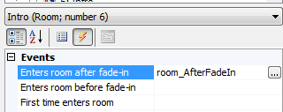
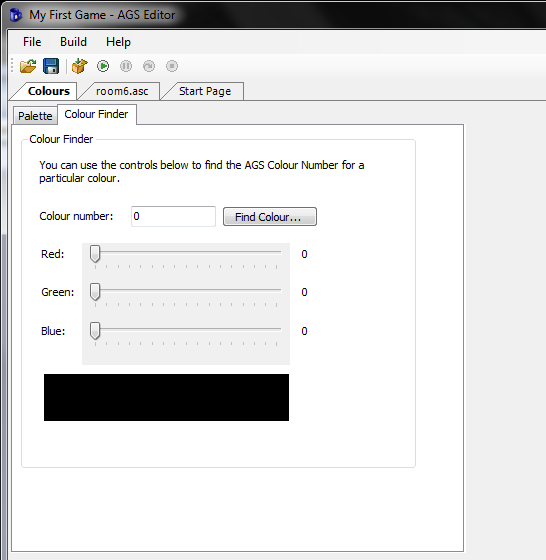
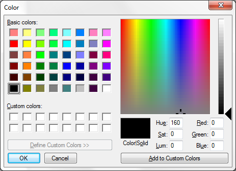

# Creating a Game Intro and End Credits

Although cutscenes can be placed just about anywhere in a game, the best way to do an intro is to create a new room for it instead of plopping it as part of the game's first room.  Yep, that's right! We're making a new room.  This is going to be a special room though, like the one we made for iHal.

Start by adding a new room to the game.  In our case this is going to be room number 6.  Open the room in the room editor and give it the name `Intro`. And that's it. We have a room to use as our intro; not much to it.

Since this is the intro room, we will want the main character to start here.  The first room that loads is always the room that is set as the starting room of the main character.

Expand the Characters node in the Project Tree and double-click on **cFoxyMonk** to edit Foxy's character.  Change Foxy's `StartingRoom` to 6. Running the game now will show the black intro screen and Foxy just standing there.  Since there are no walkable areas, Foxy won't be able to move, and won't be able to travel to another room. But that's ok. We're going to create a cutscene in this room that will move Foxy to room 1 after it plays through.

## The Cutscene

In order to make the cutscene we will use the 'after fade in' function that is available to us in each room.  We'll create a function for the 'after fade in' event and put all of our cutscene code in it.  This way, when the room loads, the function will run and the cutscene will play through.  At the end of the cutscene we will change rooms to room 1.

Go back to editing room 6.  Click the lightning bolt to show the room events and then click the ellipses next to `Enters room after fade-in` to create the function.  See [Figure 9.1](#figure91).

<a name="figure91"></a>
<span><br>**Figure 9.1: Creating the 'after fade in' Function**</span>

So that we don't forget the very important cutscene functions, let's go ahead and add them in now, and we'll go ahead and add the room change while we're at it.  Make the `room_AfterFadeIn()` function look like the following:

```agsscript
function room_AfterFadeIn()
{
  StartCutscene(eSkipAnyKeyOrMouseClick);
  //TODO: Do cutscene stuff here
  EndCutscene();
  cFoxyMonk.ChangeRoom(1);
}
```

As you can see, we start the cutscene and tell it that any key press or mouse click can be used to skip it.  Then we have a comment that reminds us to fill in the good stuff, and then we end the cutscene.  After the cutscene is over, we have Foxy change rooms to room 1 to start the game.  Be sure to put in the change room call after the cutscene is done.

Now for the actual cutscene code, we'll do something simple.  We'll have Foxy introduce the game for us and then start the game.  But, before we do this, save the game, and run it just to see what would happen.  You should see Foxy come up against a black background, which is our `Intro` room, then fade to room 1; exactly what we need.

Let's have Foxy introduce the game now.  Delete the comment in the code if you wish and add a line for Foxy to say "Hi, I'm Foxy. Welcome to Foxy's Quest!" While we're at it, let's add some actual speech.  Make sure there's a sound file called *Foxy1.wav* in the *Speech* folder of your game. We, of course, have one for you, but you can make your own.  Then make the line look like this:

```agsscript
cFoxyMonk.Say("&1 Hi, I'm Foxy. Welcome to Foxy's Quest!");
```

The `&1` will tell AGS to play the *Foxy1.wav* file while the speech is displayed. Run this and watch it.  Then run it again and click the mouse or press a button before the speech is done and it should be skipped.  And that is the simplest cutscene in the world.

## Overlays

We'll move away a bit from the cutscene now to introduce overlays.  Since we're making an intro, this would be a good place for it.  Overlays can be either text or graphical and when placed on the screen are always on top of everything else.

Let's create a few overlays to show the game's name and authors on the screen.  The name of the game will be a graphical overlay and the authors' names will be text overlays.

Start by going to the sprites editor and importing the file named *GameNameOverlay.png*. This is an image we created for the name of the game.  If you don't like it, well, make your own then.  Just remember, it needs to fit the screen.  We created a sub-folder under Sprites named *Overlays* in which to put the image, just so we can keep everything organized.  Our image was placed in slot 75 in the Sprites editor.  Yours may be different.

Go back to editing the `Intro` room's script.  Right before Foxy introduces the game, place the following lines:

```agsscript
Overlay *ovTitle;
ovTitle = Overlay.CreateGraphical( 0, 10, 75, false );
```

And right after Foxy's line place the following lines:

```agsscript
Wait(20);
ovTitle.Remove();
```

Let's examine what we just did.  The first line we added declares a variable called `ovTitle` that will hold our overlay. Notice, however, that there's a `*` before it. The `*` means that this is a pointer variable.  A pointer variable holds the address of a variable and not the contents of the variable.  If this is all foreign to you, then just remember that when declaring overlay variables, they need a `*` before them. (See [Appendix I](../../appendices/scripting.html) for scripting help and the */pointer stuff).

The second line actually creates the graphical overlay.  It places it at x,y coordinates (0,10), uses our newly imported image, which is 75, and sets the transparency to `false`. This overlay can be referenced by our variable `ovTitle` now.

The third line is a wait.  We've seen the `Wait()` function before. This one waits for 20 game cycles, or about 0.5 seconds.  The last line calls the `Remove()` function of the overlay to remove it.  It's always good to remove your overlays when you're done with them.

Creating the text overlays for the author names is even easier because there are no images to import.  We are, however, going to create a new view for Foxy to make things look neater.  This should be a quick and easy view composed of one loop and one frame.  Right-click on **Views** and choose **New View**. Call it `vFMPoint`. Create a new loop and then go back to the Sprites editor.  Find the sprite of Foxy pointing.  On ours it's number 49.  Right-click that sprite and assign it to our new view.  That's it.  Now we have a pointing view.

te the text overlays, we're going to declare overlay variables, and then call the `CreateTextual()` function instead of the `CreateGraphical()` function. Add the following:

```agsscript
Overlay *davesName;
Overlay *georgesName;
davesName = Overlay.CreateTextual( 70, 60, 100, eFontNormal, 10, "David Ensminger" );
georgesName = Overlay.CreateTextual( 190, 60, 100, eFontNormal, 10, "A. G. Madi" );
```

The `CreateTextual()` function is very similar to the graphical one.  It takes and x,y pair for text placement, a size (100), a font (`eFontNormal`, `eFontSpeech`, or `eFontOutline`),  a color code (We used 10 just randomly, but it's a nice color), and the actual text to display.

Let's improve a bit on this cutscene now by making Foxy move around a bit and introduce the game developers.  All the code for this should be familiar to you by now so we'll just show it to you here.  There are three things to note though.  One is the fact that we don't have walkable areas in this room, so we tell Foxy to walk anywhere.  You could make walkable areas instead, but there's just no need in this case.  Two is the fact that we change Foxy's view to that of our newly created pointing view.  This makes Foxy point at the authors' names when she introduces them.  Just don't forget to change it back when you're done with it.  And three is the fact that we bring Foxy back to her starting position when she's done with the introductions.  This is to make sure she starts at that position when the scene changes to room 1.  Of course, there are other ways to do this, but this is the one we chose.

```agsscript
function room_AfterFadeIn()
{
  StartCutscene(eSkipAnyKeyOrMouseClick);
  
  Overlay *ovTitle;
  ovTitle = Overlay.CreateGraphical( 0, 10, 75, false );
  
  Overlay *davesName;
  Overlay *georgesName;
  davesName = Overlay.CreateTextual( 70, 60, 100, eFontNormal, 10, "David Ensminger" );
  georgesName = Overlay.CreateTextual( 190, 60, 100, eFontNormal, 10, "A. G. Madi" );

  int x = cFoxyMonk.x;
  int y = cFoxyMonk.y;
  cFoxyMonk.Say("&1 Hi, I'm Foxy. Welcome to Foxy's Quest!");
  cFoxyMonk.Walk(110, 120, eBlock, eAnywhere);
  cFoxyMonk.LockView(VFMPOINT);
  Wait(40);
  cFoxyMonk.UnlockView();
  cFoxyMonk.Walk(240, 120, eBlock, eAnywhere);
  cFoxyMonk.LockView(VFMPOINT);
  Wait(40);
  cFoxyMonk.UnlockView();
  cFoxyMonk.Walk(x, y, eBlock, eAnywhere);
  cFoxyMonk.FaceDirection(eDirectionDown);
  Wait(20);
  EndCutscene();
  davesName.Remove();
  georgesName.Remove();
  ovTitle.Remove();
  cFoxyMonk.ChangeRoom(1);
}
```

## EndCutscene()

The `EndCutscene()` function needs to be examined a little closer since it actually returns a value. If you recall, the function will return a 0 if the player actually watched the entire cutscene and 1 if the player skipped it.  We're going to use this value to yell at the player for skipping our cutscene.

are an integer variable at the top of the intro function and call it `iYellAtPlayer`:
```agsscript
int iYellAtPlayer;
```
Change the `EndCutScene()` line to the following:
```agsscript
iYellAtPlayer = EndCutscene();
```
Right after that line and before the change room line, add the following:
```agsscript
if(iYellAtPlayer == 1)
{
  cFoxyMonk.Say(" What!!??? How dare you not watch my cutscene!!");
  Wait(20);
  cFoxyMonk.Say(" WELL FINE THEN!");
  Wait(40);
}
```
Now, when you skip the intro, you'll get yelled at.  Notice also that Foxy will end up at the final position no matter when the intro is skipped.  Remember that's because when a player skips a cutscene, AGS actually fast forwards through it and executes every instruction in there really fast.

## Colors

Remember the color that we passed in to the `Overlay.CreateTextual()` function?  Well, there are a lot of colors that you can pass in, and there is an easy way to find those colors.

Look in the Project Tree and you should see a **colours** option. Double-clicking this option will bring up the Colors editor.   We're not going to concern ourselves with creating color, but we are going to use the handy **Colour Finder**, which will be the second tab of the editor, as seen in [Figure 9.2](#figure92).

<a name="figure92"></a>
<span><br>**Figure 9.2: Colour Finder**</span>

There are two ways to find a color to use.  The first way is to play with the Red, Green, Blue sliders until you see a color you like.  Then, you can take the number in the **Colour number** box and plug it into the `Overlay.CreateTextual()` function. The second way is to click the **Find Colour...** button to bring up the Windows Color dialog box as in: 

<a name="figure93"></a>
<span><br>**Figure 9.3: Windows Color Dialog**</span>

You can use this dialog to find the Red, Green, Blue values of a color, then go back to the sliders to set that color and get the number to plug into the `Overlay.CreateTextual()` function.

## End Credits

Since we have an intro, we think it would only be fitting to also have some end credits.  Creating end credits is just as simple as creating an intro.  We will create a new room and put a cutscene in it.  Let's dive right in.

Create a new room and call it **End Credits**. Set the `ShowPlayerCharacter` option to `False`, because we don't need to see Foxy when the credits are rolling.  Now, create a function for the room's after fade-in event and create a cutscene in that function.  This is very much just like making the intro.  In the cutscene, we're going to create a text overlay and scroll it up the screen with whatever text we want in it.

The two important things that we need in order to scroll the credits are changing the position of the text overlay and changing the text of the text overlay. To change the position, we set the text overlay's x and y values; to change the text, we call the text overlay's `SetText()` function.  The `SetText()` function takes the overlay width, font type, color, and text as parameters.  These are the same parameters that `Overlay.CreateTextual()` takes except for the x and y coordinates. The code follows:

```agsscript
function room_AfterFadeIn()
{
  Overlay *ovTitle;
  Overlay *textScroller;
  int i;
  int j;
  
  StartCutscene(eSkipAnyKeyOrMouseClick);
  textScroller = Overlay.CreateTextual( 120, 200, 100, eFontNormal, 41725, "Foxy's Quest"  );
  i = 0;
  while(i < 5)
  {
    while(textScroller.Y > -30)
    {
      textScroller.Y = textScroller.Y - 1;
      Wait(1);
    }
    if(i == 0)
      textScroller.SetText(100, eFontNormal, 41725, "Written by[David Ensminger[A.G. Madi");
    else if(i == 1)
      textScroller.SetText(100, eFontNormal, 41725, "Produced by[David Ensminger[A.G. Madi");
    else if(i == 2)
      textScroller.SetText(100, eFontNormal, 41725, "Directed by[David Ensminger[A.G. Madi");
    else if(i == 3)
      textScroller.SetText(100, eFontNormal, 41725, "Voiced by[David Ensminger[A.G. Madi[T.J. Madi");
    textScroller.Y = 200;
    i++;
  }
  EndCutscene();
  textScroller.Remove();
  
  ovTitle = Overlay.CreateGraphical( 0, 10, 80, false  );
  Wait(200);
  ovTitle.Remove();
  
  QuitGame(0);
}
```

Let's dissect this code.  The first few lines should be familiar to you.  We declare two overlays; one for the text that we will be scrolling and one for the game's name that we will display at the end of the credits.  We create the text overlay first with the name of the game and set its Y coordinate to 200, which sets it at the bottom of the screen, and, since AGS uses the top left corner of the overlay for the coordinates, this effectively puts the overlay below the screen, and makes it look like it's coming up from below.

Now for some loops, but not the same kind of loops that we did with with sprites back in [Chapter 2](../../part1/chapter2/index.html). We're going to create scripting loops.  We haven't done scripting loops before, and technically, we don't have to do them now, but this is a great time to learn them.  Loops enable us to do the same thing multiple times without having to copy and paste the same code over and over again.  AGS gives us the `while` loop; which allows us to do something **WHILE** something else is true.

We are going to use 2, separate, `while` loops: One loop will be used to change the text of the overlay, and the other loop will be used to move the overlay up on the screen.   The first loop will run 5 times because we have 5 text overlays that we want to show: The name of the game, 'Written by', 'Produced by', 'Directed by', and 'Voiced by'. So, we set a variable, `i`, equal to zero to start out and we tell AGS to run the code in the `while` loop WHILE `i` is less than 5, and each time through the loop we call `i++`, which is scripting talk for adding 1 to the `i` variable. This gives us five loops when `i` is 0, 1, 2, 3, and 4. As soon as `i` reaches 5, the `while(i < 5)` will be `false` and the loop will end.  By the way, everything between the `{` and `}` gets done each time through the loop. So, this outer while loop will scroll the overlay up the screen, change the overlay's text depending on what the `i` variable is, add 1 to `i`, and start over.

The second `while` loop is inside the first and it does the actuall scrolling of the overlay up the screen.  Each time through the loop we subtract 1 from the Y coordinate of the overlay, which moves it up a pixel, and we wait for 1 game loop, so the overlay doesn't just fly up the screen.  (In fact, take the wait out and you won't even see any scrolling because the overlay will move so fast.) We do this while the Y coordinate is grater than -30.  Why -30 you ask; because that way it scrolls completely off the screen and puts a bit of a pause between each subsequent overlay scroll.

You may have noticed that there are `[` characters in our strings. And, if you already ran the game, you probably know that this tells AGS to put whatever is after the `[` character on a new line.  Just thought we'd mention that.

## Homework

Create a dialog (or GUI) that pops up after the end credits that acts like a menu with choices to start a new game, load a previous game, or quit (hints: `RestartGame()`, `RestoreGameDialog()`).

## Just For Fun

Just so that we can get to the credits quickly and for a bit of fun, we're going to change the intro so that the user will get sent straight to the credits if the intro is skipped.  Change the code after the call to `EndCutscene()` in the intro room to the following:

```agsscript
if(iYellAtPlayer == 1)
{
  cFoxyMonk.Say(" What!!??? How dare you not watch my cutscene!!");
  Wait(20);
  cFoxyMonk.Say(" WELL FINE THEN! NO GAME FOR YOU!");
  Wait(40);
  davesName.Remove();
  georgesName.Remove();
  ovTitle.Remove();
  cFoxyMonk.ChangeRoom(7);
}
else
{
  davesName.Remove();
  georgesName.Remove();
  ovTitle.Remove();
  cFoxyMonk.ChangeRoom(1);
}
```

By the way, that's actually very annoying, and we only did it to show you that you can.  Don't do that in a real game or we won't play it!
